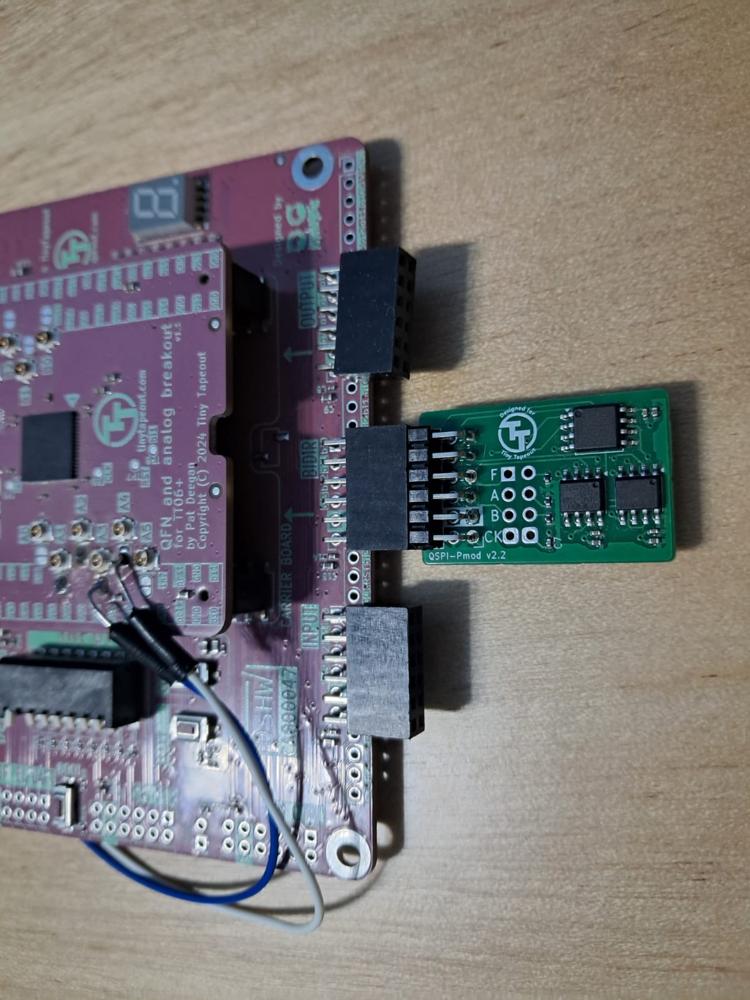
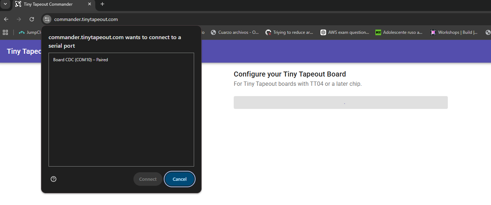
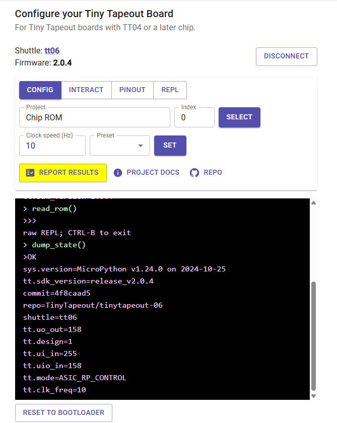
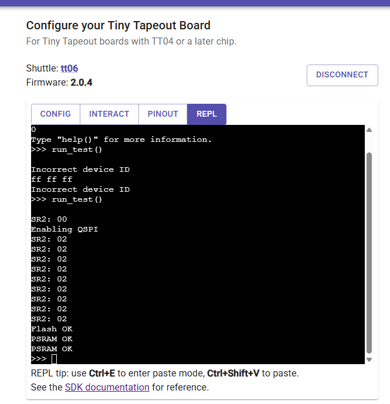
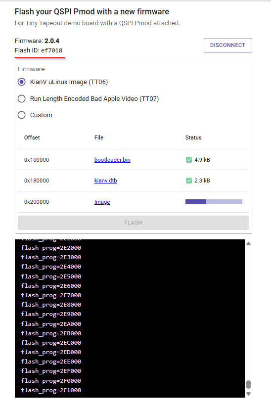

# Flashing the QSPI PMOD using a TT Dev board

You can use any [TinyTapeout development boards](https://store.tinytapeout.com/products/Development-Kits-c198115270) from build 4 on to write a BIN file in the Flash memory of the [QSPI PMOD](https://store.tinytapeout.com/products/QSPI-Pmod-p716541602)

Follow the next step to do it

## Activate the quad mode of the Flash memory

According to the W25Q128JV specs, we must set the QE bit of the status Register-2 to enable QSPI mode, by default the TinyTapeout flasher uses that mode so we must set it first.

- Plug in the QSPI PMOD in the _BIDIR_ socket of your TT Dev board

- Go go the [TinyTapeout commander](https://commander.tinytapeout.com/), plug in your board and select _CONNECT TO BOARD_ you must see a modal allowing you to select your detected board

- After connecting the board select the _Index 0_ in the config tab and head to the _REPL_ tab

- The _REPL_ tab gives you access to the Micropython where you can run scripts, here some basics commands you can use:

- - ctrl + E = Enter paste mode
- - Ctrl + Shift + V = paste
- - Ctr + D = End paste mode

- Enter the Paste mode and paste the attached [QSPI Activation Script](./QSP_Activation_Script.py) entirely
- Press _Ctrl + D_ to finalize the paste mode
- In the uPython prompt (>>>) write _run_test()_, observe it is a function declared in the python code you pasted, you must see the process going and get the following outputs if it suceeds:

- After this you're ready to write a BIN file in the Flash memory, go to the [TinyTapeout flasher](https://tinytapeout.github.io/tinytapeout-flasher/) and connect the board as you did for the commander (you must disconnect from the commander first)
- If everything's OK you must see now the Flash ID as ef7018 (not 000000 anymore), and you can select a BIN file either from your computher or one of the predefined demos, the prcess must go smoothly

- Note that you can continue using the QSPI memory as 1-bit or 4-bit interface according to your design

