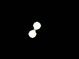
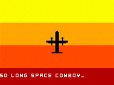
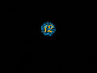
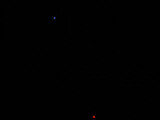
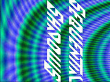
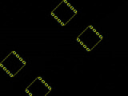
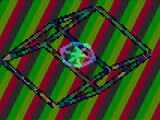
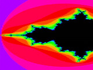
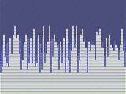

All the entries! See below for details on each entry and how they were recorded. We are waiting on silicon (due April 2025) for the judging.
[Find out more about the competition](/competitions/demoscene/).



## All the entries

<table>
<tr><td></td><td>Why not? [139] sylefeb clock: 25 MHz tags: sound, small <a href="https://www.youtube.com/watch?v=K9mu3getxhU&t=1404s">Watch</a> <a href="/runs/tt08/139">Design</a></td></tr>
<tr><td></td><td>VGA donut [227] Andy Sloane clock: 48 MHz tags: newcomer, large <a href="https://www.youtube.com/watch?v=K9mu3getxhU&t=1390s">Watch</a> <a href="/runs/tt08/227">Design</a></td></tr>
<tr><td></td><td>TT08 VGA FUN! [267] algofoogle (Anton Maurovic) clock: 25 MHz tags: mixed, seq <a href="https://www.youtube.com/watch?v=K9mu3getxhU&t=1363s">Watch</a> <a href="/runs/tt08/267">Design</a></td></tr>
<tr><td></td><td>Metaballs [322] Johannes Hoff clock: 50 MHz tags: newcomer, small <a href="https://www.youtube.com/watch?v=K9mu3getxhU&t=1349">Watch</a> <a href="/runs/tt08/322">Design</a></td></tr>
<tr><td></td><td>Flame demo [324] Konrad Beckmann &amp; Linus Mårtensson clock: 25 MHz tags: newcomer, sound, small <a href="https://www.youtube.com/watch?v=K9mu3getxhU&t=1329s">Watch</a> <a href="/runs/tt08/324">Design</a></td></tr>
<tr><td></td><td>SkyKing Demo [326] Nicklaus Thompson clock: 25.2 MHz tags: small <a href="https://www.youtube.com/watch?v=K9mu3getxhU&t=1321s">Watch</a> <a href="/runs/tt08/326">Design</a></td></tr>
<tr><td></td><td>Generate VGA output for Color Blindness Test [330] Krushnasis Pradhan, Aniruddha Ranade clock: 25 MHz tags: newcomer, small <a href="https://www.youtube.com/watch?v=K9mu3getxhU&t=1314s">Watch</a> <a href="/runs/tt08/330">Design</a></td></tr>
<tr><td></td><td>nyan [448] Peter Nørlund clock: 25 MHz tags: newcomer, sound, small <a href="https://www.youtube.com/watch?v=K9mu3getxhU&t=1300s">Watch</a> <a href="/runs/tt08/448">Design</a></td></tr>
<tr><td></td><td>Demo by a1k0n [484] Andy Sloane clock: 48 MHz tags: newcomer, sound <a href="https://www.youtube.com/watch?v=K9mu3getxhU&t=1244s">Watch</a> <a href="/runs/tt08/484">Design</a></td></tr>
<tr><td></td><td>nVious Graphics [582] James Ross clock: 25.175 MHz tags: newcomer, small <a href="https://www.youtube.com/watch?v=K9mu3getxhU&t=1232s">Watch</a> <a href="/runs/tt08/582">Design</a></td></tr>
<tr><td></td><td>DemoSiine [587] SagarDevAchar clock: 25 MHz tags: newcomer, sound, small <a href="https://www.youtube.com/watch?v=K9mu3getxhU&t=1207s">Watch</a> <a href="/runs/tt08/587">Design</a></td></tr>
<tr><td></td><td>Munch [589] bytex64 clock: 25.175 MHz tags: newcomer, sound, small <a href="https://www.youtube.com/watch?v=K9mu3getxhU&t=1109s">Watch</a> <a href="/runs/tt08/589">Design</a></td></tr>
<tr><td></td><td>cfib Demoscene Entry [591] Christian Fibich clock: 50 MHz tags: newcomer, sound, small <a href="https://www.youtube.com/watch?v=K9mu3getxhU&t=973s">Watch</a> <a href="/runs/tt08/591">Design</a></td></tr>
<tr><td></td><td>VGA Nyan Cat [646] Andy Sloane clock: 25.175 MHz tags: newcomer, sound <a href="https://www.youtube.com/watch?v=K9mu3getxhU&t=928s">Watch</a> <a href="/runs/tt08/646">Design</a></td></tr>
<tr><td></td><td>Warp [648] sylefeb clock: 25 MHz tags: sound <a href="https://www.youtube.com/watch?v=K9mu3getxhU&t=780s">Watch</a> <a href="/runs/tt08/648">Design</a></td></tr>
<tr><td></td><td>VGA Drop (audio/visual demo) [650] ReJ aka Renaldas Zioma, eriQue aka Erik Hemming, Matthias Kampa clock: 25.2 MHz tags: sound <a href="https://www.youtube.com/watch?v=K9mu3getxhU&t=743s">Watch</a> <a href="/runs/tt08/650">Design</a></td></tr>
<tr><td></td><td>Sea Battle [654] Yuri Panchul clock: 23 MHz tags: newcomer <a href="https://www.youtube.com/watch?v=K9mu3getxhU&t=732s">Watch</a> <a href="/runs/tt08/654">Design</a></td></tr>
<tr><td></td><td>Bouncy Capsule [704] htfab clock: 25 MHz tags: sound <a href="https://www.youtube.com/watch?v=K9mu3getxhU&t=722s">Watch</a> <a href="/runs/tt08/704">Design</a></td></tr>
<tr><td></td><td>donut [710] Daniel Endraws clock: 50.35 MHz tags: newcomer <a href="https://www.youtube.com/watch?v=K9mu3getxhU&t=706s">Watch</a> <a href="/runs/tt08/710">Design</a></td></tr>
<tr><td></td><td>VGA Screensaver with Tiny Tapeout Logo [716] Uri Shaked clock: 25 MHz tags: small <a href="https://www.youtube.com/watch?v=K9mu3getxhU&t=698s">Watch</a> <a href="/runs/tt08/716">Design</a></td></tr>
<tr><td></td><td>Patater Demo Kit Waggling Rainbow on a Chip [718] Jaeden Amero clock: 25.175 MHz tags: newcomer, small <a href="https://www.youtube.com/watch?v=K9mu3getxhU&t=685s">Watch</a> <a href="/runs/tt08/718">Design</a></td></tr>
<tr><td></td><td>TT08 Pachelbel's Canon demo [768] Mike Bell clock: 36 MHz tags: sound <a href="https://www.youtube.com/watch?v=K9mu3getxhU&t=567s">Watch</a> <a href="/runs/tt08/768">Design</a></td></tr>
<tr><td></td><td>Sequential Shadows [TT08 demo competition] [770] Toivo Henningsson clock: 50.4 MHz tags: sound <a href="https://www.youtube.com/watch?v=K9mu3getxhU&t=194s">Watch</a> <a href="/runs/tt08/770">Design</a></td></tr>

<tr><td></td><td>TinyMandelbrot [772] Gerrit Grutzeck clock: 40 MHz tags: extra_hw, seq <a href="https://www.youtube.com/watch?v=K9mu3getxhU&t=529s">Watch</a> <a href="/runs/tt08/772">Design</a></td></tr>
<tr><td></td><td>Sprite Bouncer with Looping Background Options [774] Jacob Mack clock: 25 MHz tags: newcomer <a href="https://www.youtube.com/watch?v=K9mu3getxhU&t=522s">Watch</a> <a href="/runs/tt08/774">Design</a></td></tr>
<tr><td></td><td>"SQUARE-1": VGA/audio demo [778] Zachary Catlin clock: 25.2 MHz tags: newcomer, sound <a href="https://www.youtube.com/watch?v=K9mu3getxhU&t=399s">Watch</a> <a href="/runs/tt08/778">Design</a></td></tr>
<tr><td></td><td>Sequential Shadows Deluxe [TT08 demo competition] [782] Toivo Henningsson clock: 50.4 MHz tags: sound, large, extra_hw <a href="https://www.youtube.com/watch?v=K9mu3getxhU&t=194s">Watch</a> <a href="/runs/tt08/782">Design</a></td></tr>
<tr><td></td><td>Wirecube [832] Leo Moser clock: 50.35 MHz tags: (none) <a href="https://www.youtube.com/watch?v=K9mu3getxhU&t=58s">Watch</a> <a href="/runs/tt08/832">Design</a></td></tr>
<tr><td></td><td>VGA Mandelbrot [844] Mike Bell clock: 100 MHz tags: (none) <a href="https://www.youtube.com/watch?v=K9mu3getxhU&t=50s">Watch</a> <a href="/runs/tt08/844">Design</a></td></tr>
<tr><td></td><td>Rounding error [846] Edwin Török clock: 25.25 MHz tags: newcomer <a href="https://www.youtube.com/watch?v=K9mu3getxhU&t=42s">Watch</a> <a href="/runs/tt08/846">Design</a></td></tr>
<tr><td></td><td>VGA Tiny Logo (1 tile) [911] Renaldas Zioma clock: 25.175 MHz tags: small <a href="https://www.youtube.com/watch?v=K9mu3getxhU&t=33s">Watch</a> <a href="/runs/tt08/911">Design</a></td></tr>
<tr><td></td><td>asic design is my passion [965] Nicholas Junker clock: 25.175 MHz tags: newcomer, small <a href="https://www.youtube.com/watch?v=K9mu3getxhU&t=24s">Watch</a> <a href="/runs/tt08/965">Design</a></td></tr>
<tr><td></td><td>VGA Scroller [973] FavoritoHJS clock: 25 MHz tags: newcomer, small <a href="https://www.youtube.com/watch?v=K9mu3getxhU&t=14s">Watch</a> <a href="/runs/tt08/973">Design</a></td></tr>
<tr><td></td><td>Glyph Mode [975] James Ross clock: 25.175 MHz tags: newcomer, small <a href="https://www.youtube.com/watch?v=K9mu3getxhU&t=7s">Watch</a> <a href="/runs/tt08/975">Design</a></td></tr>
</table>

# Recording information

Thanks to Tamas for recording the outputs of the demos.

Designs were run on the Basys 3 FPGA board with its built-in 4-bit VGA output and MuseLab's PMOD-AUDIO.
They were recorded through a VGA+jack to HDMI adapter and an HDMI to USB capture card. Some artifacts in the videos might be a result of this setup.
Most designs were compiled using the open source F4PGA toolchain with the clock frequency rounded to 25 MHz or 50 MHz.
Designs 227 & 844 didn't work with F4PGA and were compiled using Vivado instead. I also used Vivado for designs 768 & 772 due to their clock frequencies.

## Tag descriptions
* newcomer: no submission in previous TT shuttles where the repo url has the same github username
* small: single tile design
* large: uses 2x2 tiles
* sound: has non-empty & non-noise audio output
* mixed: mixed signal design, has some analog circuitry
* extra_hw: needs extra hardware (772 uses the RP2040 with custom firmware as a framebuffer, 782 uses a Digilent PmodVGA for higher color depth)
* seq: controlled with switches or micropython, I've added a simple sequencing loop to demonstrate its functionality in the recording
