All of the winners of the TT08 demoscene competition - congratulations contestants!



Read more about the competition on our [announcement page](../demoscene/), or check out all of the entries [here](../demoscene-tt08-entries/).

## Newcomer

### 1st Place

<table>
    <tr>
        <td style="width: 20%"></td>
        <td>
            
<b>Glyph Mode</b> by James Ross 
            <a href="https://tinytapeout.com/chips/tt08/975">Project page</a> 
            <a href="https://www.youtube.com/live/il_qKTiyKLY?si=iUSH1VLfD4roa_jb&t=1037">Livestream announcement</a> 
            

        </td>
    </tr>
</table>

### 2nd Place

<table>
    <tr>
        <td style="width: 20%">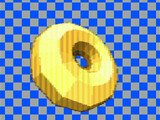</td>
        <td>
            
<b>VGA donut</b> by Andy Sloane 
            <a href="https://tinytapeout.com/chips/tt08/227">Project page</a> 
            <a href="https://www.youtube.com/live/il_qKTiyKLY?si=iUSH1VLfD4roa_jb&t=881">Livestream announcement</a> 
            <a href="https://www.a1k0n.net/2025/01/10/tiny-tapeout-donut.html">Author's project writeup</a> 
            

        </td>
    </tr>
    <tr>
        <td></td>
        <td>
            
<b>Flame demo</b> by Konrad Beckmann & Linus Mårtensson 
            <a href="https://tinytapeout.com/chips/tt08/324">Project page</a> 
            <a href="https://www.youtube.com/live/il_qKTiyKLY?si=0oB5slAiuxV2-dnU&t=918">Livestream announcement</a> 
            

        </td>
    </tr>
</table>

### 3rd Place

<table>
    <tr>
        <td style="width: 20%">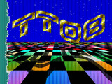</td>
        <td>
            
<b>Demo by a1k0n</b> by Andy Sloane 
            <a href="https://tinytapeout.com/chips/tt08/484">Project page</a> 
            <a href="https://www.youtube.com/live/il_qKTiyKLY?si=iUSH1VLfD4roa_jb&t=591">Livestream announcement</a> 
            <a href="https://www.a1k0n.net/2025/12/19/tiny-tapeout-demo.html">Author's project writeup</a> 
            

        </td>
    </tr>
    <tr>
        <td>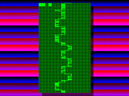</td>
        <td>
            
<b>cfib Demoscene Entry</b> by Christian Fibich 
            <a href="https://tinytapeout.com/chips/tt08/591">Project page</a> 
            <a href="https://www.youtube.com/live/il_qKTiyKLY?si=0oB5slAiuxV2-dnU&t=711">Livestream announcement</a> 
            

        </td>
    </tr>
    <tr>
        <td></td>
        <td>
            
<b>Patater Demo Kit Waggling Rainbow on a Chip</b> by Jaeden Amero 
            <a href="https://tinytapeout.com/chips/tt08/718">Project page</a> 
            <a href="https://www.youtube.com/live/il_qKTiyKLY?si=BIoALtoYJLGxN6pq&t=775">Livestream announcement</a> 
            

        </td>
    </tr>
</table>

## Sound

### 1st Place

<table>
    <tr>
        <td style="width: 20%">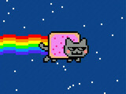</td>
        <td>
            
<b>VGA Nyan Cat</b> by Andy Sloane 
            <a href="https://tinytapeout.com/chips/tt08/646">Project page</a> 
            <a href="https://www.youtube.com/live/il_qKTiyKLY?si=iUSH1VLfD4roa_jb&t=1565">Livestream announcement</a> 
            <a href="https://www.a1k0n.net/2025/12/19/tiny-tapeout-demo.html">Author's project writeup</a> 
            

        </td>
    </tr>
</table>

### 2nd Place

<table>
    <tr>
        <td style="width: 20%"></td>
        <td>
            
<b>Demo by a1k0n</b> by Andy Sloane 
            <a href="https://tinytapeout.com/chips/tt08/484">Project page</a> 
            <a href="https://www.youtube.com/live/il_qKTiyKLY?si=iUSH1VLfD4roa_jb&t=1316">Livestream announcement</a> 
            <a href="https://www.a1k0n.net/2025/12/19/tiny-tapeout-demo.html">Author's project writeup</a> 
            

        </td>
    </tr>
    <tr>
        <td>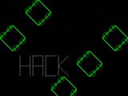</td>
        <td>
            
<b>Munch</b> by bytex64 
            <a href="https://tinytapeout.com/chips/tt08/589">Project page</a> 
            <a href="https://www.youtube.com/live/il_qKTiyKLY?si=0oB5slAiuxV2-dnU&t=1330">Livestream announcement</a> 
            

        </td>
    </tr>
    <tr>
        <td></td>
        <td>
            
<b>TT08 Pachelbel's Canon demo</b> by Mike Bell 
            <a href="https://tinytapeout.com/chips/tt08/768">Project page</a> 
            <a href="https://www.youtube.com/live/il_qKTiyKLY?si=BIoALtoYJLGxN6pq&t=1377">Livestream announcement</a> 
            

        </td>
    </tr>
    <tr>
        <td>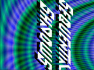</td>
        <td>
            
<b>Sequential Shadows Deluxe</b> by Toivo Henningsson 
            <a href="https://tinytapeout.com/chips/tt08/782">Project page</a> 
            <a href="https://www.youtube.com/live/il_qKTiyKLY?si=BIoALtoYJLGxN6pq&t=1430">Livestream announcement</a> 
            <a href="https://github.com/toivoh/tt08-demo/blob/main/docs/info.md">Author's project writeup</a> 
            <a href="https://www.youtube.com/watch?v=pkiTu3iLA_U">Author's video</a> 
            

        </td>
    </tr>
</table>

### 3rd Place

<table>
    <tr>
        <td style="width: 20%"></td>
        <td>
            
<b>VGA Drop (audio/visual demo)</b> by ReJ aka Renaldas Zioma, eriQue aka Erik Hemming, Matthias Kampa 
            <a href="https://tinytapeout.com/chips/tt08/650">Project page</a> 
            <a href="https://www.youtube.com/live/il_qKTiyKLY?si=iUSH1VLfD4roa_jb&t=1207">Livestream announcement</a> 
            

        </td>
    </tr>
</table>

## Single Tile

### 1st Place

<table>
    <tr>
        <td style="width: 20%">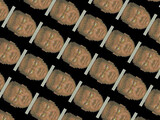</td>
        <td>
            
<b>Why not?</b> by sylefeb 
            <a href="https://tinytapeout.com/chips/tt08/139">Project page</a> 
            <a href="https://www.youtube.com/live/il_qKTiyKLY?si=iUSH1VLfD4roa_jb&t=1881">Livestream announcement</a> 
            <a href="https://github.com/sylefeb/tt08-fun/blob/main/docs/info.md">Author's project writeup</a> 
            

        </td>
    </tr>
</table>

### 2nd Place

<table>
    <tr>
        <td style="width: 20%"></td>
        <td>
            
<b>Munch</b> by bytex64 
            <a href="https://tinytapeout.com/chips/tt08/589">Project page</a> 
            <a href="https://www.youtube.com/live/il_qKTiyKLY?si=iUSH1VLfD4roa_jb&t=1783">Livestream announcement</a> 
            

        </td>
    </tr>
    <tr>
        <td></td>
        <td>
            
<b>Glyph Mode</b> by James Ross 
            <a href="https://tinytapeout.com/chips/tt08/975">Project page</a> 
            <a href="https://www.youtube.com/live/il_qKTiyKLY?si=0oB5slAiuxV2-dnU&t=1800">Livestream announcement</a> 
            

        </td>
    </tr>
</table>

### 3rd Place

<table>
    <tr>
        <td style="width: 20%">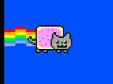</td>
        <td>
            
<b>Nyan</b> by Peter Nørlund 
            <a href="https://tinytapeout.com/chips/tt08/448">Project page</a> 
            <a href="https://www.youtube.com/live/il_qKTiyKLY?si=iUSH1VLfD4roa_jb&t=1689">Livestream announcement</a> 
            

        </td>
    </tr>
    <tr>
        <td>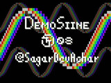</td>
        <td>
            
<b>DemoSiine</b> by SagarDevAchar 
            <a href="https://tinytapeout.com/chips/tt08/587">Project page</a> 
            <a href="https://www.youtube.com/live/il_qKTiyKLY?si=0oB5slAiuxV2-dnU&t=1734">Livestream announcement</a> 
            

        </td>
    </tr>
</table>

## Graphics

### 1st Place

<table>
    <tr>
        <td style="width: 20%">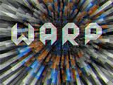</td>
        <td>
            
<b>Warp</b> by sylefeb 
            <a href="https://tinytapeout.com/chips/tt08/648">Project page</a> 
            <a href="https://www.youtube.com/live/il_qKTiyKLY?si=iUSH1VLfD4roa_jb&t=2229">Livestream announcement</a> 
            <a href="https://github.com/sylefeb/tt08-compo-entry/blob/main/docs/info.md">Author's project writeup</a> 
            <a href="https://www.shadertoy.com/view/w3KyW3">Author's ShaderToy sandbox</a> 
            <a href="https://www.youtube.com/watch?v=ELOYGwZgHnw">Author's video</a> 
            

        </td>
    </tr>
</table>

### 2nd Place

<table>
    <tr>
        <td style="width: 20%"></td>
        <td>
            
<b>Demo by a1k0n</b> by Andy Sloane 
            <a href="https://tinytapeout.com/chips/tt08/484">Project page</a> 
            <a href="https://www.youtube.com/live/il_qKTiyKLY?si=iUSH1VLfD4roa_jb&t=2180">Livestream announcement</a> 
            <a href="https://www.a1k0n.net/2025/12/19/tiny-tapeout-demo.html">Author's project writeup</a> 
            

        </td>
    </tr>
    <tr>
        <td></td>
        <td>
            
<b>Sequential Shadows Deluxe</b> by Toivo Henningsson 
            <a href="https://tinytapeout.com/chips/tt08/782">Project page</a> 
            <a href="https://www.youtube.com/live/il_qKTiyKLY?si=0oB5slAiuxV2-dnU&t=2197">Livestream announcement</a> 
            <a href="https://github.com/toivoh/tt08-demo/blob/main/docs/info.md">Author's project writeup</a> 
            <a href="https://www.youtube.com/watch?v=pkiTu3iLA_U">Author's video</a> 
            

        </td>
    </tr>
</table>

### 3rd Place

<table>
    <tr>
        <td style="width: 20%"></td>
        <td>
            
<b>VGA donut</b> by Andy Sloane 
            <a href="https://tinytapeout.com/chips/tt08/227">Project page</a> 
            <a href="https://www.youtube.com/live/il_qKTiyKLY?si=iUSH1VLfD4roa_jb&t=2038">Livestream announcement</a> 
            <a href="https://www.a1k0n.net/2025/01/10/tiny-tapeout-donut.html">Author's project writeup</a> 
            

        </td>
    </tr>
    <tr>
        <td></td>
        <td>
            
<b>VGA Drop (audio/visual demo)</b> by ReJ aka Renaldas Zioma, eriQue aka Erik Hemming, Matthias Kampa 
            <a href="https://tinytapeout.com/chips/tt08/650">Project page</a> 
            <a href="https://www.youtube.com/live/il_qKTiyKLY?si=0oB5slAiuxV2-dnU&t=2058">Livestream announcement</a> 
            

        </td>
    </tr>
</table>

## Size

### 1st Place

<table>
    <tr>
        <td style="width: 20%"></td>
        <td>
            
<b>Why not?</b> by sylefeb 
            <a href="https://tinytapeout.com/chips/tt08/139">Project page</a> 
            <a href="https://www.youtube.com/live/il_qKTiyKLY?si=iUSH1VLfD4roa_jb&t=2697">Livestream announcement</a> 
            <a href="https://github.com/sylefeb/tt08-fun/blob/main/docs/info.md">Author's project writeup</a> 
            

        </td>
    </tr>
</table>

### 2nd Place

<table>
    <tr>
        <td style="width: 20%"></td>
        <td>
            
<b>Flame demo</b> by Konrad Beckmann & Linus Mårtensson 
            <a href="https://tinytapeout.com/chips/tt08/324">Project page</a> 
            <a href="https://www.youtube.com/live/il_qKTiyKLY?si=iUSH1VLfD4roa_jb&t=2567">Livestream announcement</a> 
            

        </td>
    </tr>
    <tr>
        <td></td>
        <td>
            
<b>Nyan</b> by Peter Nørlund 
            <a href="https://tinytapeout.com/chips/tt08/448">Project page</a> 
            <a href="https://www.youtube.com/live/il_qKTiyKLY?si=iUSH1VLfD4roa_jb&t=2585">Livestream announcement</a> 
            

        </td>
    </tr>
    <tr>
        <td>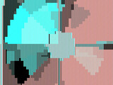</td>
        <td>
            
<b>Rounding error</b> by Edwin Török 
            <a href="https://tinytapeout.com/chips/tt08/846">Project page</a> 
            <a href="https://www.youtube.com/live/il_qKTiyKLY?si=iUSH1VLfD4roa_jb&t=2596">Livestream announcement</a> 
            

        </td>
    </tr>
</table>

## Mixed Signal

### 1st Place

<table>
    <tr>
        <td style="width: 20%"></td>
        <td>
            
<b>TT08 VGA FUN!</b> by algofoogle (Anton Maurovic) 
            <a href="https://tinytapeout.com/chips/tt08/267">Project page</a> 
            <a href="https://www.youtube.com/live/il_qKTiyKLY?si=iUSH1VLfD4roa_jb&t=2747">Livestream announcement</a> 
            <a href="https://tinytapeout.com/chips/tt08/tt_um_algofoogle_tt08_vga_fun">Author's project writeup</a> 
            

        </td>
    </tr>
</table>

## Most Useful

### 1st Place

<table>
    <tr>
        <td style="width: 20%"></td>
        <td>
            
<b>VGA donut</b> by Andy Sloane 
            <a href="https://tinytapeout.com/chips/tt08/227">Project page</a> 
            <a href="https://www.youtube.com/live/il_qKTiyKLY?si=iUSH1VLfD4roa_jb&t=3066">Livestream announcement</a> 
            <a href="https://www.a1k0n.net/2025/01/10/tiny-tapeout-donut.html">Author's project writeup</a> 
            

        </td>
    </tr>
</table>

### 2nd Place

<table>
    <tr>
        <td style="width: 20%"></td>
        <td>
            
<b>TT08 VGA FUN!</b> by algofoogle (Anton Maurovic) 
            <a href="https://tinytapeout.com/chips/tt08/267">Project page</a> 
            <a href="https://www.youtube.com/live/il_qKTiyKLY?si=iUSH1VLfD4roa_jb&t=2951">Livestream announcement</a> 
            <a href="https://tinytapeout.com/chips/tt08/tt_um_algofoogle_tt08_vga_fun">Author's project writeup</a> 
            

        </td>
    </tr>
    <tr>
        <td></td>
        <td>
            
<b>nVious Graphics</b> by James Ross 
            <a href="https://tinytapeout.com/chips/tt08/582">Project page</a> 
            <a href="https://www.youtube.com/live/il_qKTiyKLY?si=iUSH1VLfD4roa_jb&t=2987">Livestream announcement</a> 
            

        </td>
    </tr>
</table>

### 3rd Place

<table>
    <tr>
        <td style="width: 20%"></td>
        <td>
            
<b>Warp</b> by sylefeb 
            <a href="https://tinytapeout.com/chips/tt08/648">Project page</a> 
            <a href="https://www.youtube.com/live/il_qKTiyKLY?si=iUSH1VLfD4roa_jb&t=2934">Livestream announcement</a> 
            <a href="https://github.com/sylefeb/tt08-compo-entry/blob/main/docs/info.md">Author's project writeup</a> 
            <a href="https://www.shadertoy.com/view/w3KyW3">Author's ShaderToy sandbox</a> 
            <a href="https://www.youtube.com/watch?v=ELOYGwZgHnw">Author's video</a> 
            

        </td>
    </tr>
</table>