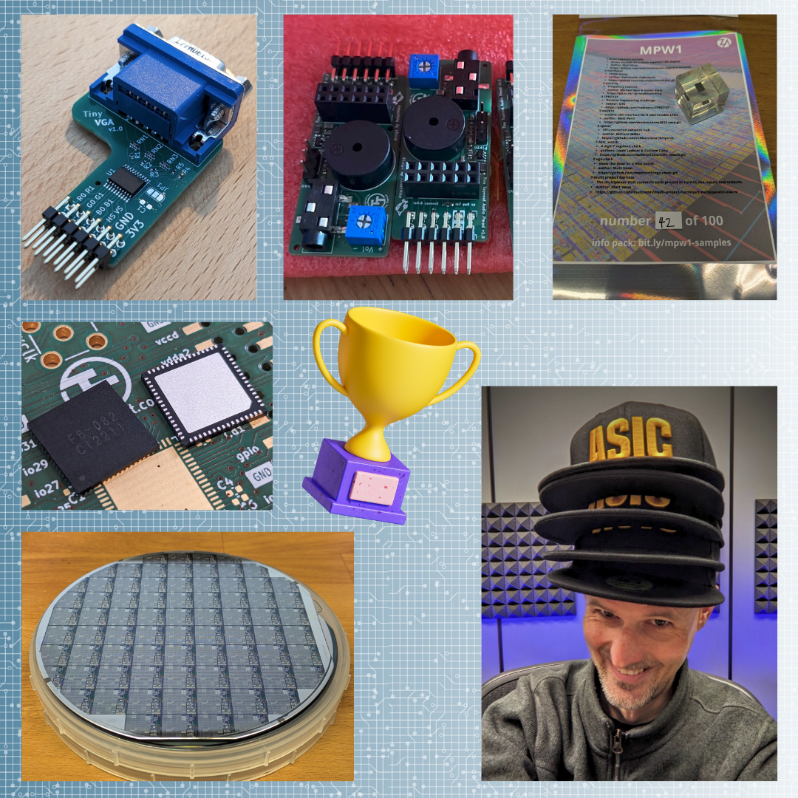

## Demoscene competition!

The [home computer demoscene](https://en.wikipedia.org/wiki/Demoscene) has resulted in some amazing feats of hacking and pushing hardware to its limits.

The Tiny Tapeout demoscene competition sticks to the same audio/visual output format, but instead of using an existing computer, you create your own ASIC hardware!

> The most fun demoscene competition I ever participated! Also it is time for ASICs to become part of the "official" demoscene movement!

> The Tiny Tapeout community is welcoming and incredibly talented, it was like being back in the 90's learning demoscene tricks at 3am on a table corner! It's not easy, but it's fun and rewarding, and you will learn many new tricks.

> Taking part in the Tiny Tapeout demo competition was a great experience: figuring out how to make a demo in hardware, interacting with the community, discussing solutions afterwards...

For inspiration, check the [winners of our last demoscene competition](/competitions/demoscene-tt08-winners/).

## Categories

* Newcomer - TTSKY26a must be your first TT tapeout
* 4 tiles
* 2 tiles
* 1 tile
* 2 tile + QSPI Pmod 4kByte max FLASH, unlimited RAM

## What are the rules?

* Free single tile (but no chip) to all entrants
* Must target the [VGA Pmod](/specs/pinouts/#vga-output)
* RP2350 on the devkit is only used for selecting the design, clock and reset
* If the demo is interactive must use the [gamepad Pmod](/specs/pinouts/#game-controllers)
* If the demo is using FLASH or RAM, must use [QSPI Pmod](/specs/pinouts/#qspi-flash-and-psram)
* If the demo produces audio, must use the [TT audio Pmod](/specs/pinouts/#audio-output)
* Apart from the above - no other hardware must be used
* Start up sequence using the commander app:
    * Enable the project, (optionally provide binary image for FLASH, optionally provide a value for ui_in[7:0] ), Reset, Enjoy
* Final judging will be done against the silicon after chips have been received (expected November 2026)
* Must be submitted to [TTSKY26a](https://app.tinytapeout.com/shuttles/ttsky26a) before the closing date of May 11th 2026

## How to enter

* Once your design is passing the GitHub actions, submit it to the shuttle at [app.tinytapeout.com](https://app.tinytapeout.com)
* Send us a link to your submitted design with the [competition form](https://docs.google.com/forms/d/e/1FAIpQLSeZfyClhZ-y-XTt6421OPqAOx9Evsk8-TdV3BMcKPcRoRPRPg/viewform?usp=dialog) 
* We will send you a coupon for a free tile on TTSKY26a within 48 hours
* Apply the coupon and submit a revision to the shuttle
* You can continue working on your design up to the closing date

## How to get help

* Discuss on the [competition channel](https://discord.com/channels/1009193568256135208/1259420274445516891) discord community channel. Join the [discord here](/discord)
* [Quick start VGA graphics at the VGA playground](https://vga-playground.com)
* [Audio output demo](https://github.com/MichaelBell/tt08-pwm-example)
* [Bitmap Fonts](https://github.com/ianhan/BitmapFonts)
* [Previous competition entries](/competitions/demoscene-tt08-entries/)
* Writeups by previous competition winners:
    * https://www.a1k0n.net/2025/01/10/tiny-tapeout-donut.html
    * https://www.a1k0n.net/2025/12/19/tiny-tapeout-demo.html
    * https://github.com/toivoh/tt08-demo/blob/main/docs/info.md
    * https://github.com/sylefeb/tt08-fun/blob/main/docs/info.md
    * https://www.a1k0n.net/2025/01/10/tiny-tapeout-donut.html

## Prizes

* All entrants who purchase the demoboard will get free VGA, Audio and QSPI Pmod
* Winners of each category will receive combinations of:
    * Lithography masks
    * Silicon wafers
    * Matt’s first ASIC die mounted in an epoxy cube, numbered and signed
    * ASIC baseball caps
    * Free tiles for future tapeouts
    * Previous TT chip

## Judges

We have some fantastic judges lined up:

* [Jeri Ellsworth](https://en.wikipedia.org/wiki/Jeri_Ellsworth)
* [Will Green](https://projectf.io/) 
* TBD

## Small print

* How will the competition be judged? 
    * A panel of appointed judges will vote and have the final say
* The final results will be judged on the post-silicon results
* When will the competition be judged? 
    * TBD
* TT team members are excluded from winning prizes, but can still enter
* There is no possibility to extend the deadline
* You can change the documentation used by the judges up to the point of judging the design. Any changes must be submitted to the chip datasheet by pull request to the GitHub repository
* You are not limited to a maximum clock frequency, but if the judges can’t get the design to work (because their ASIC is slower for example) then you run the risk of not qualifying. You are advised to use ~80MHz or less
* You are advised to stick with a standard VGA timing, if it doesn’t work on the judge’s display you run the risk of not qualifying
