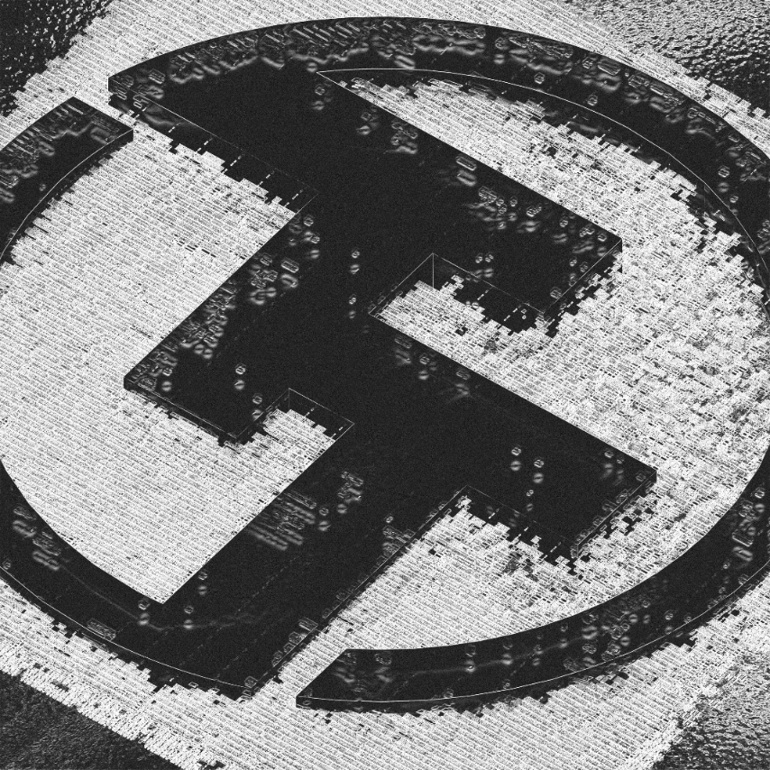
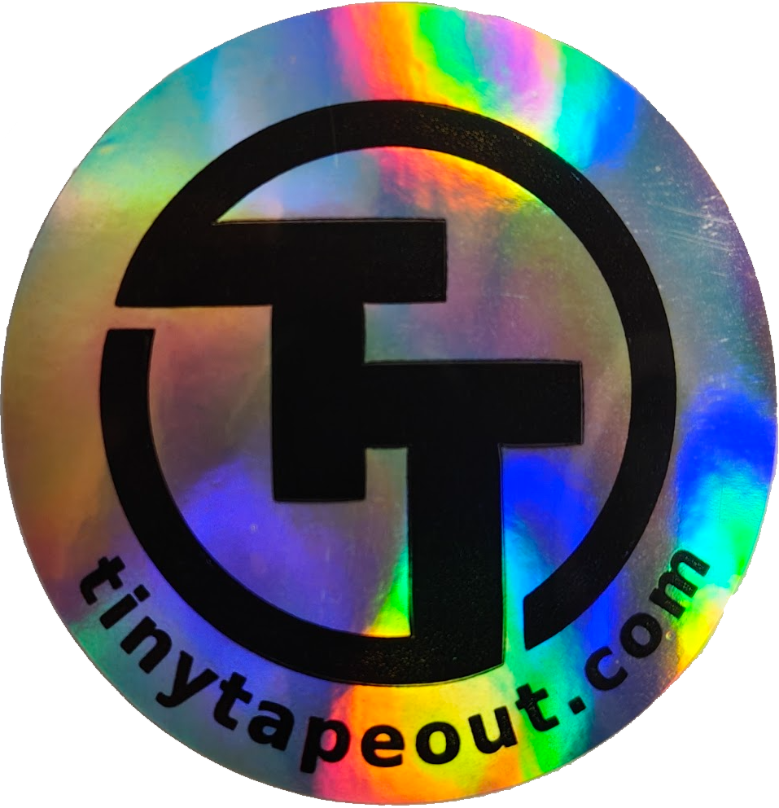
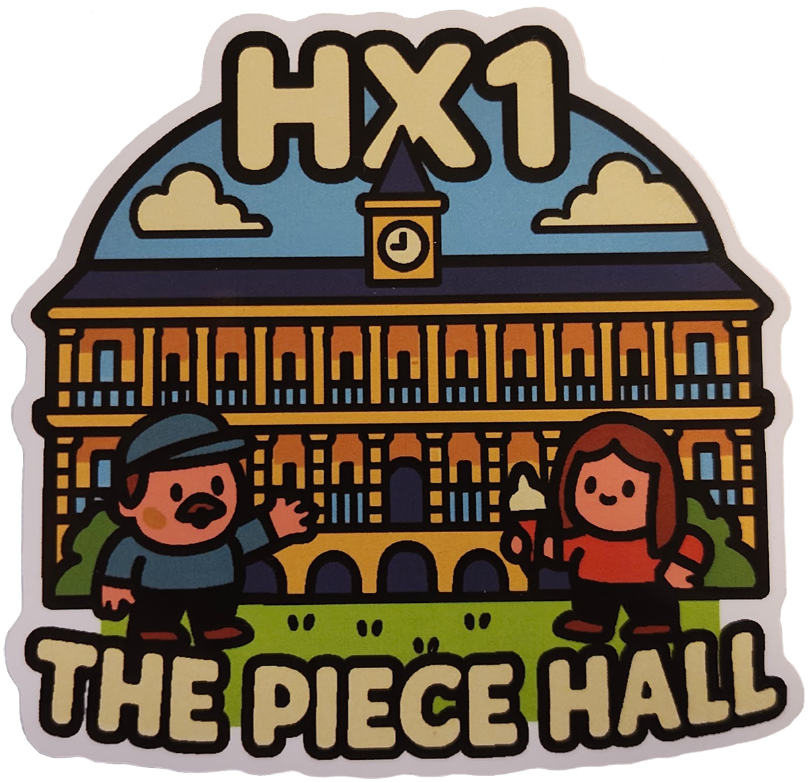

{}
This competition is now closed! Congratulations to the winners, and thank you to everyone who participated.
{}

## Winners of the sticker competition!

Congratulations to **Kanishk K** and **Louis Ledoux** for your winning designs! See below for the two winning designs that have
been sent to print.

Thank you to everybody who submitted artwork, you will shortly receive an email requesting your shipping details for
your prizes.

This competition was an experiment to do something slightly different to ASIC design, and we're super happy it turned
out well :)

<table>
    <tr align="center">
        <td>  </td>
        <td>  </td>
    </tr>
    <tr align="center">
        <td> Credit: Kanishk K </td>
        <td> Credit: Louis Ledoux </td>
    </tr>
</table>

 

## Design some stickers for a chance to win a prize!

We're planning to make some new stickers to promote Tiny Tapeout, and thought it would be cool to ask our community
to submit their designs!

The designs must be related to Tiny Tapeout in some way, and include any of the following:
- Tiny Tapeout logo artwork
- The words "Tiny Tapeout"
- A link to [tinytapeout.com](https://tinytapeout.com)
- Relevant words or phrases to open-source silicon, for example:
    - "Making Silicon Accessible"
    - "I say Tiny, you say Tapeout"
- Anything you can think of that is cool and related to what we do :)

## How to enter
This competition is now closed. Stay tuned in to our socials where we announce our future competitions!

### Sticker details
Two styles of stickers are available, as shown below. They can be any shape, minimum 40mm and maximum 100mm in both
width and length.

<table>
    <tr align="center">
        <td>  </td>
        <td>  </td>
    </tr>
    <tr align="center">
        <td> Shiny, laser effect with black text </td>
        <td> Multicoloured print</td>
    </tr>
</table>

## Restrictions and guidelines
All of the above and...
- Must be related to Tiny Tapeout
- Artwork must not contain offensive imagery or wording
- Artwork must not contain any logos, imagery or text that refers to any company or organisation other than Tiny Tapeout.
  References to Siliwiz and Wokwi are permitted.
- Artwork must be submitted in one of the following formats:
    - SVG (all fonts must be converted to paths to avoid issues with missing fonts)
    - PDF (300 dpi resolution)
    - JPEG (300 dpi resolution)
- Maximum 5 artworks may be submitted per person
- Each file must be under 10MB in size

## Prizes
- Everybody that submits designs to the competition will receive free stickers
- Each person that submits designs which are chosen for production will receive a prize of a tile for a future shuttle,
  maximum one tile per person

## Further details
- Submissions are accepted until the 15th November 2025
- All submitters will receive free stickers
- Each person that submits designs which are chosen for production will receive a prize of a tile for a future shuttle, 
  maximum one tile per person
- Designs will be selected by the Tiny Tapeout team and announced no later than the 20th November 2025
- Submissions must be made via the provided Google Form

Please understand that by uploading your artwork you agree to grant Tiny Tapeout a worldwide, non-exclusive, perpetual,
irrevocable, royalty-free, transferable, right and license to: copy, reproduce, publicly display, distribute, and create
derivatives from the artwork, whether in print, merchandise, or any kind of electronic version for any purpose
(including commercial purposes). Usage of the artwork will be attributed to the artist where possible. You agree to not
create, upload or input any content that is considered to be confidential or proprietary.