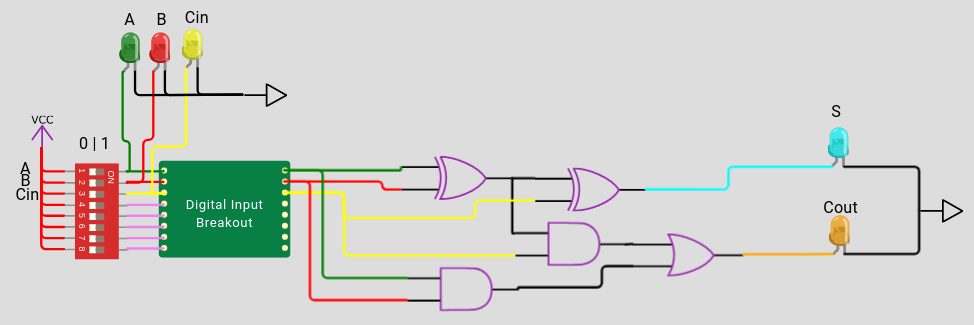

In this puzzle, you will learn how to perform basic arithmetic using a logic circuit called a [full adder](https://en.wikipedia.org/wiki/Adder_(electronics)#Full_adder).

Why are adders important? Lots of basic computation and math is dependent on addition and multiplication, making adders a crucial circuit for computers. And while doing basic arithmetic may seem to be a solved problem, there is actually lots of [ongoing research on how to optimize adders](https://www.zerotoasiccourse.com/post/interview-with-teo/). When so many of a computer's instructions rely on addition, even tiny improvements can make a big difference!

So how are adders built? Let's first think about the problem:
* Can't we just use an OR gate for addition? An OR gate will add two numbers, e.g. 0 and 0, 0 and 1, or 1 and 0, but what if we have 1 and 1? If we use just an OR gate for addition, we would lose important information -- in other words, the answer should be 2, but the OR gate says the answer is 1. Generating this extra bit is called generating a **carry**. If our circuit cannot generate a carry, we end up with **overflow**, which amounts to lost information. 
    * Overflow happening unknowingly is BAD. A register overflowing was at the source of the [Ariane 5 rocket crash](https://www.youtube.com/watch?v=PK_yguLapgA&ab_channel=AmazingInfoTV).
* As we build more complex circuits, we will want to add more than two bits together. To do so, we need a way to **carry in** bits from a previous adder and **carry out** bits to the adder.

So let's check out the [full adder](https://wokwi.com/projects/344128781499236946). This circuit implements a two-bit adder (A + B, where each input has one bit). While there is an OR gate in the design, there are several other [logic gates](/digital_design/logic_gates) too. **Using the truth table in the Wokwi project, can you make sense of the other logic gates?**

.

**Extra credit: using this circuit, can you build a four-bit full adder?** This circuit needs to accept two two-bit values, A and B, and a carry-in bit. It needs to output a two-bit value, S, and a carry-out bit.

Feel free to play around to try to figure it out. You can always return to the [logic gate tutorial](/digital_design/logic_gates) if you need a refresher. 

You can also check out the [**solution**](https://wokwi.com/projects/344249305917293138).