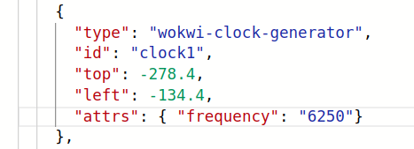

### Support

#### I’m stuck, how can I get support?

Join the [discord community with this link](https://discord.gg/rPK2nSjxy8).

### Wokwi FAQs

#### How do I do x, y, z with Wokwi?

Wokwi’s [documentation is here](https://docs.wokwi.com/?utm_source=wokwi). We don’t have much documentation yet for the [ASIC](https://www.zerotoasiccourse.com/terminology/asic/) version of Wokwi.

#### Shortcut keys

* select a component and press **delete** to remove it
* select a component (or shift select to add more components), then **d** to duplicate it.
* shift and drag to drag a box around multiple components
* [More here](https://docs.wokwi.com/guides/diagram-editor#keyboard-shortcuts).

#### Can I copy and paste from one Wokwi design to another?

1. Select the all the parts you want to copy (using shift and click the parts or shift and drag a box)
2. Copy them to clipboard (Ctrl+C or Cmd+C)
3. Go to the target project, click on the diagram editor, and paste (Ctrl+V or Cmd+V) 

#### How can I undo / redo?

* Ctrl+Z & Ctrl+Y

#### How do I find out the wiring of the 7 segment display?

Clicking on a component will bring up a ? in a circle. Click on the ? to [get the help](https://docs.wokwi.com/parts/wokwi-7segment).

#### Do I have to use the 7 segment?

No, you can delete it and put whatever you want there. There’s lots of other components you can choose from the + menu. But if you get a PCB, it will only have the 7 segment on it. You’d need to plug the board into a breadboard and add your extra components after.

#### How do I add new gates?

Either duplicate an existing one (select it and press **d**), or:

* press the + button menu at the top of the page,
* in the filter box, type 'logic' to filter only the logic gates.

#### How do I move a set of gates?

Select all the ones you want to move (using shift and click the parts or shift and drag a box). Then drag the selection.

#### How many ins and outs do I get?

8 ins and 8 outs.

#### What is the top clock speed?

We think it wil be around 12.5KHz. We have a built in [clock divider](https://github.com/mattvenn/tinytapeout-mpw7/blob/mpw7/INFO.md#clock-divider) that can further reduce this speed down to 255 times slower than the top clock speed.

#### How do I use the clock block?

You can use the first input as the clock. If you need to change the clock frequency you have to do it by editing the json diagram file. It’s a hack for the demo.

Note that we expect the update frequency to be 12.5KHz, so your maximum clock frequency will be half of that. We have clock divider that can divide down from 2 to 255 times slower.

Also, note that we haven't yet validated the clock frequency yet, so it maybe be lower or higher.

#### Are there some examples of projects people have made?

You can see all the [designs currently submitted here](https://github.com/mattvenn/tinytapeout-mpw7). Here are some more ideas:

* [Starting project](https://wokwi.com/projects/339684301812531795)
* [Seven segment animator](https://wokwi.com/projects/339555071699190356)
* [Simple blinky](https://wokwi.com/projects/339732875283792466)
* [Guess the number](https://wokwi.com/projects/340661930553246290)
* [Seven segment seconds counter](https://wokwi.com/projects/340805072482992722)
* [Spinny](https://wokwi.com/projects/340218629792465491)
* [Ripple adder](https://wokwi.com/projects/341154161238213203)
* [BCD to Decimal](https://wokwi.com/projects/341161378978988626)
* [Pseudo random number generator](https://wokwi.com/projects/341178154799333971)
* [Cycle](https://wokwi.com/projects/341262321634509394)
* [4x4-bit unsigned multiplier with Wallace tree reduction](https://github.com/GuzTech/tinytapeout-4x4-multiplier)

And we have the PDF datasheet of [Tiny Tapeout 01 here](/tt01.pdf).

#### Do I need to delete unused digital gates?

No, unused gates will be optimised out by the ASIC tools.

#### I found and fixed a problem in my design - do I need to resubmit?

No you just need to make sure that after saving your project you [re-run the github action](#i-updated-and-saved-my-wokwi-design-how-do-i-re-run-the-github-action-to-update-the-gds-files).

#### Do I need to use Wokwi, or could I use an HDL?

If you’re an advanced user, you can use the HDL of your choice. Have a look at the info.yaml file.
Here's an example of a Verilog submission: https://github.com/TinyTapeout/tt02-submission-template/tree/verilog-demo

### TinyTapeout FAQs

#### When will the chips get manufactured?

Please see the details on each chip's page.

* [TinyTapeout-01](/tt01)
* [TinyTapeout-02](/tt02)

#### When will the course material be available?

We are adding this to the website as we go. Please check the [digital design section](/digital_design) section.

#### How many spaces are there?

At the moment, 498. It’s an array of 500, but we use 2 of the slots as a kind of controller for the tiny designs.

#### How big can my design be?

90 x 120 (0.1 x 0.1 mm!). This is enough for about 500 digital logic gates, depending on their size. 

### Github FAQs

#### I got an error on my github action.

This is to be expected during the early phases of TinyTapeout. I’m hoping to have one config file that will handle all the designs, but we may need to make some tweaks. The best way to let me know is to [open an issue on the template repository with a link to your wokwi design](https://github.com/tinytapeout/tt02-submission-template/issues/new?assignees=mattvenn&labels=&template=bug_report.md&title=) and I’ll get back to you.

#### I updated and saved my wokwi design, how do I re-run the Github action to update the GDS files?

1. Go to your repository, click the actions tab
2. Then click the ‘gds’ workflow
3. Then click the ‘Run workflow’ button
3. Then click the ‘Run workflow’ button

#### What are all the files in the artifact?

There are lots!

* gds render - an SVG of your chip
* gds.html - pan and zoomable picture of your chip
* src - the source files for your chip:
    * user_module_xxxxx.v the [Verilog](https://www.zerotoasiccourse.com/terminology/hdl/) file that represents your Wokwi design.
    * scan_wrapper_xxxxx.v the wrapper that adds a scan chain to your design so its inputs and outputs can be connected to the inputs and outputs of the [ASIC](https://www.zerotoasiccourse.com/terminology/asic/).
    * config.tcl - config file for the [OpenLane](https://www.zerotoasiccourse.com/terminology/openlane/) ASIC tool flow that turns the Verilog into [GDS](https://www.zerotoasiccourse.com/terminology/gds2/).
    * cells.v translates the modules into the [standard cells](https://www.zerotoasiccourse.com/terminology/standardcell/) available for the Skywater 130nm process.
    * ID the id number of your design
* runs/wokwi/reports/metrics.csv - a detailed summary report of the tool flow. It’s beyond the scope of this doc for now to explain it all.
* runs/wokwi/reports/syntheeis/1-synthesis.stat.rpt.strategy4 report of the standard cells used for your design. 
* runs/wokwi/results/final/ (just the most important described here)
    * gds - the final GDS file that will be added to the TinyTapeout submission.
    * lef - an abstract version of the GDS with less information, used for routing.
    * verilog - the gate level verilog of your design.

#### Where is the submission repository for the shuttle?

* [See the TT01 page](/tt01/)

#### Why do I have fewer / more standard cells than I expected?

Logic synthesis has to convert Verilog to a data structure which has specific properties so that a technology library (like Sky130) can be mapped to it, so that it can actually be fabricated.

If you have 2 inverters in series, Yosys (the synthesis tool) may well optimise them both out, so you end up with less cells than expected.

As well as your design, we wrap it in a scan chain, so we can link all the designs together. This adds another 16 cells, 8 flipflops and 8 latches.

### ASIC FAQs

#### What do all these acronyms you keep using mean?

Sorry! I’m trying to keep it accessible but I’ll inevitably use some ASIC terminology at some point! See the [terminology guide here](https://zerotoasiccourse.com/terminology/).

#### How can I learn more about ASICs and how to design them?

[Check out my Zero to ASIC course!](https://zerotoasiccourse.com/)

