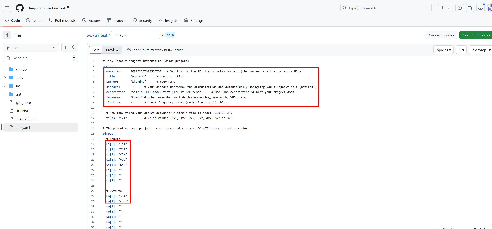
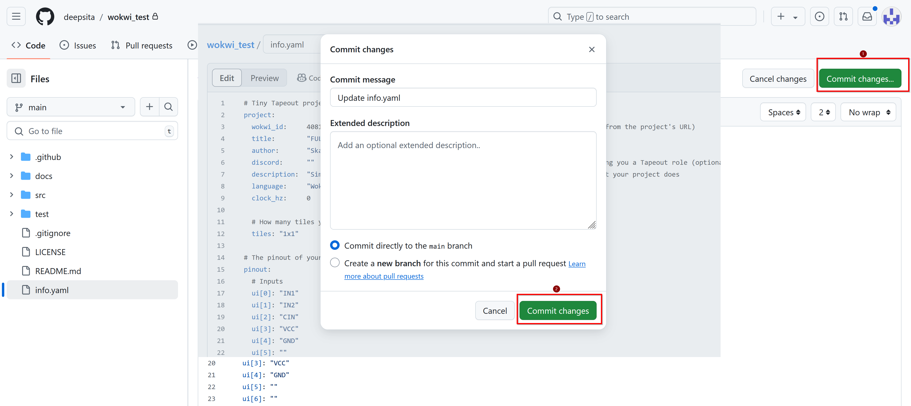
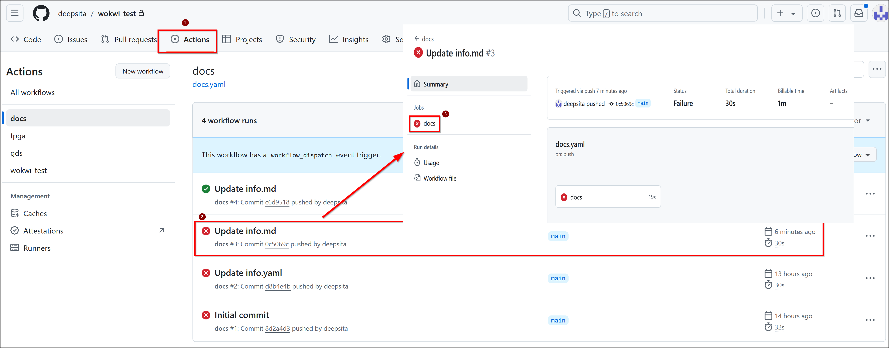
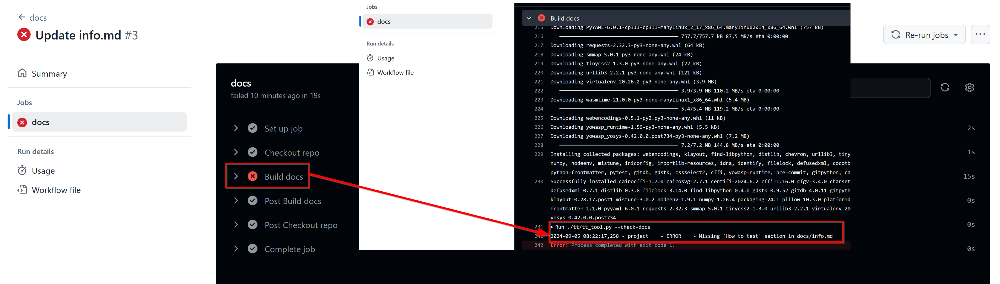
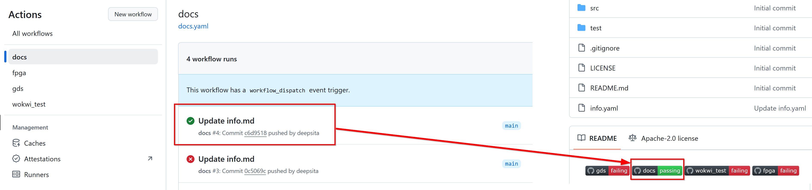
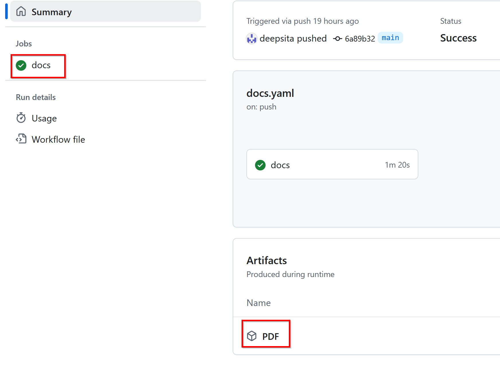

This guide will walk you through the process of preparing your design for submission using the TinyTapeout GitHub template. We’ll cover the necessary steps to convert your design into the ASIC files required for chip manufacturing and also view your files with the 3d viewer.

## Pre-requisites

   1. Check Wokwi Project: The digital design that you want to tapeout can be created following this [video tutorial](https://tinytapeout.com/digital_design/wokwi/). Note that your Wokwi project should comply with the [Tiny Tapeout Wokwi template](https://wokwi.com/projects/354858054593504257).
   2. Github Account:  If you don’t have a GitHub account, sign up for one from [here](https://docs.github.com/en/get-started/start-your-journey/creating-an-account-on-github).

## Access the GitHub Template

1. Navigate to the Template Repository: 

   - GitHub templates are predefined configurations or starter files that streamline the creation of new repositories, issues, or pull requests.
   - Repository Templates are used to create new repositories with predefined structure and files (e.g., documentation, configuration files). 
   - There two types of template repositories: one for Wokwi designs and another for Verilog or other HDLs. For this guide, we'll use the [Wokwi Template](https://github.com/TinyTapeout/tt09-wokwi-template). 

2. Create Your Repository:
   - Click the ‘Use this template’ button to generate your own copy of the repository.



## Enable GitHub Actions
GitHub Actions allow automated tasks to run. They are enabled by default, but we need to enable them to publish the results.
   1. Go to Repository Settings: Access your repository’s settings page of the repo that is created by you from the template.
   2. Configure Build and Deploy Source: Navigate to the “Pages” section and set the build and deploy source to GitHub Actions.
   3. Allow Actions: Ensure that actions are enabled to create the results page.

##  Edit the `info.yaml` File

   1. Adjust Wokwi ID: For Wokwi projects, update the Wokwi ID in the `info.yaml` file of yur repository to match the ID from your Wokwi project.
   
   2. Fill Metadata:
      - Enter the 'title', 'author', and your 'discord' username if applicable.
      - It is recommended to include a brief project description in the 'description' field.
      - For the Wokwi projects, the 'language' field should be set to 'Wokwi'.
      - If your project has clock frequency specification, provide the frequency in Hz under the 'clock_hz' field.
   
   3. Describe Pins:
      - Provide descriptions for the pins in info.yaml under 'pinout' section to aid in testing the designs. 
      - The Pin description are the inputs and outputs utilised in your Wokwi Project. You can refer the Wokwi project diagram to fill the pin description fields. 
      - Note that the unused pins are to be left blank and additional pins cannot be included. 
      - Save your changes by clicking the commit button.
   

<!-- 
  -->

<!--  -->
##  Edit the `info.md` File in the Docs Directory:
   - Include detailed instructions on how to experiment with your design. 
   - This documentation is useful for users receiving the chip and for you to recall design details later and also generates the datasheet for your project. 
   - Note that leaving the info.md unmodified will cause the 'docs' action to fail. 
   - Save and commit your changes as you did before.
  
## Wokwi Actions

   1. Access Actions Tab:
      - Go to the ‘Actions’ tab in your repository to view results. 
      - Each commit will trigger these actions to run again. 
      - Find out more: how the GitHub actions work to build the [GDS](https://www.zerotoasiccourse.com/terminology/gds2/) files for your project, you can check [here](https://tinytapeout.com/making_asics/).
    
   2. Actions for Wokwi:

      - docs: This action generates a preview of how your documentation will look.
      - fpga: This action generates bitstream for a compatible FPGA
      - gds: This action generates the gds for your project, results for warnings, utilization statistics, and cell usage.
      - wokwi test: This action will test the design if you created a truth table for your Wokwi design.
      - Note that red indicates failure and green indicates success. Only the actions 'docs' and 'gds' need to be green.
 
## Troubleshoot Action Failures 

   1. Docs Action:

      - This action generates a preview of how your documentation will look.

      - Check the action result to get the status of the check. 
      - View the Errors and Modify your Docs based on the Error displayed, commit the new info.md for actions to rerun. 
   
   
      - [Tips](#tips) for common cause of errors is shown in the end of this guide.
      - Committing the changes will re-run the action and you will be able to check if your change has fixed the problem.
   
      - Download the PDF to verify formatting, your project datasheet and content.

      

<!-- 
 -->
<!--    

 -->

   2. GDS Action:

      - This action generates the GDS for your project, along with warnings, utilization statistics, and cell usage details.

      - Action View: Similar to docs action, the gds action result can be viewed from Actions Tab and selecting 'gds' under the list of 'All workflows'. The 'gds' action also has other jobs 'precheck' and 'viewer' which are dependent on the main 'gds' job.

## View your Design Summary:
The gds action if succesful generates a   summary of 

   1. gds summary:
      - Synthesis Warnings section is to display the warnings in your design. Synthesis of a design refers to  conversion of high level description of digital system to the target technology library, converting the generic gates into specific gates from a technology library (such as NAND, NOR, flip-flops, etc.) based on the fabrication process.
   
      - Standard cell usage according to the category of cells. These cells are comprised of Sky130nm PDK from [Skywater Technologies](https://skywater-pdk.readthedocs.io/en/main/index.html).
      - The details for each of the standard cells utilised in your project can be viewed by clicking on specific cells. 
   
      - The cell usage table includes additional cells such as fill cells and tap cells that are not part of your original design. certain cells like fill cells and tap cells are automatically inserted during the physical design stage to ensure the integrity of the layout and meet the manufacturing requirements. For instance, Tap cells are to prevent latch-up conditions and Fill cells are to maintain uniform density across the chip and avoid uneven metal deposition. 

   2. precheck summary:
      - The precheck summary includes the Layout pre-requisites required to be met before sending for a tapeout.
   
   
   3. viewer summary:
      - This section offers a unique feature that allows you to view the layout abstraction of your design.
      - The 3D view of your layout can be seen by clicking on 'open 3D viewer'.
   

## View GDS Of Your Design:  
   1. 2D Viewer: 
       The layout 2D Preview is directly shown in the same page.
   2. 3D Viewer: 
      - Click on 'open 3D viewer'
      - The 3D GDS of your design is rendered in a web browser tab. The key strokes for few operations are as below
            1. Hide Fill, Decap, Tap cells
            2. Hide top cell geometry
            3. Isolate selection / back
            4. Zoom to selection
      - There are other controls like Layer visibility, cell/Instances visibilty etc. 
   
      - To zoom on to the layout, sliding the mouse roller or regular zoom gesture with the mousepad works.
      - The panning of layout can be done typically by clicking and dragging.
      - The layout can be moved by Shift + Left click + drag. 
      - The layer visibility can be toggled using the checkboxes on the right of viewer under the 'layers' section.
      - For Instance, you can observe the MOSFET typically contains Active Area made of diffusion material, Gate terminal made of  polysilicon and metal layers, vias for signal routing.
   

      - Similarly, the Cells/Instances section can be utilised to toggle the visibiity of cells.
      - You can get layout view of an isolated cell selected from the whole view by selecting a required portion with  keystroke of 3. In the example shown below, the isolated cell is a four input OR gate. 
   

## Next Steps
Usually, on each commit, the workflow runs automatically, However in a scenario that you changed Wokwi design itself and now you want to check the action result, Manual action workflow is to be opted. For instance, the 'gds' action is selected to run manually as shown.
   

In such a case of change in logic of your Wokwi design, the standard cells that are inferred also change and this change can be noticed from the summary section of the latest workflow run under the Actions Tab of your repository.

## Tips
   1. View Logs:
      - The logs for each of the actions can be viewed and downloaded from the 'Artifacts' section of the actions summary page in your repository. 
   
       - The errors for any action can be viewed from the logs or the jobs section.
   

   2. Common Pitfalls:

      a. The setting of permissions to publish pages.
         - Fix: Refer and follow the [steps to enable](#enable-github-actions) the pages.

      b. Incorrect Wokwi Project ID
         - Fix: The Project Id for your projet is found on the address bar of your Wokwi project page. Recheck with the digits. Do not include any quotes for the number in the 'wokwi_id' field of info.yaml. Also note that your Wokwi project should be in compliance with the [Tiny Tapeout template](https://wokwi.com/projects/354858054593504257).

      c. Missing Docs or Unaltered docs
         - Fix: Leaving the info.md in its default original form leads to failure of docs action. The info.md doc should always be modified according to your project. 
  
<!-- 

## Working with an HDL
look at the verilog template, this is what we’d use for more advanced designs.
link to the HDL page on the website
1. **Overview**:
   - Learn how to submit a Verilog or other HDL project to TinyTapeout. Refer to the resources available on the ‘working with HDLs’ page.

2. **Verilog Demo**:
   - Review the Verilog demo repository. Ensure that the Wokwi ID is set to zero and list all necessary source files and the top module name.

3. **Testing Your HDL Design**:
   - Use a Makefile and a top-level test bench for testing. Consider gate-level verification to ensure accuracy. -->
