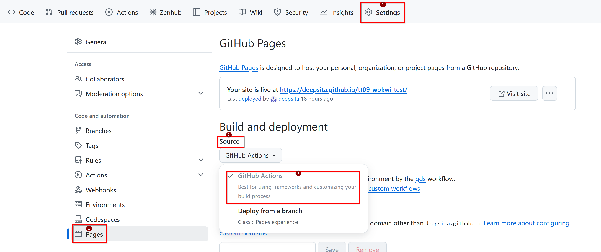
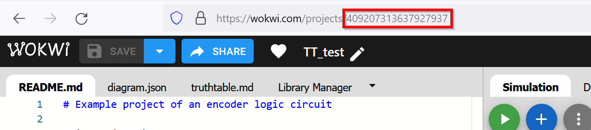
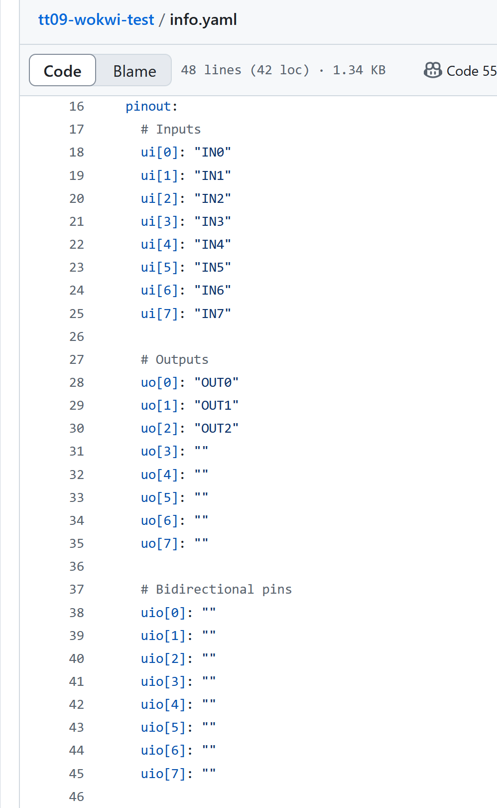
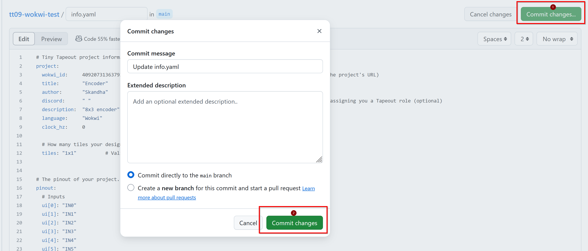

This guide will walk you through the process of preparing your design for submission using the TinyTapeout GitHub template. We’ll cover the necessary steps to convert your design into the ASIC files required for chip manufacturing and also view your files with the 3d viewer.
If you don't already have a GitHub account, please create one before proceeding.

## Access the GitHub Template

1. **Create a GitHub Account**: If you don’t have a GitHub account, sign up for one from [here](https://docs.github.com/en/get-started/start-your-journey/creating-an-account-on-github).

2. **Navigate to the Template Repository**: 
   - We offer two types of repositories: one for Wokwi designs and another for Verilog or other HDLs. For this guide, we'll use the [Wokwi template](https://github.com/TinyTapeout/tt08-wokwi-template).

3. **Create Your Repository**:
   - Click the ‘Use this template’ button to generate your own copy of the repository.

   
<!--  -->

## Enable GitHub Actions
GitHub Actions allow automated tasks to run. They are enabled by default, but we need to enable them to publish the results
1. **Go to Repository Settings**:
   - Access your repository’s settings page.

2. **Configure Build and Deploy Source**:
   - Navigate to the “Pages” section and set the build and deploy source to GitHub Actions.

3. **Allow Actions**:
   - Ensure that actions are enabled to create the results page.

   
<!--  -->
##  Edit the `info.yaml` File

1. **Adjust Wokwi ID**:
   - For Wokwi projects, update the Wokwi ID in the `info.yaml` file to match the ID from your Wokwi project.
   - For HDL projects, use the source files section as covered in a separate guide titled [Working with an HDL]().

   
<!--  -->

2. **Fill Out Metadata**:
   - Enter the title, author information, and your Discord username if applicable.
3. **Describe Pins**:
   - Provide descriptions for the pins to aid in testing other designs. 

   

    - Save your changes by clicking the commit button.

    
<!-- 
  -->

<!--  -->
##  Edit the `info.md` File in the Docs Directory

  **Update Documentation**:
   - Include detailed instructions on how to experiment with your design. This documentation is useful for users receiving the chip and for you to recall design details later. Note that leaving the info.md unmodified will cause the 'docs' action to fail. Save and commit your changes. Commit can be done in similar way as in Step 2.

   
<!--  -->

## Wokwi Actions

1. **Access Actions Tab**:
   - Go to the ‘Actions’ tab in your repository to view results. Note that each commit will trigger these actions to run again. Find out more: how the GitHub actions work to build the GDS (link to zero to asic GDS terminology page) files for your project, you can check here (link to /making_asics).
    
2. **Actions for Wokwi**:

    - docs: This action generates a preview of how your documentation will look.
    - fpga:
    - gds: Action to generate the gds for your project, results for warnings, utilization statistics, and cell usage.
    - wokwi test:
    

    

    Note that red indicates failure and green indicates success. Only the actions 'docs' and 'gds' need to be green
    Now, the Action results are to be watched to resolve the action failures.

## Troubleshoot Action Failures 

1. **Docs Action**:

   - This action generates a preview of how your documentation will look.
   - Check the action result to get the status of the check. 

   
   
   - View the Errors and Modify your Docs based on the Error showed, commit the new info.md for actions to rerun. [Tips]() for common cause of errors is shown in the end of this guide.

   

   - Commit will redpo the check and observe the status. 

    

    - Download the PDF to verify formatting and content.

    

<!-- 
 -->
<!--    

 -->

2. **GDS Action**:

   - This action results in warnings, utilization statistics, and cell usage.
   - View Action results.
   - what do the metrics mean - what standard cells are in use? is that what you expected? explain why the results here might not match your drawing
   - Use the 3D viewer to inspect your design by panning, zooming, and toggling layer visibility. open the 3d viewer
    guide to the viewer, what each part does, the short cut keys.
    - isolate a cell, where are the mosfets

## Next Steps

try adding a new standard cell and re-run the action (how to re-run)

## Tips
where to look if an action fails.  common causes
    no permissions to publish page
    issue with info.yaml incorrect wowi Id
    issue with no docs / default docs

<!-- 

## Working with an HDL
look at the verilog template, this is what we’d use for more advanced designs.
link to the HDL page on the website
1. **Overview**:
   - Learn how to submit a Verilog or other HDL project to TinyTapeout. Refer to the resources available on the ‘working with HDLs’ page.

2. **Verilog Demo**:
   - Review the Verilog demo repository. Ensure that the Wokwi ID is set to zero and list all necessary source files and the top module name.

3. **Testing Your HDL Design**:
   - Use a Makefile and a top-level test bench for testing. Consider gate-level verification to ensure accuracy. -->
