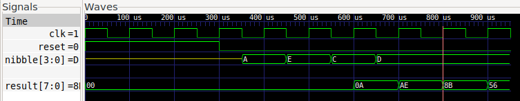

## 24 : 0b 000 011 000 : Simple multiply



* Author: Anton Maurovic
* Description: Multiply two 8-bit numbers, get a 16-bit result.
* [GitHub repository](https://github.com/algofoogle/anton1-tt03)
* HDL project
* [Extra docs](https://github.com/algofoogle/anton1-tt03/blob/main/README.md)
* Clock: Any Hz
* External hardware: 

### How it works

This very simple design streams in two 8-bit numbers (split into nibbles) and then streams out their 16-bit product (split into bytes).
      
Following a synchronous reset, each rising clock edge represents a new step in a sequence of 6 steps:
(1) load first value's high nibble; (2) load first value's low nibble; (3) load second value's high nibble; (4) load second value's low nibble;
(5) present high byte of product result at output; (6) present low byte of product result at output.

It then repeats this sequence.

### How to test

After synchronous reset, expect `result` output to be 0. Set `nibble` to a value of your choice, then pulse the clock. Repeat 3 more times.

Then pulse the clock 2 more times, each time expecting to get a byte at the output `result`.

### IO

| # | Input        | Output       |
|---|--------------|--------------|
| 0 | clock  | result[0] |
| 1 | reset  | result[1] |
| 2 | none  | result[2] |
| 3 | none  | result[3] |
| 4 | nibble[0]  | result[4] |
| 5 | nibble[1]  | result[5] |
| 6 | nibble[2]  | result[6] |
| 7 | nibble[3]  | result[7] |
