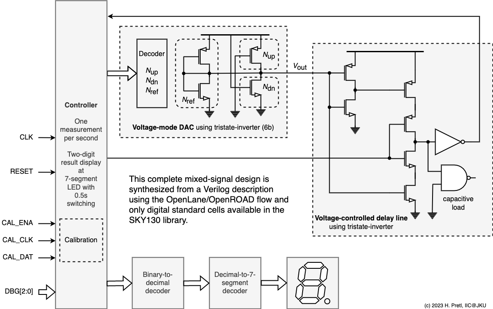

## 47 : Synthesizable Digital Temperature Sensor

* Author: Harald Pretl
* Description: Measure the on-chip temperature and display on the LED display.
* [GitHub repository](https://github.com/hpretl/tt03-tempsensor)
* [Most recent GDS build](https://github.com/hpretl/tt03-tempsensor/actions/runs/4784301820)
* HDL project
* [Extra docs](https://github.com/hpretl/tt03-tempsensor/blob/main/README.md)
* Clock: 10000 Hz
* External hardware: 

### How it works

By creatively twisting the use of a tristate-inverter (EINVP) a voltage DAC is built. This
voltage-mode DAC is used in another twisted arrangement of an EINVP to bias an NMOS into
subthreshold operation to discharge a pre-charged capacitor (the input capacitor of an inverter).
Since the subthreshold current of a MOSFET is a strong function of temperature, the resulting
delay time is also a strong function of temperature, thus a digital temperature sensor is built.

The temperature-dependent digital signal is output at the LED display, showing tens (dot off) and ones (dot on).

A calibration engine via a LUT is included, to allow to linearize and calibrate the shown
temperature code.

io_in[0] is used as a CLK signal, and io_in[1] is used a RESET.

io_in[4:2] is used to load and enable the calibration engine.

io_in[7:5] is used to enable various debug modes, presenting internal state signals to the io_out.

### How to test

After reset, one temperature measurement is taken per second and displayed using the LEDs. A code ranging 0...63 is
displayed with tens first (dot off) and ones later (dot on).

During normal operation io_in[7:5] have to be set to 000. The different debug modes are documented in the Verilog code.

For calibration, the internal LUT can be serially loaded by using CAL_CLK (io_in[2]) and CAL_DAT (io_in[3]). Once fully
loaded the calibration engine is enabled by setting CAL_ENA (io_in[4]) to 1 (setting it to 0 displays the raw sensor
code).

### IO

| # | Input        | Output       |
|---|--------------|--------------|
| 0 | clock  | segment a (or debug information) |
| 1 | reset  | segment b (or debug information) |
| 2 | cal_clk  | segment c (or debug information) |
| 3 | cal_dat  | segment d (or debug information) |
| 4 | cal_ena  | segment e (or debug information) |
| 5 | debug_mode[0]  | segment f (or debug information) |
| 6 | debug_mode[1]  | segment g (or debug information) |
| 7 | debug_mode[2]  | indicate ones or tens (or debug information) |
