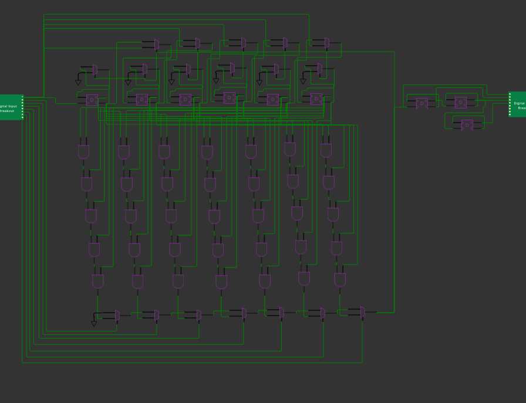

## 122 : 0b 001 111 010 : Tiny Synth



* Author: Nanik Adnani
* Description: A tiny synthesizer! Modulates the frequency of the clock based on inputs, plays a C scale (hopefully).
* [GitHub repository](https://github.com/nanikgeorge/tt02-submission-template)
* [Wokwi](https://wokwi.com/projects/348255968419643987) project
* [Extra docs](Not done yet, I would like to build this into a proper keyboard of somekind. Coming soon!)
* Clock: 12500 Hz
* External hardware: An external speaker and some way to drive it - probably a buffer of some kind on the output.

### How it works

The 6 flipflops are setup as toggle flipflops, storing a value which counts up from zero. The banks of and gates each store a value and compare it to the value stored in the flipflops as they count up. By toggling the input one of the banks of and gates is selected, when the value it is storing is reached by the flipflops, the flipflops are reset. This allows us to set and reset the last flip flop before the output to the frequency of our desired musical note. The additional flip flops on outputs 3 and 4 are there to lower the pitch, each dividing the frequency by two.

### How to test

Make sure the clock is tied to input 0, then you can play different notes by toggling the other inputs.

### IO

| # | Input        | Output       |
|---|--------------|--------------|
| 0 | clock  | Pitch +1 Octave |
| 1 | C  | Pitch |
| 2 | D  | Pitch -1 Octave |
| 3 | E  | Pitch -2 Octave |
| 4 | F  | none |
| 5 | G  | none |
| 6 | A  | none |
| 7 | B  | none |
