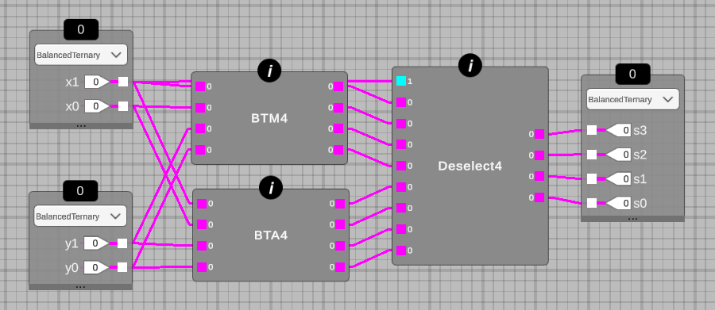

## 244 : 0b 011 110 100 : Balanced Ternary Calculator



* Author: Steven Bos
* Description: A 2-trit async balanced ternary calculator allowing multiplication, addition and subtraction with negative numbers in binary encoded ternary
* [GitHub repository](https://github.com/aiunderstand/tt03-balanced-ternary-calculator)
* HDL project
* [Extra docs](https://github.com/aiunderstand/tt03-balanced-ternary-calculator/blob/main/README.md)
* Clock: 0 Hz
* External hardware: none, but all files needed for testing on Basys3 FPGA are included

### How it works

This chip is a 2-trit asynchronous balanced ternary calculator having 2 functions: multiplication and addition/subtraction (which is one function in balanced ternary). It demonstrates how to build ternary logic with binary transistors using binary encoded ternary (BET). 1-trit (3 values) is thus encoded in 2-bits (4 values, 1 is ignored). This inefficient encoding is neccesary since current CMOS processes can only construct binary transistors. Despite this inefficiency, there are several benefits on various levels. We use balanced ternary notation meaning that each trit contains -1, 0 and +1. This allows balanced arithmethic with negative numbers without any special circuitry or convention (eg. 2's complement). Typically designing ternary logic is cumbersome. The open source tool MRCS works with binary and ternary and mixed truth tables (TT) that automatically convert to netlist and verilog. This means a designer does not need to think in binary when making ternary logic. The design can be verified 1) manually in the tool, 2) automated by uploading a CSV with TT input-output pairs, 3) by using Vivado verilog simulator (test bench is included), 4) by deploying on FPGA (constraint file for Xilinx Basys3 is included) or 5) by using HSPICE for analog verification. The HSPICE verification is currently using 3 types of carbon nanotubes transistors (CNTFET) as technology as these are designed for ternary signals. Future versions of MRCS will integrate the various SPICE libs from the Sky130 open PDK. 

### How to test

Included is a c_TT3_BTCalculator_tb file containing a test bench for simulation in a verilog simulator (eg. Vivado). The test bench shows how the chip can select either the balanced ternary multiplier function using x1 (io_in[7:6]) being logical -1 (encoded as 2'b01) or the balanced ternary adder function using x1 being logical 0  (encoded as 2'b11) or logical 1 (encoded as 2'b10). Note that this version shares input x1 with the selector function meaning that some numbers can not be computed in a certain function despite the functionality being present. One example (for other see the test bench file) in balanced ternary notation: X= -- Y= -- meaning -4 * -4 = 16. This is encoded as 01 01 01 01 with MSB being the first bit and corresponding to io_in[7]. This means that all inputs are -1 resulting in (-1* 3^1) + (-1 * 3^0) = -3 + -1 = -4. The output is 10 01 01 10 decoded as 1 -1 -1 1 meaning (1* 3^3) + (-1 * 3^3) + (-1* 3^1) + (1 * 3^0) = 27 -9 -3 +1 = 16    

### IO

| # | Input        | Output       |
|---|--------------|--------------|
| 0 | io_in[7] input x1 MSB (reused as function selector, eg 2'b01 = -1 (multiply), while 2'b11 and 2'b10 = 0 and 1 (both add/subtract)  | io_in[7] output s3 MSB (this is the most significant bit and using the balanced ternary positional system means either (3^3)*-1 = -27, (3^3)*0 = 0 or (3^3)*1 = 27 |
| 1 | io_in[6] input x1 LSB  | io_in[6] output s3 LSB |
| 2 | io_in[5] input x0  | io_in[5] output s2 MSB (3^2)*-1 = -9, (3^2)*0 = 0 or (3^2)*1 = 9 |
| 3 | io_in[4] input x0  | io_in[4] output s2 LSB |
| 4 | io_in[5] input y1 (this is the most significant bit of input Y meaning (3^1)*-1 = -3, (3^1)*0 = 0 or (3^1)*1 = 3  | io_in[3] output s1 MSB (3^1)*-1 = -3, (3^1)*0 = 0 or (3^1)*1 = 3 |
| 5 | io_in[5] input y1  | io_in[2] output s1 LSB |
| 6 | io_in[5] input y0 (3^0)*-1 = -1, (3^0)*0 = 0 or (3^0)*1 = 1  | io_in[1] output s0 MSB (3^0)*-1 = -1, (3^0)*0 = 0 or (3^0)*1 = 1 |
| 7 | io_in[5] input y0  | io_in[0] output s0 LSB |
