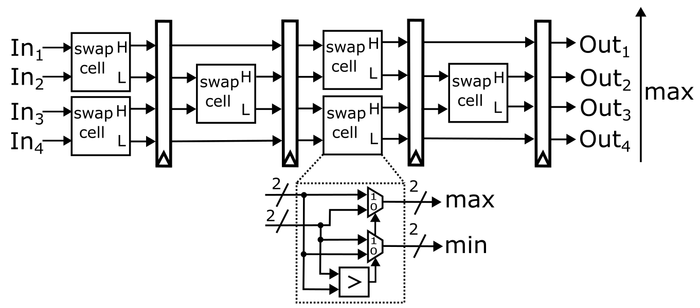

## 5 : Odd even sorter

* Author: Vasileios Titopoulos
* Description: An odd even sorter of four 2-bit values
* [GitHub repository](https://github.com/Vasitito/Odd_even_sorter)
* [GDS submitted](https://github.com/Vasitito/Odd_even_sorter/actions/runs/5655139770)
* HDL project
* [Extra docs](https://github.com/Vasitito/Odd_even_sorter/blob/main/README.md)
* Clock: 25 000 000 Hz
* External hardware: 

### How it works

The sorter takes the inputs from ui_in[7:0] signals and rearranges them properly to uo_out[7:0] signals after they pass from the four internal pipeline registers.

### How to test

Connect a clock for the internal registers and use the inputs ui_in[7:0] to assign the values to the design. The sorted values are provided through uo_out[7:0] signals

### IO

| # | Input        | Output       | Bidirectional      |
|---|--------------|--------------| -------------------|
| 0 | I0/In1[0]  | O0/Out1[0]/segment a | none |
| 1 | I1/In1[1]  | O1/Out1[1]/segment b | none |
| 2 | I2/In2[0]  | O2/Out2[0]/segment c | none |
| 3 | I3/In2[1]  | O3/Out2[1]/segment d | none |
| 4 | I4/In3[0]  | O4/Out3[0]/segment e | none |
| 5 | I5/In3[1]  | O5/Out3[1]/segment f | none |
| 6 | I6/In4[0]  | O6/Out4[0]/segment g | none |
| 7 | I7/In4[1]  | O7/Out4[1]/dot | none |
