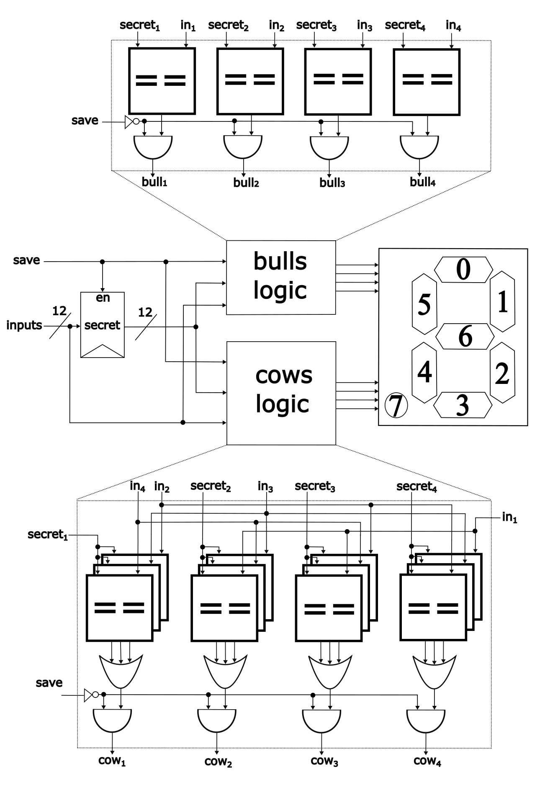

## 6 : The Bulls and Cows game

* Author: Giorgos Dimitrakopoulos
* Description: An implementation of the Bulls and Cows game
* [GitHub repository](https://github.com/gdimitrak/Bulls-and-Cows)
* [GDS submitted](https://github.com/gdimitrak/Bulls-and-Cows/actions/runs/5672228058)
* HDL project
* [Extra docs](https://github.com/gdimitrak/Bulls-and-Cows/blob/main/README.md)
* Clock: 25 000 000 Hz
* External hardware: 

### How it works

The bulls and cows is a game where the users try to discover the exact pattern of secret numbers

### How to test

Firstly, a secret pattern of four 3-bit numbers, which are different with each other, should be set. This is done through the save signal. After the secret number is set, another user tries to find the correct pattern of numbers. In order for the correct pattern to be found, the signals of cows and bulls are pinpointing as to whether the user input had any match with the secret pattern. The cows indication shows as to whether the input matches with any secret number but it is not in the right position. On the other hand, the bulls indication shows as to whether the input matches and is placed correctly. The purpose of the game is for the user to achieve four bulls indications. For the signals of bulls and cows the indications are showed through the seven segment display. In the seven segment display the bulls indication is placed in the top region (0-1-5-6) and the cows indication is placed in the bottom region (2-3-4-7) of the seven segment display.

### IO

| # | Input        | Output       | Bidirectional      |
|---|--------------|--------------| -------------------|
| 0 | I0/Number1[0]  | O0/bulls[1]/segment a | I7/Number3[0] |
| 1 | I1/Number1[1]  | O1/bulls[2]/segment b | I8/Number3[1] |
| 2 | I2/Number1[2]  | O2/cows[0]/segment c | I9/Number3[2] |
| 3 | I3/Number2[0]  | O3/cows[1]/segment d | I10/Number4[0] |
| 4 | I4/Number2[1]  | O4/cows[2]/segment e | I11/Number4[1] |
| 5 | I5/Number2[2]  | O5/bulls[0]/segment f | I12/Number4[2] |
| 6 | I6/Save the secret number  | O6/bulls[3]/segment g | none |
| 7 | none  | O7/cows[3]/dot | none |
