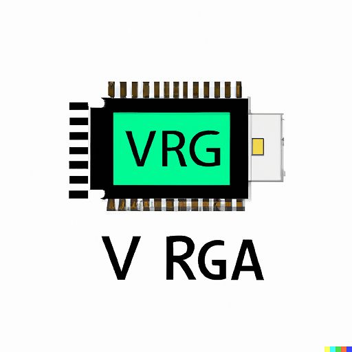

## 16 : VGA Output for Arduino

* Author: Devin Atkin
* Description: The final goal of this project is to create an arduino VGA driver. Currently it's nothing
* [GitHub repository](https://github.com/devinatkin/tt04-arduino-gpu-vga)
* [GDS submitted](https://github.com/devinatkin/tt04-arduino-gpu-vga/actions/runs/5946390880)
* HDL project
* [Extra docs]()
* Clock: 25175000 Hz
* External hardware: You're going to need to hook up a VGA output to the chip alongside the clock, to control it you'll need some form of microcontroller

### How it works

The name is overly ambitious but that's why I'll submit it to future submisisons as I add more features. :)

This project uses the CLK input to generate a VGA output, this will default to a Random noise output, the output can be set to a background colour using the SPI interface.
32'b1000_0000_1111_1100_0000_0000_0000_0000 32-bit configuration word
configuration[31:30] = 2'b11 - Set output mode 00 = Random Noise, 01 = Solid Configuration Set Colour, 10 = Coloured Text (Color set by config), 11 = Bouncing Ball
configuration[29:24] = 6'b111111 - Background Colour for Solid Colour and Colour Text
configuration[23] = (Forced to 0 given utilization issues character memory array data input)
configuration[22] = (Forced to 0 given it increases utilization too high, this may be implemented if I choose to join TT05 in the future )character memory array write
configuration[21] = Write for the character memory. (Has issues due to utilization, may be implemented if I join TT05 in the future)
configuration[20:15] = Character memory being written to row memory address

### How to test

The design has been simulated and tested with the eric eastwood simulator using the output generated by tb.v.
The output will be tested using a Basys 3 board prior to the final sumbission time permitting.
The design is currently set up to output a 640x480 60Hz VGA signal. The output is currently set to a random test pattern.
The design will have a way to adjust background colour, and draw onto the display using a few basic SPI commands. (Not yet implemented)
I'm testing my output using a VGA simulator tool online https://madlittlemods.github.io/vga-simulator/ and will be testing on a Basys 3 board prior to submission.

### IO

| # | Input        | Output       | Bidirectional      |
|---|--------------|--------------| -------------------|
| 0 | SPI MOSI  | VGA HSync | SPI MISO |
| 1 | SPI CLK  | VGA VSync | none |
| 2 | SPI CS  | VGA Red 0 | none |
| 3 | none  | VGA Red 1 | none |
| 4 | btn_up  | VGA Green 0 | none |
| 5 | btn_down  | VGA Green 1 | none |
| 6 | none  | VGA Blue 0 | none |
| 7 | none  | VGA Blue 1 | none |
