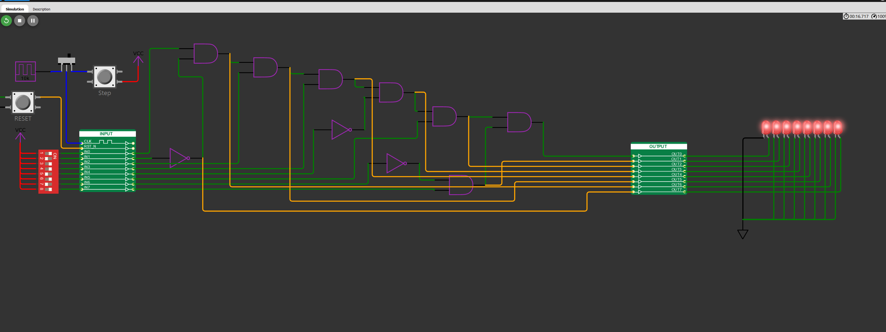

## 17 : Digital Cipher & Interlock System

* Author: Eric German MKME Lab
* Description: Digital Cipher with 256 combinations & one solution which sets output to high
* [GitHub repository](https://github.com/MKme/tt04-submission-template)
* [GDS submitted](https://github.com/MKme/tt04-submission-template/actions/runs/5706674629)
* [Wokwi](https://wokwi.com/projects/371604537887211521) project
* [Extra docs](https://github.com/MKme/tt04-submission-template/tree/main)
* Clock: 0 Hz
* External hardware: NA

### How it works

Can be used as a simple puzzle demo or as a safety chain/interlock on equipment.  Being hardware interlocks without microcontroller logic it mimics a standalone safety relay function which is used to verify all subsystems are online before allowing machinery to run. The high or low input can be tied to the sensors and switches in the safety chain. Only when all are in the desired state will the output be OKAY/HIGH.  NO and NC switches/sensors can be tied to the appropriate pins. Feedback signals are provided from gate outputs by FB1 through FB7

### How to test

Provide below inputs on the required pins to activate output

### IO

| # | Input        | Output       | Bidirectional      |
|---|--------------|--------------| -------------------|
| 0 | HIGH  | HIGH All Chain Unlocked | none |
| 1 | LOW  | FB1 Feedback signal | none |
| 2 | HIGH  | FB2 Feedback signal | none |
| 3 | HIGH  | FB3 Feedback signal | none |
| 4 | LOW  | FB4 Feedback signal | none |
| 5 | HIGH  | FB5 Feedback signal | none |
| 6 | LOW  | FB6 Feedback signal | none |
| 7 | HIGH  | FB7 Feedback signal | none |
