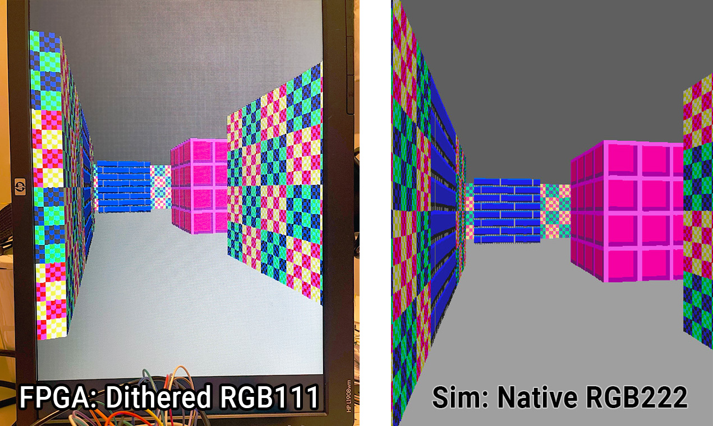

## 33 : raybox-zero

* Author: algofoogle (Anton Maurovic)
* Description: Simple VGA ray caster game demo
* [GitHub repository](https://github.com/algofoogle/tt04-raybox-zero)
* [GDS submitted](https://github.com/algofoogle/tt04-raybox-zero/actions/runs/6125308887)
* HDL project
* [Extra docs](https://github.com/algofoogle/tt04-raybox-zero/blob/main/README.md)
* Clock: 25000000 Hz
* External hardware: VGA connector with RGB222 DAC

### How it works

NOTE: Expect updates after the TT04 datasheet is made.
Check tt04-raybox-zero's README (https://github.com/algofoogle/tt04-raybox-zero)
for latest info.

This framebuffer-less VGA display generator is 'racing the beam' to yield a simple realtime
"3D"-like render of a game map using ray casting. It's inspired by Wolf3D and based on
Lode's Raycasting tutorial (https://lodev.org/cgtutor/raycasting.html). Think of it as
a primitive 'GPU' using a grid map of wall blocks, with basic texture mapping
and flat-coloured floor/ceiling. No doors or sprites -- but maybe in TT05?
In TT04's 130nm process we use 4x2 tiles (~0.16mm&sup2;) at ~48% density.

Without a framebuffer, rendering/animation occurs at full speed. Registers store the
'POV' (Point of View) to render. It's expected that a host controller
implements game/motion logic and calculates the POV, then sending it to the chip via SPI
(`ss_n`/`sclk`/`mosi`). An MCU or low-spec CPU should do. I've been bit-banging
SPI with a Raspberry Pi Pico.

At reset the POV registers are set to an angled view of the inbuilt 16x16 grid map.

NOTE: "FPS games" like Wolf3D use a landscape display, i.e. normal desktop monitor
orientation. I designed this as a portrait display (rotated 90&deg; clockwise) for silicon
area optimisations that come with rendering by scanline instead of by column. If you don't want
a sideways monitor, design a game/demo using this different perspective.
For example, image Mario's 1st-person view of his 2D platform world...

###### Features

* 640x480 VGA display at ~60Hz from 25MHz clock (25.175MHz ideal)
* Registered and unregistered digital VGA outputs: RGB222 and H/VSYNC
* Portrait "FPS" orientation
* Hard-coded 16x16 map with 3 textures: light- and dark-side variations
* SPI interface to set POV with debug option to see POV register bits
* 'SPI2' interface to set ceiling colour, floor colour, or floor 'leak'
* Reset loads an interesting POV. Optional 'demo mode' inputs can vary it.
* HBLANK and VBLANK outputs as optional interrupt requests

###### A warning about turning your screen on its side

As stated, this is designed to drive a display with a *portrait* orientation when
used as a "first person shooter" but BEWARE: The backlights failed on *two* old flat
panel VGA displays (from circa 2003) not long after I turned them on their sides.
Coincidence? Age? A CCFL failure mode? Not sure. I'm using a monitor from 2008 now.

### How to test

Attach a VGA connector's HSYNC and VSYNC to the chip's respective outs with (say) inline 100R resistors
for protection. Connect at least `red[1]`, `green[1]`, `blue[1]` with inline 270R resistors,
or better yet use an R2R DAC on each colour output *pair*. Make sure VGA GND is connected, of course.

Pull up `reg` to select 'registered outputs'. Without this, you will get the unregistered versions, which
might be murky or have some timing issues -- I included this option for testing purposes.
In the actual ASIC version of this, I expect the registered outputs will be much cleaner, but we'll see.

Supply a 25MHz clock (or ideally 25.175MHz), and assert the `reset` signal, and you should get a
clockwise-90&deg;-rotated display of textured walls with dark grey ceiling (right-hand side)
and light grey floor (left-hand side).

Pull up the `debug` input and you should see little squares show up in the corner of the screen that
represent the current state of the POV registers.

Pull up either/both of `inc_px/py` and the view should drift along slowly.
This is 'demo mode'. Don't be alarmed when it goes through walls, or for periods when you see half the
screen is just grey and the other half is flickering different colours -- this just means you're moving
*through* a wall block.

Changing POV: https://github.com/algofoogle/tt04-raybox-zero#write-pov-via-spi

### IO

| # | Input        | Output       | Bidirectional      |
|---|--------------|--------------| -------------------|
| 0 | SPI in: sclk  | hsync_n | Out: o_hblank |
| 1 | SPI in: mosi  | vsync_n | Out: o_vblank |
| 2 | SPI in: ss_n  | red[0] | SPI2 in: reg_sclk |
| 3 | debug  | red[1] | SPI2 in: reg_mosi |
| 4 | inc_px  | green[0] | SPI2 in: reg_ss_n |
| 5 | inc_py  | green[1] | none |
| 6 | reg  | blue[0] | none |
| 7 | none  | blue[1] | none |
