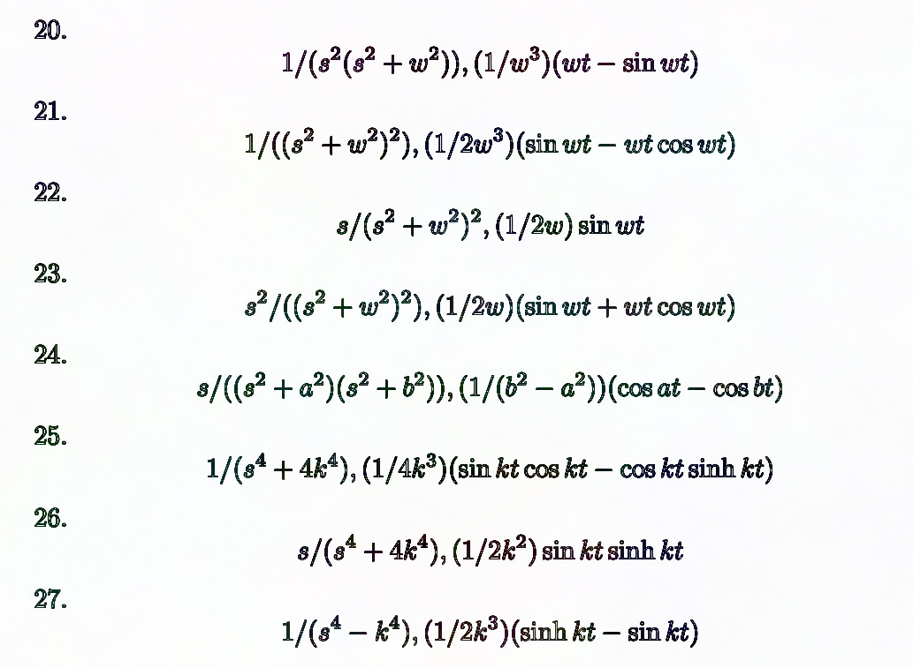

## 50 : Experiment Number Six: Laplace LUT

* Author: Paul Hansel
* Description: ASCII ROM encoding the LaTeX characters needed to typeset the Laplace transforms of a few specialized functions.
* [GitHub repository](https://github.com/phansel/tt04-experiment-number-six)
* [GDS submitted](https://github.com/phansel/tt04-experiment-number-six/actions/runs/6080005203)
* HDL project
* [Extra docs]()
* Clock: 1 Hz
* External hardware: 

### How it works

This project provides an ASCII encoding of the LaTeX code to typeset a few dozen Laplace transforms of common functions. When the user sets the lower ui_in pins to a number, asserts reset and then asserts ui_in 6 high, the project will begin clocking out the transform char-by-char, with uio_out showing F(s) = L{f(t)} and uo_out showing f(t) itself. If either one is shorter than the other for a particular transform, empty space characters are appended. It uses two different address spaces to do this: mem_addr, which maps each pair of concatenated ASCII characters (function, transformed function) from all transforms back-to-back as 16-bit values to a linear 10-bit address space, and pointer_addr, which maps the concatenated start address and length of each row (within mem_addr space) as 20-bit values to that row's line number in an 8-bit address space (with only 6 bits used). The read-only Verilog containing the actual ASCII data is generated by a python script that reads the LaTeX source directly. Verification is achieved in the same way.

### How to test

Program a number onto ui_in[5:0] between 0 and 43. Toggle reset_n (high/low/high), then toggle ui_in[6] high to start printing. Watch uo_out and uio_out for the resulting ASCII characters. The input address bus accepts a number (0-45) corresponding to an arbitrary Laplace tranform encoding; it must be set before asserting start. The active-high character output enable signal must be high to start or continue character output. The clock divider disable input must be high to run at full speed or low to run at 1 character per 5x10^7 clocks.

### IO

| # | Input        | Output       | Bidirectional      |
|---|--------------|--------------| -------------------|
| 0 | Address bit 0  | RHS_BIT_0 | LHS_BIT_0 |
| 1 | Address bit 1  | RHS_BIT_1 | LHS_BIT_1 |
| 2 | Address bit 2  | RHS_BIT_2 | LHS_BIT_2 |
| 3 | Address bit 3  | RHS_BIT_3 | LHS_BIT_3 |
| 4 | Address bit 4  | RHS_BIT_4 | LHS_BIT_4 |
| 5 | Address bit 5  | RHS_BIT_5 | LHS_BIT_5 |
| 6 | Character output enable  | RHS_BIT_6 | LHS_BIT_6 |
| 7 | Clock divider disable  | RHS_BIT_7 | LHS_BIT_7 |
