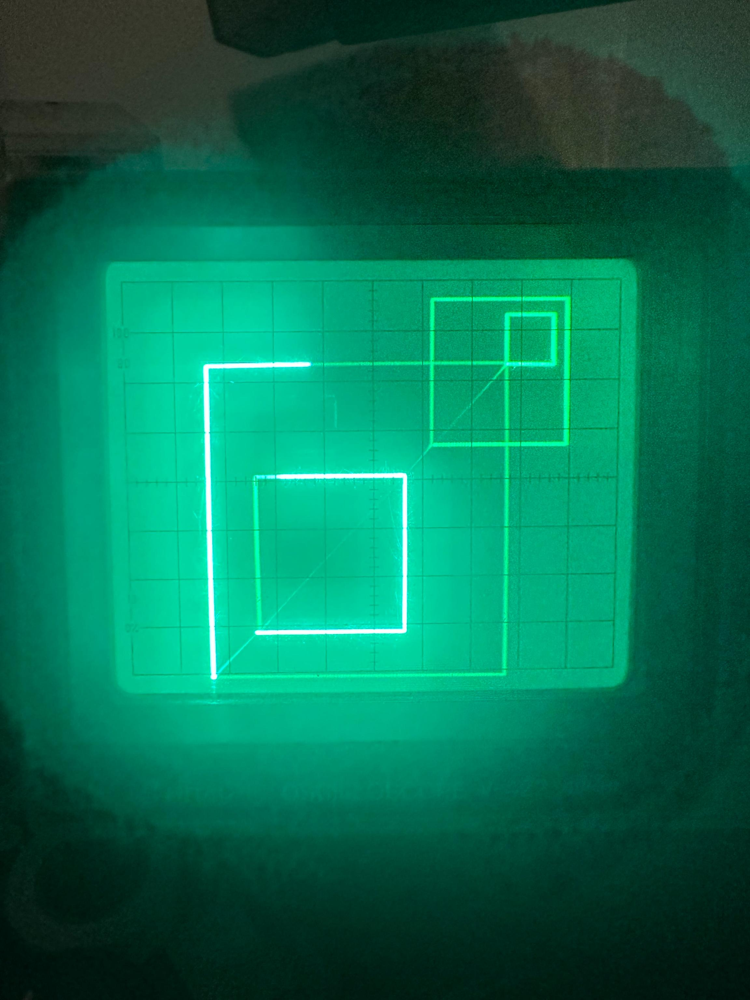

## 96 : Dandy VGA

* Author: Blaise Saunders
* Description: Serial vector graphics adapter
* [GitHub repository](https://github.com/DavidoRotho/tt04-davidroth-dandy-vga)
* [GDS submitted](https://github.com/DavidoRotho/tt04-davidroth-dandy-vga/actions/runs/6110577489)
* HDL project
* [Extra docs](https://github.com/DavidoRotho/tt04-davidroth-dandy-vga)
* Clock: 10000000 Hz
* External hardware: 2 DACs, vector graphics display, fastish UART input

### How it works

This module is a serial vector graphics adapter [ or VGA for short ;^) ] it has a small set of state machine based primitive instructions
that can be programmed over serial and animated etc. It does a nice job of drawing squares and I'm hoping 3D graphics can be achieved
with use of the line primitive. There are 16 instruction registers that can be programmed and updated live over serial.

### How to test

The device outputs 8 bits on the bidirectional IO and 8 bits on the output pins, one is for X and the other is for Y display on a
vector graphics display, most oscilloscopes with XY mode should work well. Can convert to analog with a simple R2R resistor ladder
or whatever method you like best :). You can find some test code that can be flashed a Teensy or similar and hook it up to pin 1
on the input to send some primitives to be drawn: https://github.com/DavidoRotho/tt04-davidroth-dandy-vga

### IO

| # | Input        | Output       | Bidirectional      |
|---|--------------|--------------| -------------------|
| 0 | UART RX input, 921600 baud input. Tested with Teensy 4.1  | binary X axis output [7:0] | binary Y axis output [7:0] |
| 1 | Safe/Unsafe mode toggle, unsafe high. Whether or not to wait while  | n/a | n/a |
| 2 | binary graphics clock divider for compensating for slow DAC drive speed [2:7]  | n/a | n/a |
| 3 | n/a  | n/a | n/a |
| 4 | n/a  | n/a | n/a |
| 5 | n/a  | n/a | n/a |
| 6 | n/a  | n/a | n/a |
| 7 | n/a  | n/a | n/a |
