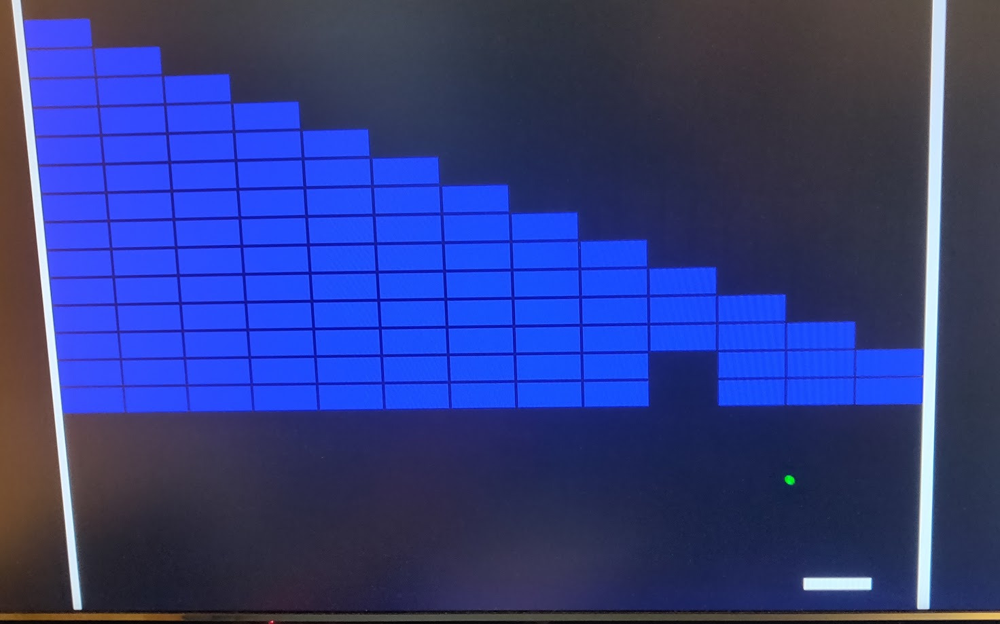

## 98 : Tiny Breakout

* Author: Robbert-Jan de Jager
* Description: This is a small breakout game implemented in HDL. It uses a VGA connector to output the video signal. The game is controlled by 3 buttons. The left button moves the paddle to the left, the right button moves the paddle to the right and the action button starts the game. The game is over when all blocks are destroyed or when the ball hits the bottom of the screen.
* [GitHub repository](https://github.com/robojan/tt04-breakout-submission)
* [GDS submitted](https://github.com/robojan/tt04-breakout-submission/actions/runs/5778717649)
* HDL project
* [Extra docs](https://github.com/robojan/tt04-breakout-submission/blob/main/README.md)
* Clock: 25175000 Hz
* External hardware: 3x 2bit DAC for the red, green and blue video signals. VGA connector. 3 buttons.



### How it works

#### Basic operation

The core of the design is the vga_timing module. This module generates all the required timing signals. Some of these signals like hsync and vsync
are used to generate the video signal, while others like the horizontal and vertical position are used to generate the graphics. The horizontal and
vertical sync signals are also used for the game logic.

Before outputting the video signal the video mux selects the correct input color to display. It does so based on the highest priority component that
wants to output a color.

We have multiple painter modules. These generate from the current game state and the current horizontal and vertical position the correct color to
display. Ideally the painters would not contribute to the game logic, but for optimization reasons they do.

While drawing a frame the game logic keeps track of collisions. It does so by checking if multiple painters want to draw at the same position. If so
it will latch a collision, which will be processed after drawing the frame.

At the end of each frame the game logic will calculate the next ball position, taking collisions into account. The collision with the paddle is special.
To have an entertaining game that does not play the same every time the ball will bounce off the paddle at a different angle depending on where it hits.
This is done by splitting the paddle into multiple segments and checking for collisions with these segments. The game logic will look at the segment
when a paddle collision was registered. An exception to the end of frame gamestate update is the breaking of blocks. It would require too much memory to
keep the updated state for the next frame. Instead we will update the row of blocks that was just finished drawing.

We can display a grid of 13x16 blocks. This requires 208 bits of memory. This is a lot of memory for such a small design and takes up a lot of space.
To reduce the number of connections the state has been put into a shift register that outputs one row at a time. This shift register is rotated 13 bits
when we reach the end of drawing a row of blocks. Also we can write to the shift register the new block state if a block has been broken. This is done
one clock cycle before shifting to the next row. 1 clock cycle after shifting to the next row we load the current row into a buffer which will be used
to update the state.


### How to test

This is a small breakout game implemented in HDL. It uses a VGA connector to output the video signal.
The game is controlled by 3 buttons.
The left button moves the paddle to the left, the right button moves the paddle to the right and the action button starts the game.
The game is over when all blocks are destroyed or when the ball hits the bottom of the screen.

##### Required hardware

This project requires a VGA monitor and a VGA DAC. An easy way to create the VGA DAC is to use 3 2-bit R2R DACs.
The 2-bit R2R DACs can be created using 2 resistors per bit. The resistors should be 200Ohm and 390Ohm. For the 3.3V power supply.

**What has not been verified is the current sourcing capability of the ASIC, If it can not at least source 10mA through each pin and
30mA through the power supply pins you should add a buffer before the DAC.**

The VGA DAC should be connected as follows:

```
           ___       ___
Bit 0 ----|___|--+--|___|-- GND
           390   |   390
                .-.
                | |
            200 | |
                '-'
          ____   |  
Bit 1 ---|____|--+---- Out
          390
```

Every color should have an identical copy of this DAC. The red DAC should be connected to the red VGA pin,
the green DAC to the green VGA pin and the blue DAC to the blue VGA pin. The outputs of the DACs should be connected to the VGA
connector. The HSync and VSync pins should also be connected to the VGA connector.
The following connections need to be made to the VGA connector:

- Red DAC output to VGA connector pin 1
- Green DAC output to VGA connector pin 2
- Blue DAC output to VGA connector pin 3
- HSync to VGA connector pin 13
- VSync to VGA connector pin 14
- GND to VGA connector pin 5, 6, 7, 8

##### SPI interface

For changing the game state externally you can use the SPI interface.
The SPI interface returns the current game state when reading and accepts a few commands when writing.
The SPI interface uses 16 bit words.

The returned state is as follows:

- bit 0-12: The block state of the current row. Use HBlank and VBlank to determine which row is currently being drawn.
- bit 13: right button state
- bit 14: left button state
- bit 15: action button state
- bit 16: collision state. This bit is set when a collision has been detected.
- bit 17: ball out of bounds. This bit is set when the ball is off screen.
- bit 18: game state: 0 = game idle, 1 = game running
- bit 19-20: remaining lives

When writing the first word is the command word, the following words are the data words for the command.
Command words:

- 0x0000: Do nothing. Usefull when you want to read the state.
- 0x0001: Write a row state. This will shift the state to the next row. Be sure to only use this during the VBlank and call
  this with 15 words to completely draw the screen.
- 0x0002: Send control word. The next word is the control word. The control word is as follows:
  - bit[0]: Send the stop game command.

##### Board configuration

The ASIC requires an input clock of 25.175MHz. The 7-Segment display is not used.


### IO

| # | Input        | Output       | Bidirectional      |
|---|--------------|--------------| -------------------|
| 0 | MOSI  | HSync | MISO |
| 1 | SCK  | VSync | HBlank |
| 2 | slave select  | Red output bit 0 | VBlank |
| 3 | none  | Red output bit 1 | sound output. Connect to a speaker with amplifier. |
| 4 | none  | Green output bit 0 | none |
| 5 | Button left  | Green output bit 1 | none |
| 6 | Button right  | Blue output bit 0 | none |
| 7 | Button action  | Blue output bit 1 | none |
