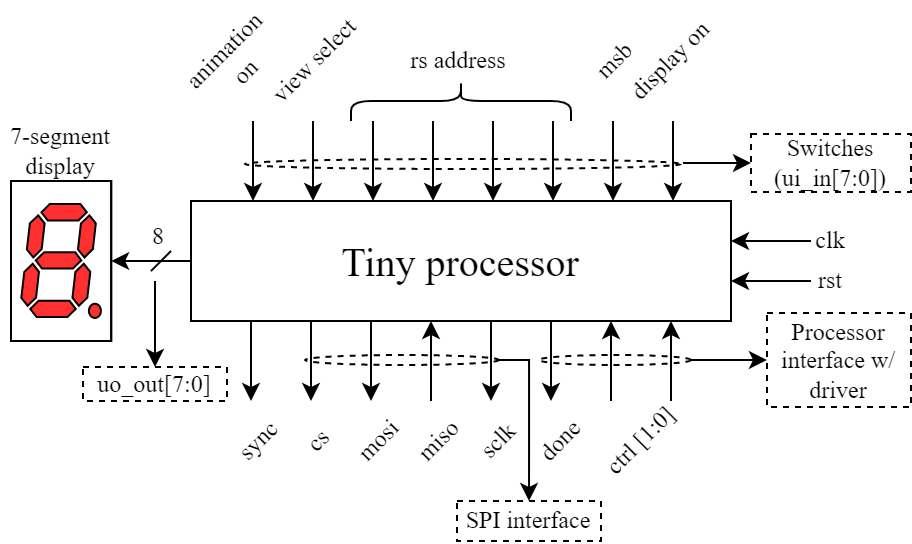

## 102 : Tiny processor

* Author: Kosmas Alexandridis
* Description: An 8-bit processor
* [GitHub repository](https://github.com/kosmalex/tiny_processor)
* [GDS submitted](https://github.com/kosmalex/tiny_processor/actions/runs/6125311778)
* HDL project
* [Extra docs](./README.md)
* Clock: 25 000 000 Hz
* External hardware: FPGA, a device that supports SPI (optional)

### How it works

The design is an 8-bit processor that supports communication with a single external device through the
Serial Periferal Interface or SPI protocol, and has the capability to animate the seven segment display.
To use the processor an additional external driver is needed. In this project we use an Digilent Nexys A7 FPGA. The FPGA is programmed w/ the driver.sv module. The driver's
internal storages (imem, dmem) are initialized w/ .mem files. The driver then sends this data to the processor and signals it to begin
execution. Once execution is finished the user can view the contents of the GPRs or watch an animation on the 7-segment display.

### How to test

1. Write and assemble a simple program using the provided assembler (more on that in the README.md) to generate a .mem file. This file will be used to initialize the instructions' memory of the processor. Make a similar .mem initialization file for registers.
2. Open Xilinx' Vivado and create a project containing all the necessary file (e.g. driver.sv, tp.xdc).
3. Replace the desired file paths in the **readmemh** macros in the driver.sv module for instructions and data.
4. Connect the processor to the FPGA.
5. Program the FPGA using Vivado.

- Turn on the switch connected to the **drive** signal of the driver module. This will signal the driver to begin intializing the processor and signal it to start execution.
- Use the first switch to turn the 7-seg display [on] and [off].
- Use the second switch to select which 4-bit values (msbs [on] or lsbs [off]) of a Byte, you wish to see on the 7-seg display.
- The switches[5:2] represent the 4-bit address used to index the 14 registers available for display.
- The sixth switch changes the source between instruction [on] and data [off] memory.
- The last switch enables the animation of the 7-seg display. If it is turned on, the display's source is the animation register (x9). Otherwise it displays the data stored in one of the processor's memories.

**Note:** Unless the processor has stopped executing (is in its `IDLE` state), the contents of its memories will not be clearly visible on the display.

### IO

| # | Input        | Output       | Bidirectional      |
|---|--------------|--------------| -------------------|
| 0 | Display on/off  | segment a | Driver_ctrl[0] (I) |
| 1 | Most Significant Bits  | segment b | Driver_ctrl[1] (I) |
| 2 | RS_addr[0]  | segment c | Done executing (O) |
| 3 | RS_addr[1]  | segment d | Serial clock   (O) |
| 4 | RS_addr[2]  | segment e | MISO           (I) |
| 5 | RS_addr[3]  | segment f | MOSI           (O) |
| 6 | View select  | segment g | Chip select    (O) |
| 7 | Animation on/off  | dot | Sync           (O) |
