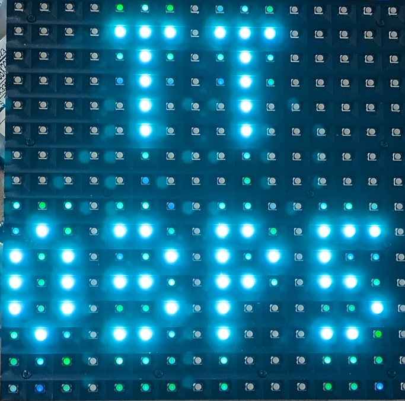

## 112 : LED Panel Driver

* Author: Tom Keddie
* Description: Drives a 16x16 P10 LED panel
* [GitHub repository](https://github.com/TomKeddie/tinytapeout-2023-tt04a)
* [GDS submitted](https://github.com/TomKeddie/tinytapeout-2023-tt04a/actions/runs/6077733585)
* HDL project
* [Extra docs]()
* Clock: 12000000 Hz
* External hardware: led panel, level converter to 5V logic

### How it works

* The circuit updates a P10 16x16 LED display module
* It initially displays the string TT03P5
* It provides a 1.2Mbaud uart input to
  - paint pixels
  - erase pixels
  - clear the display
  - change the displayed colour
* Functionality is limited by resource availability
  - single colour at once
  - no double buffer, updates may have artifacts
* Mode pin to allow for 2 different clocking patterns

### How to test

* Connect the display module as per the outputs
* Connect the uart
* Power on and see the TT03P5 text
* If the display is swapped by quadrant change the mode pin
* Use the script(s) in the software directory to control the display

### IO

| # | Input        | Output       | Bidirectional      |
|---|--------------|--------------| -------------------|
| 0 | uart  | red0 | red1 |
| 1 | mode  | blue0 | blue1 |
| 2 | none  | b | green1 |
| 3 | none  | blank | none |
| 4 | none  | green0 | none |
| 5 | none  | a | none |
| 6 | none  | clk | none |
| 7 | none  | latch | none |
