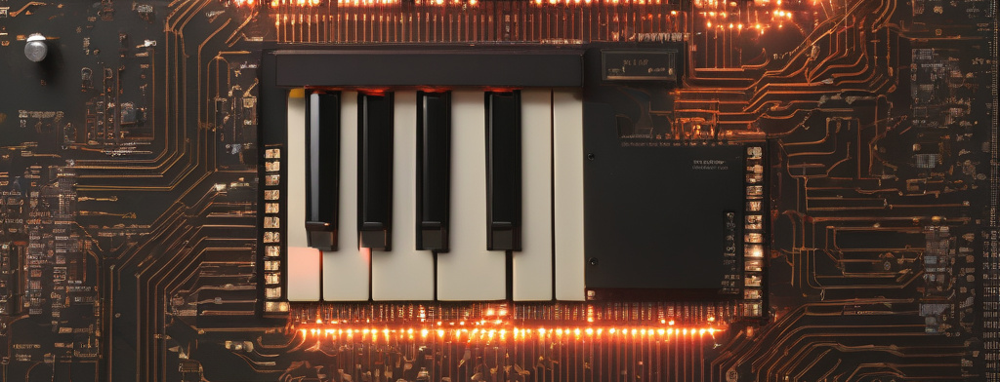

## 165 : Simple Piano

* Author: Sarthak Raheja and Bittu N
* Description: An eight octave twelve key piano with two inbuilt songs. The design can be customized and incorporated as per user requirement in multiple use cases.

* [GitHub repository](https://github.com/diadatp/vlsi-iisc-tt4)
* [GDS submitted](https://github.com/diadatp/vlsi-iisc-tt4/actions/runs/6113198516)
* HDL project
* [Extra docs]()
* Clock: 1000000 Hz
* External hardware: 12 momentary switches, 4 toggle switches, an led bar and a speaker

### How it works

Description: Twelve Independent Tonal Frequencies and Two Pre-defined Songs

Introduction: In this ASIC, we generate twelve independent tonal frequencies and two predefined songs based on RTTTL. This design features sixteen input switches for selecting one of two modes, one of eight octaves, any one of twelve notes. In the demo mode one out of two keys can be used to select the song.

Tone Generation:
Clock generation: The design makes use of a 1MHz clock to generate tonal frequencies/notes. A tone gen module generates a specific frequency, which is configured based on user input.
Song demo mode: The design includes a note sequencer that steps through one of two predefined songs. The songs are stored as a list of note-duration pairs. The sequence is generated from an RTTTL description of the songs.

Output Channels:
The ASIC generates one single ended square wave output for the notes and the remaining outputs are used to drive an LED bar visualizer.

Clock, Enable and Reset:
Clock Input: The ASIC requires an external clock signal of 1MHz to synchronize its operations. This clock signal ensures that all generated tones and sentences are coherent and correctly timed. This allows us a frequency resolution of less than 0.5%.
Enable: The design only produces output when the enable pin is held high.
Reset Mechanism: The chip features a reset input, allowing you to reset its internal state and restart the frequency generation process if needed.

### How to test

The design requires a 1MHz clock. The design needs to be reset before using and enable must be set to 1 for output.
To test the piano function, set the mode toggle to 0 and press any one of the twelve keys just as you would on a piano.
To test the demo function, set the mode toggle to 1 and press either the C or C# keys for a short song.
The audio output is single ended and must be fed to an amplifier.

### IO

| # | Input        | Output       | Bidirectional      |
|---|--------------|--------------| -------------------|
| 0 | Note E  | LED bar [6] | Mode piano = 0 & demo = 1 |
| 1 | Note F  | LED bar [5] | Octave [3] |
| 2 | Note F#  | LED bar [4] | Octave [2] |
| 3 | Note G  | LED bar [3] | Octave [1] |
| 4 | Note G#  | LED bar [2] | Note C |
| 5 | Note A  | LED bar [1] | Note C# |
| 6 | Note A#  | LED bar [0] | Note D |
| 7 | Note B  | Audio out | Note D# |
