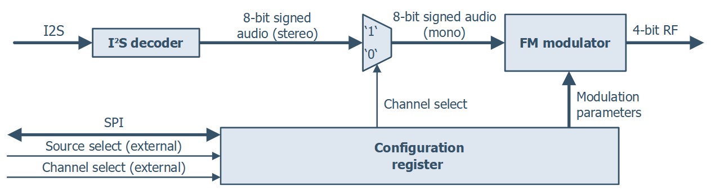

## 195 : FM Transmitter

* Author: Jan Kral (<jan.kral@vut.cz>), Ondrej Kolar (<ondrej.kolar@vut.cz>)
* Description: FM transmitter with I2S input
* [GitHub repository](https://github.com/jankralx/tt04-fm-transmitter)
* [GDS submitted](https://github.com/jankralx/tt04-fm-transmitter/actions/runs/6125688305)
* HDL project
* [Extra docs](https://github.com/jankralx/tt04-fm-transmitter/blob/main/README.md)
* Clock: 50000000 Hz
* External hardware: 4-bit R-2R DAC, I2S source, SPI (optional)

### How it works

Our design takes an audio signal and modulates it to a higher carrier frequency, using [*FM modulation*](https://en.wikipedia.org/wiki/Frequency_modulation). The modulator in our design is based on a [*numerically controlled oscillator*](https://en.wikipedia.org/wiki/Numerically_controlled_oscillator) (NCO) with several modifications.

The *frequency control word*, which increments the *phase accumulator*, is being added with the audio signal. This results in the phase increments proportional to the current audio sample level. The variation directly determines the actual shift of the output signal frequency. For the conversion of phase to a harmonic signal (sine wave) NCOs usually use look-up tables or [*CORDIC algorithm*](https://en.wikipedia.org/wiki/CORDIC). However, both of these methods are resource-heavy, therefore the design adopts a very rough, piecewise linearized approximation of the sine function. The main upside of this approach is the lightweight implementation, which utilizes only simple bit-shifting and addition operations.

Since the output digital-to-analog converter suggested below is not followed by a [*reconstruction filter*](https://en.wikipedia.org/wiki/Reconstruction_filter), the output signal will not be present only on a single frequency but also on several higher ones, sometimes called *mirrors* (as they appear on frequencies mirrored by the sampling frequency and its multiples). Thanks to this, it is possible to get the signal in the range of FM broadcast band, even with the sampling frequency lower than the carrier frequency.

### How to test

**Disclaimer! Our design is not intended for real *on air* use. Any signals generated by our design are far from ideal and require proper filtering. Improper use will most probably violate your local regulations. Use only at your own risk!**

For testing the design you need to provide an audio source using the I2S bus interface. You can use for example Raspberry Pi. For the output, you need to build a DAC. A simple [*R–2R resistor ladder network*](<https://en.wikipedia.org/wiki/Resistor_ladder#R%E2%80%932R_resistor_ladder_network_(digital_to_analog_conversion>)) should be enough for testing. The schematic is provided in our [GitHub repository](https://github.com/jankralx/tt04-fm-transmitter).

### IO

| # | Input        | Output       | Bidirectional      |
|---|--------------|--------------| -------------------|
| 0 | i2s_clk  | dac[0] (LSB) | none |
| 1 | i2s_din  | dac[1] | none |
| 2 | i2s_ws  | dac[2] | none |
| 3 | i2s_ws_align_pin  | dac[3] (MSB) | none |
| 4 | audio_chan_sel_pin  | none | spi_clk (in) |
| 5 | multiply_sel_pin  | none | spi_csn (in) |
| 6 | dith_disable_pin  | none | spi_mosi (in) |
| 7 | none  | none | spi_miso (inout) |
