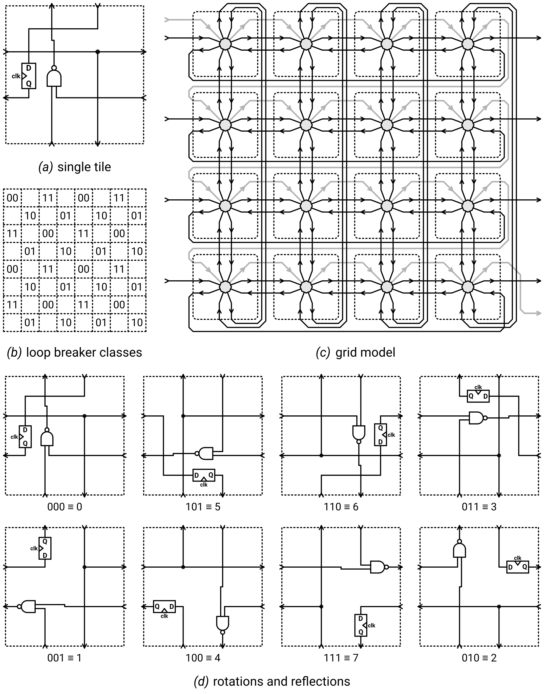

## 197 : ROTFPGA v2

* Author: htfab
* Description: A reconfigurable logic circuit made of identical rotatable tiles
* [GitHub repository](https://github.com/htfab/rotfpga2)
* [GDS submitted](https://github.com/htfab/rotfpga2/actions/runs/6125388821)
* HDL project
* [Extra docs](https://github.com/htfab/rotfpga2/blob/main/README.md)
* Clock: 10000000 Hz
* External hardware: 

### How it works

ROTFPGA v2 is a reconfigurable logic circuit built from identical copies of the tile in
Figure *(a)* containing a NAND gate, a D flip-flop and a buffer, with each
tile individually rotated or reflected as described by the FPGA configuration. It is a port
of the original [ROTFPGA](https://github.com/htfab/rotfpga) from Caravel to TinyTapeout.
Porting the design required a 50-fold decrease in chip area which was achieved using a
combination of cutting corners, heavy optimization and a few design changes. In particular:

- The FPGA was reduced from 24×24 to 8×8 tiles.
  There are 8 inputs and 8 outputs instead of 12 each.
- To compensate for smaller size, tiles can also be mirrored in addition to rotation.
- Tiles (being the most repeated part of the design) were rewritten as hand-optimized
  gate-level Verilog.
- Each tile only contains 1 flip-flop (the one exposed to the user). Configuration is
  now stored in latches.
- Configuration and reset are performed using a routing-efficient scan chain, so the design
  is no longer routing constrained. This allows standard cells to be placed with >80% density.
- Openlane and its components are 2 years more mature, hardening the same HDL more efficiently.

###### Configuration

Each tile can be configured in 8 possible orientations. Bits 0, 1 and 2 correspond to a diagonal,
horizontal and vertical flip respectively. Any rotation or reflection can be described as a
combination as shown in Figure *(d)*. (The bottom row looks somewhat different,
but we just rearranged the wires so that the inputs and outputs line up with the unmirrored tiles.)

Tiles are arranged in an 8×8 grid:

- Top, bottom, left and right inputs and outputs are connected to the tile in the respective direction.
- Tiles mostly wrap around, e.g. the bottom output of a cell in the last line connects to the top input
  of the cell in the first line.
- As an exception to the wrapping rules, left inputs in the first column correspond to chip inputs and
  right outputs in the last column correspond to chip outputs.
- There is a scan chain meandering through all the tiles, visiting lines from top to bottom and within
  each line going from left to right.

Figure *(c)* shows a 4×4 model of the tile grid. When the *scan enable* input is 0,
the FPGA operates normally and each tile sets its flip-flop to the input it receives from one of
the neighboring tiles according to its current rotation/reflection (black arrows).
When *scan enable* is 1, it sets the flip-flop to the value received through the scan chain instead
(grey arrows). This allows us to set the initial state of each flip-flop and also to query their
state later for debugging. With some extra machinery it also allows us to change the rotations/reflections.

When the 2-bit *configuration* input is is 01, each cell updates its *vertical flip* bit to the
current value of its flip-flop. Similarly, for 10 it sets the *horizontal flip* and for 11 it
sets the *diagonal flip*. When *configuration* is 00, all three flip bits are latched and the
orientation doesn't change.

One can thus configure the FPGA by sending the sequence of all *diagonal flip* bits through the
scan chain, then setting *configuration* to 11 and back to 00, then sending all *horizontal flip*
bits, setting *configuration* to 10 and back to 00, and finally sending the *vertical flip* bits
and setting *configuration* to 01 and back to 00.

Note that in order to save space the flip bits are stored in latches, not registers. Changing the
*configuration* input from 00 to 11 or vice versa can cause a race condition where it is
temporarily 01 or 10, overwriting the horizontal or vertical flip bits. Therefore one should
configure the diagonal flips first.

###### Loop breaker

The user design may intentionally or inadvertantly contain combinational loops such as ring
oscillators. To help debug such designs, the chip has a loop breaker mechanism using
a *loop breaker enable* input as well as a 2-bit *loop breaker class* input.

Tiles are assigned to loop breaker classes according to Figure *(b)*.
The loop breaker latches a tile output if and only if the following conditions are all met:

- The *loop breaker enable* input is 1.
- The current tile has a non-empty class that is different from the *loop breaker class* input.
- The output doesn't come from the tile's flip-flop.

The loop breaker has the following properties:

- If *loop breaker enable* is 1 and *loop breaker class* is constant, there are no combinational
  loops running. If we also pause the clock, the circuit keeps a steady state.
- If *loop breaker enable* is 1 and we cycle *loop breaker class* through all possible
  values repeatedly while the clock is paused, everything will eventually propagate.
  If we also assume that the design has no race conditions, it will behave in the same
  way as if *loop breaker enable* was 0.

###### Reset

Setting the *active-low reset* input to 0 has the following effect:

- Override *scan enable* to 1, *scan chain* input to 0 and disengage the latches for
  vertical, horizontal and diagonal flips. When kept low for 64 clock cycles this will reset
  the state and configuration in every tile.
- Override *loop breaker enable* to 1 and *loop breaker class* to 00.
  This ensures that we play nice with other designs on TinyTapeout and keep a steady
  state while our design is not selected.

### How to test

Follow the test suite in `src/test.py`.

### IO

| # | Input        | Output       | Bidirectional      |
|---|--------------|--------------| -------------------|
| 0 | tile(0,0) left in  | tile(7,0) right out | _scan enable_ input |
| 1 | tile(0,1) left in  | tile(7,1) right out | _scan chain_ input |
| 2 | tile(0,2) left in  | tile(7,2) right out | _configuration_ input bit 0 |
| 3 | tile(0,3) left in  | tile(7,3) right out | _configuration_ input bit 1 |
| 4 | tile(0,4) left in  | tile(7,4) right out | _loop breaker enable_ input |
| 5 | tile(0,5) left in  | tile(7,5) right out | _loop breaker class_ input bit 0 |
| 6 | tile(0,6) left in  | tile(7,6) right out | _loop breaker class_ input bit 1 |
| 7 | tile(0,7) left in  | tile(7,7) right out | _scan chain_ output |
