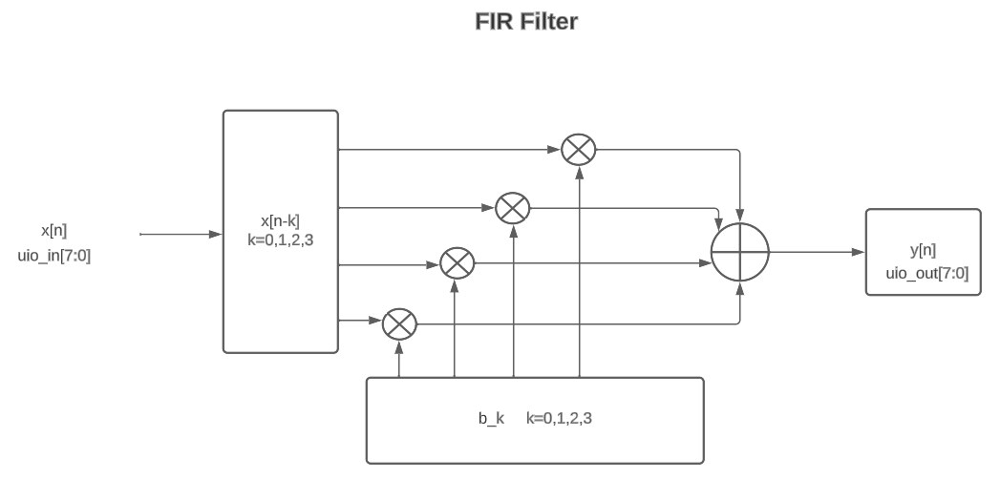

## 199 : FIR Filter

* Author: Daniel González
* Description: FIR Filter with 4 coefficients
* [GitHub repository](https://github.com/DanielG1010/verilog-template)
* [GDS submitted](https://github.com/DanielG1010/verilog-template/actions/runs/6062458312)
* HDL project
* [Extra docs](https://github.com/DanielG1010/verilog-template)
* Clock: 10000000 Hz
* External hardware: Requires a microcontroller to send the x[n] values for the input signal

### How it works

Uses for coefficients which can be defined by the user with the swtichs, or by default 1s are used. The last 4 values of the input signal are multiplied by the coefficients and sum to generate the output value.

### How to test

You have to send the input signal x[n] with the uio_in, and the output uio_out will be the output signal y[n]

### IO

| # | Input        | Output       | Bidirectional      |
|---|--------------|--------------| -------------------|
| 0 | {'ui_in': 'Assign custom coefficients, ui_in[7:3] with sel [2:1] and enable [0]'}  | {'uio_out': 'Output y[n]'} | None |
| 1 | {'uo_out': 'does nothing'}  | n/a | n/a |
| 2 | {'ui_in': 'Input x[n]'}  | n/a | n/a |
| 3 | {'uio_oe': 'does nothing'}  | n/a | n/a |
| 4 | {'ena': 'enables the shift register for taking the inputs'}  | n/a | n/a |
| 5 | {'clk': 'clock'}  | n/a | n/a |
| 6 | {'rst_n': 'when 0 past values of x[n] are set to 0 and coefficients to 1s'}  | n/a | n/a |
| 7 | n/a  | n/a | n/a |
