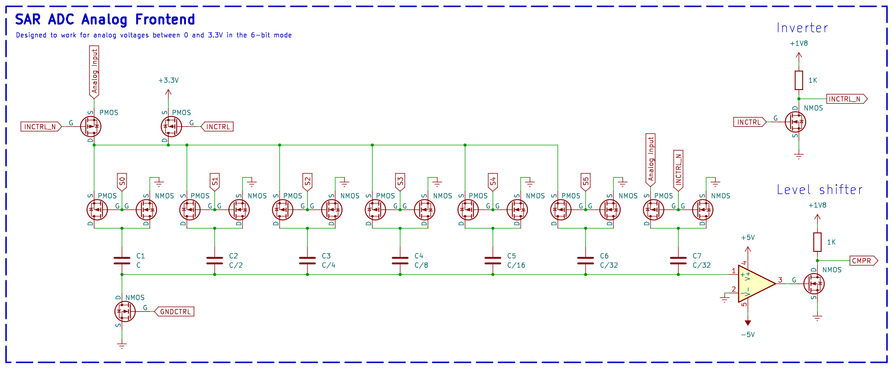

## 262 : SAR ADC Backend

* Author: Hugo Frisk
* Description: A digital backend of a successive approximation digital to analog converter (SAR ADC) featuring two interfaces: I2C or an 11-bit parallel bus.
* [GitHub repository](https://github.com/PepperoniPingu/tt04-submission-SAR-ADC-Backend)
* [GDS submitted](https://github.com/PepperoniPingu/tt04-submission-SAR-ADC-Backend/actions/runs/6114816375)
* [Wokwi](https://wokwi.com/projects/372347167704674305) project
* [Extra docs]()
* Clock: 100000 Hz
* External hardware: Op-amp, some precise capacitors, resistors, negative supply, and, p-channel and n-channel mosfets

### How it works

This is the digital backend of a charge redistrbution successive approximation analog to digital converter (SAR ADC).
A SAR ADC converts an analog voltage to a digital value by successively recreating better and better
approximations of the input analog signal. The analog frontend consists of a bank of capacitors where every
capacitor has half of the previous capacitors capacitance. Each capacitor can be connected to either the positive or
the negative supply, controlled by the digital backend. This forms a variable capacitive divider, or in simpler
terms, a digital to analog converter with very high output impedence. The voltage created by the divider is sent to
a comparator and compared with a reference voltage. In this implementation, the hold circuit that samples the analog
input is combined with the capacitor bank.

See this document from Texas Instruments that the design is based on: https://www.ti.com.cn/cn/lit/an/slyt176/slyt176.pdf

### How to test

The precision of the ADC can be set to either 11-bits or 6-bits (for faster measurements). When PRECSEL is low, the ADC is in
11-bit mode. When PRECSEL is high, the ADC is in 6-bit mode. S6 through S10 should be left floating when in 6-bit mode.

In the picture of this design there is an example circuit of how the analog frontend could be built. Note that it is not
tested so use your own judgement and don't blow up your chip.

There are two ways to interface with the ADC:

1. Through a 6- or 11-bit paralell bus:
   To make a measurement, pulse START/BUSY high. While the measurement is taking place the pin will remain high as to
   signal that it is busy. When the pin goes low, the measurement is done. Store the measurement by reading S0 through
   S10. S0 is MSB and S10 is LSB.

2. Through I2C:
   Connect SCL and SDA to a microcontroller with pullups. The I2C address of the ADC can be configured to
   either 0x34 or 0x35. When ADRSEL is high, the address is 0x34 and when it is low it is 0x35. To make a measurement,
   send a write command to configured address with the data 0x01. Read the measurement by requesting 2 bytes from
   configured address. The ADC will NACK the request if it is still busy with the measurement.

Make sure RST_N is pulsed low after a power cycle.

The clock speed that this design works at is yet to be determined and is left as an exercise to the engineer.

### IO

| # | Input        | Output       | Bidirectional      |
|---|--------------|--------------| -------------------|
| 0 | CMPR  | S0 | START/BUSY |
| 1 | PRECSEL  | S1 | SCL |
| 2 | ADRSEL  | S2 | SDA |
| 3 | none  | S3 | S8 |
| 4 | none  | S4 | S9 |
| 5 | none  | S5 | S10 |
| 6 | none  | S6 | INCTRL |
| 7 | none  | S7 | GNDCTRL |
