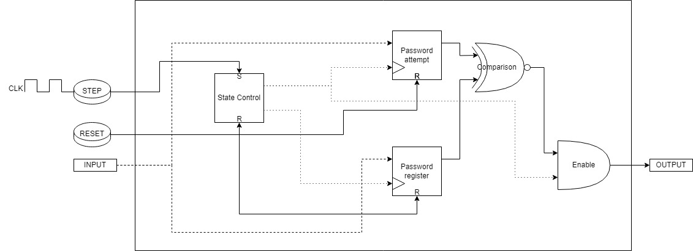

## 279 : IFSC 6-bit Locker

* Author: Gabriel Mota, Luis Davi Kenig Paganella and Vinícius Westphal de Paula
* Description: A lock that receives a 6-bit entry combination.
* [GitHub repository](https://github.com/viniwestphal/tt04-submission-IFSC-Locker)
* [GDS submitted](https://github.com/viniwestphal/tt04-submission-IFSC-Locker/actions/runs/6115950807)
* [Wokwi](https://wokwi.com/projects/375246321309880321) project
* [Extra docs]()
* Clock: 0 Hz
* External hardware: requires two step buttons and some LED or display

### How it works

The circuit has 6 input pins (representing a 6-bit password), 1 for the Step button (Clock of the circuit), and 1 for the Reset button. Each of the 6 inputs is connected to 2 registers, called password register and attempt register. Control between the state of registering a password and trying to enter a password is done by a latch connected with its output to one AND gate and its inverted output to another AND gate. When powering up the circuit, a reset must be performed first to ensure its correct operation. Then, it is possible to register the default password using the switches. The first clock pulse through the button registers the default password in 6 D-type flip-flops (DSR), which store this information in the circuit indefinitely until the Reset button is pressed. When the Step button is pressed again, the next clock signals update the other 6 DSR flip-flops in the attempt register. The comparison between each pair of flip-flops is done by an XOR gate with an inverter at the end, as it is necessary to compare when both flip-flops have the same logic state. To prevent the lock from being released when no password is registered (since in the initial state both sets of flip-flops would be cleared), an AND gate is inserted into a set of OR gates connected to the output of each "password register" flip-flop. In other words, the comparison between flip-flops will only be enabled when a password has been registered.

### How to test

For the circuit to operate, it is necessary to use a Step button that connects to pin IN0 to VCC when pressed, and another Reset button in the same configuration, connected to pin IN1. The remaining inputs from IN2 to IN7 are connected to 6 switches linked to VCC. When powering up the circuit, the circuit is reset with the Reset button, allowing a password to be registered. The user must adjust the switches as desired to form a combination and then press the Step button to register the password. After that, the next times the Step button is pressed, comparisons are made between the original combination and the tested combination, and a logical signal is sent to the output pins that can be used as desired.

### IO

| # | Input        | Output       | Bidirectional      |
|---|--------------|--------------| -------------------|
| 0 | Step Button  | Lock Exit State | none |
| 1 | Reset Button  | Lock Exit State | none |
| 2 | Switch Entry 1  | Lock Exit State | none |
| 3 | Switch Entry 2  | Lock Exit State | none |
| 4 | Switch Entry 3  | Lock Exit State | none |
| 5 | Switch Entry 4  | Lock Exit State | none |
| 6 | Switch Entry 5  | Lock Exit State | none |
| 7 | Switch Entry 6  | Lock Exit State | none |
