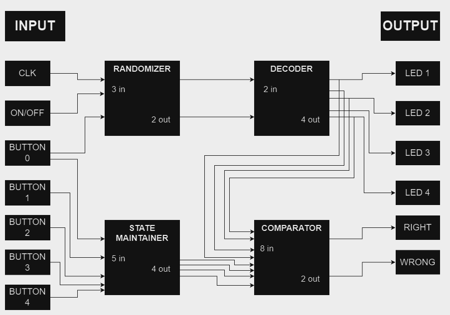

## 288 : Randomizer and status checker

* Author: Thomas Linden, Karla Gabrielly Viana Nascimento, Maria Eduarda Amelco, Arthur Hasse
* Description: it randomizes a number between 0 and 3, a corresponding led will light up. After that will compare with a button pressed by the user and say if it was true or false
* [GitHub repository](https://github.com/karla-gabrielly/tt04-submission-Randomizer-and-Status-Checker)
* [GDS submitted](https://github.com/karla-gabrielly/tt04-submission-Randomizer-and-Status-Checker/actions/runs/6115135906)
* [Wokwi](https://wokwi.com/projects/375217288209912833) project
* [Extra docs]()
* Clock: 64 Hz
* External hardware: 

### How it works

General Description: The circuit is a random number generator, that will turn on a random LED between LED 1 and LED 4. Then, the player should press the button with the number corresponding to the LED that is on, and the circuit will say if it is the RIGHT or WRONG button. The button 0 will make the circuit restart, generating another random number.

Blocks Description: When ON, the circuit will run a 4 bit counter, that will oscilate between 0 and 3 (binary). When the 0 button receives an input, the randomizer will select the number out of the counter, and send it to decoder, that will turn on one of the LEDs.

Now, the user have to press a button between 1 and 4, that correspondes to the LED that is on. This signal is sent to the comparator, that will cross the information with the LEDs that is on, and will sign if was pushed the right or the wrong button with the Right or Wrong LEDs.

As the goal is to use "no hold" buttons, the signal will be sent to the state maintainer, that will keep it in high level, so the right/wrong LEDs keep on. When the button 0 is pressed again, the state maintainer will reset it output.

### How to test

In the inputs, the user will need to connect 5 momentary switch labeled from "Button 0" to "Button 4." The clock signal considered in CLK is 64 Hz, but any value above 20 Hz will work as expected.

On the ON/OFF input, a switch should be connected, or it can be driven directly to a high logic level.

On the outputs, 6 LEDs should be connected.

To start, the first step is to turn the switch to ON/OFF, and then press BUTTON 0.

One of the four LEDs will light up.The user should press the button corresponding to the LED that is on. If the correct button is pressed, the RIGHT LED will light up; if another button is pressed, the WRONG LED will light up.

### IO

| # | Input        | Output       | Bidirectional      |
|---|--------------|--------------| -------------------|
| 0 | clock  | LED 1 | none |
| 1 | on/off  | LED 2 | none |
| 2 | button 0  | LED 3 | none |
| 3 | button 1  | LED 4 | none |
| 4 | button 2  | LED True | none |
| 5 | button 3  | LED False | none |
| 6 | button 4  | none | none |
| 7 | seletor  | none | none |
