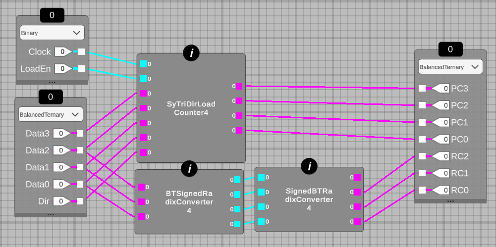

## 291 : 4-trit balanced ternary program counter and convertor

* Author: Steven bos
* Description: A 4-trit synchronous balanced ternary (BT) program counter allowing tri-directional counting (up, down, hold) and jump/load the program counter. The other part is a 3-trit asyncronous BT radix converter.
* [GitHub repository](https://github.com/aiunderstand/tt04-balanced-ternary-counter-and-radix-convertor)
* [GDS submitted](https://github.com/aiunderstand/tt04-balanced-ternary-counter-and-radix-convertor/actions/runs/6114924600)
* HDL project
* [Extra docs](https://github.com/aiunderstand/tt04-balanced-ternary-counter-and-radix-convertor/tree/main/README.md)
* Clock: 0 Hz
* External hardware: 

### How it works

This design tests various aspects of the MRCS verilog generator in combination with the new pin capabilities of TT. It tests both a sync and async design and uses all the available pins including the bidirectional io. The program counter is the ternary version of the binary one submitted for TT2. It is scalable, loadable (needed for both initialization and jump) and can count up,down and hold. 4-trit BT counters have a range of -40 to 40. The second design has two radix converters: BT to signed binary and immediately followed by a signed binary to BT converter. The output is thus a copy of the input if within range. The design is 4-bit signed binary as intermediate format and has a range of -8 to 7. BT input should thus not be higher or the output is wrong. The BT encoding is 2'b10 is logical 1, 2'b11 is logical 0, 2'b01 is logical -1 and 2'b00 is illegal.

### How to test

The repository has a FPGA folder where a verilog testbench is included with test input. The screenshot shown in the readme is expected as output (a pyramid counting up and down). The design is also tested on the Basys3 FPGA. The FPGA version is only minor different than the verilog file for the ASIC as the data direction (bi-dir) pins are not needed for the FPGA. Inputs {data2,data1,data0} are used for the radix convertor chain and inputs {data3,data2,data1,data0} for the program counter.

### IO

| # | Input        | Output       | Bidirectional      |
|---|--------------|--------------| -------------------|
| 0 | clock  | uo_out[7] PC data3 MST | {'uio_in[7]': 'data3 MST'} |
| 1 | reset  | uo_out[6] PC data3 | {'uio_in[6]': 'data3'} |
| 2 | ui_in[7] data2 MST (most significant trit)  | uo_out[5] PC data2 MST | {'uio_out[5]': 'RC data2 MST'} |
| 3 | ui_in[6] data2  | uo_out[4] PC data2 | {'uio_out[4]': 'RC data2 MST'} |
| 4 | ui_in[5] data1 MST  | uo_out[3] PC data1 MST | {'uio_out[3]': 'RC data1 MST'} |
| 5 | ui_in[4] data1  | uo_out[2] PC data1 | {'uio_out[2]': 'RC data1 MST'} |
| 6 | ui_in[3] data0 MST  | uo_out[1] PC data0 MST | {'uio_out[1]': 'RC data0 MST'} |
| 7 | ui_in[2] data0  | uo_out[0] PC data0 | {'uio_out[0]': 'RC data0 MST'} |
