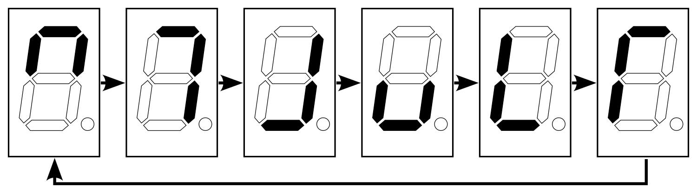

## 353 : Adjustable Frequency LED Chaser

* Author: Daniel Teal
* Description: Animates a seven-segment display given any clock
* [GitHub repository](https://github.com/dteal/tt04-led-chaser)
* [GDS submitted](https://github.com/dteal/tt04-led-chaser/actions/runs/6122792647)
* [Wokwi](https://wokwi.com/projects/375288605206694913) project
* [Extra docs]()
* Clock: any Hz
* External hardware: 

### How it works

This is a simple LED chaser animation for a seven-segment display, but a configurable bank of clock dividers allows the animation to run at human speeds (1-10Hz) for all input clock frequencies. The intent is to support a wide range of testing situations: as long as there's any clock and display whatsoever, you get a pretty demo.

It can also be used as a frequency counter in a pinch.

### How to test

The chip clock input should be connected to any clock source of nonzero frequency. Examples include a manual tactile switch, a kHz clock source, or the maximum MHz source supported by the chip. The reset input is not used. Standard inputs 0--4 can be set high or low and are ideally adjustable, e.g., via a DIP switch array. These inputs may safely be toggled high and low while the chip is running. Inputs 5--7 are not used. Standard outputs 0--5 should be connected in order to the perimeter elements of a seven-segment display or equivalent. Outputs 6--7 are not connected internally (and so may be connected to a display anyway with no effect). The bidirectional IO is not used.

By default, a new frame of the 6-frame LED chaser pattern is displayed on outputs 0 through 5 every rising clock edge. Inputs 0 through 4 toggle clock dividers of 2x ($2^1$), 4x ($2^2$), 16x ($2^4$), 256x ($2^8$), and 65536x ($2^{16}$) respectively. These dividers stack multiplicatively for a maximum clock division of $2^31$ = 2.15e9, which easily slows the maximum expected 50MHz clock to sub-Hertz frequencies.

Combine a subset of the clock dividers for fine adjustment. For example, one might find the original clock signal makes the animation far too fast to see, applying the 65536x divider makes it too slow, and the combination of 256x and 16x dividers (for a total 4096x) works well. Clock division factors are intentionally chosen to be able to express any power of two.

Finally, note the first six frames after chip startup may be partially incorrect due to noise. Later frames should be correct.

### IO

| # | Input        | Output       | Bidirectional      |
|---|--------------|--------------| -------------------|
| 0 | enable 2x ($2^1$) divider  | segment a | n/c |
| 1 | enable 4x ($2^2$) divider  | segment b | n/c |
| 2 | enable 16x ($2^4$) divider  | segment c | n/c |
| 3 | enable 256x ($2^8$) divider  | segment d | n/c |
| 4 | enable 65536x ($2^{16}$) divider  | segment e | n/c |
| 5 | n/c  | segment f | n/c |
| 6 | n/c  | n/c | n/c |
| 7 | n/c  | n/c | n/c |
