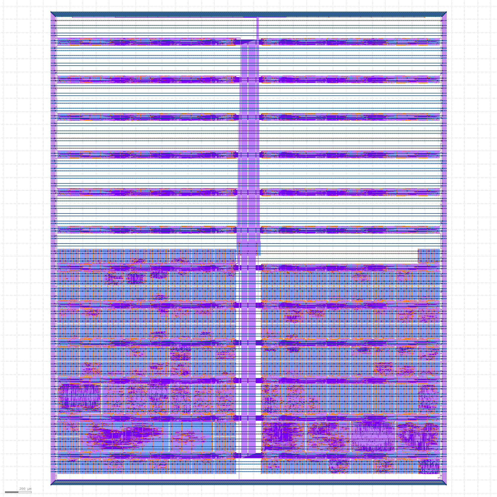

{}

# Detalles del diseño

* [Repositorio de Github](https://github.com/TinyTapeout/tinytapeout-04)
* [Hoja de Datos en PDF](https://tinytapeout.github.io/tinytapeout-04/datasheet.pdf)
* [Envío de Efabless](https://repositories.efabless.com/urish/tinytapeout-04)
* [Indice de transporte  ](https://tinytapeout.github.io/tinytapeout-04/shuttle_index.json)

# Estadísticas de lanzamiento

* Lanzamiento: 1 de julio de 2023
* Envío cerrado: 8 de septiembre de 2023
* Enviado al shuttle Effabless [2309C chipIgnite](https://efabless.com/shuttle-status) utilizando Skywater 130nm de código abierto PDK.
* Se espera que los chips lleguen en febrero de 2024, y las PCB en marzo del 2024

# Estadisticas de proyecto

* 143 proyectos
* Envíos de más de 30 países
* Tiempo de fabricación para todos los proyectos de 8.6 horas
* Total de celdas de 82126
* Máximo de celdas de 6813 para [project 033](./033)
* La máxima utilización fue del 87.18% para [project 016](./016)
* Longitud total de cable de 2607 mm
* 92 usaron Verilog, 46 Wokwi, 1 SystemVerilog, 1 SpinalHDL, 1 mrcs, 1 spade, 1 RustHDL
* 10 etiquetas más utilizadas:
    - test      : 18
    - timer     : 12
    - experiment: 12
    - game      : 9
    - clock     : 7
    - pwm       : 5
    - serial    : 5
    - vga       : 4
    - music     : 4

# Renderizado de la matriz completa

# Testimonios

Davey: TinyTapeout me ha dado la increíble oportunidad de seguir algo que creía que sólo podría hacer tras años de educación terciaria, ¡silicio personalizado diseñado por mí! La configuración de los flujos de trabajo CI/CD del equipo hace muy sencillo para cualquiera iniciar con los ASIC, ¡Motivo a la gente a que le dé una oportunidad! 

----

Kheng Meng: Tiny Tapeout me dió el empujón para finalmente retomar el diseño digital básico.

Comencé a través de los excelentes tutoriales de Wokwi para hacerme una idea de como funciona el diseño digital a nivel de compuerta. Excelentes recursos disponibles para dejarme adaptar proyectos para hacer mi propio controlador de LCD de 7 segmentos.

Después de que mi interés creció y viendo como aún tengo tiempo antes de la fecha límite, me llevó rápidamente a elegir Verilog, ¡que me llevó a enviar mi segundo proyecto de PWM! Algunas veces realmente necesitas una fecha límite para empujarte. 🙂

La comunidad de Discord también fue de mucha ayuda respondiendo rápidamente cualquier duda que tuve.

----

Ashley: Fue un placer participar en TinyTapeout. ¡El flujo de diseño fue increíblemente simple! En base a mi experiencia previa con herramientas para diseño de silicio es realmente excelente que el proceso de RTL a GDS pasa al click de un botón con solo unos pocos archivos de configuración y todos ellos alojados en GitHub. Cualquier pregunta que tuve fue respondida rápidamente por el equipo y otros miembros del equipo en Discord. ¡Estoy deseando probar mi diseño cuando el silicio llegue!

----

Donnel: Tiny Tapeout es un cambio radical para estudiantes univesitarios. Nos ha otorgado a mi compañero y a mí la oportunidad única de crear e implementar nuestro propio diseño en un ASIC, algo que a menudo está fuera del alcance para estudiantes universitarios. No me canso de repetir cuánto aprendí a través de todo el proceso, y el conocimiento es realmente invaluable para mi. ¡No podría estar más agradecido por la experiencia!

----

mgyenik77: Gracias al duro esfuerzo del equipo de Tiny Tapeout, hacer tu propio ASIC ha pasado de un sueño imposible a un proyecto de un fin de semana!

----

Robojan: Tiny Tapeout es un proyecto increíble donde ingenieros pueden adquirir experiencia práctica diseñando un chip digital. Frecuentemente he soñado sobre crear el diseño de un chip, pero pensaba que no era viable hacerlo como un proyecto de hobby. Cuando encontré Tiny Tapeout en Youtube estuve enganchado. Inmediatamente creé un diseño y lo envié. El proceso fue relativamente simple, pero cuando tuve algunas preguntas ¡la comunidad estuvo dispuesta a ayudar!

----

SteveJ: TinyTapeout es una fantástica manera de tomar tus habilidades de diseño digital al siguiente nivel. Con geniales herramientas y una amigable comunidad, cada día trabajando en ello fue interesante y divertida. ¡Espero al siguiente TinyTapeout!

----

Eldritch: Tiny Tapeout 4 me permitó diseñar un proyecto digital por mi mismo desde cero. Siguiendo todos los pasos, desde la planeación a la verificación y limitando el diseño, me hizo entender mejor el flujo del desarrollo de ASIC. Realmente disfruté interactuando con la comunidad y centrándome en realizar un projecto bien probado.
Las herramientas son muy intuitivas, y los tutoriales hechos por el equipo son muy útiles. ¡Espero con impaciencia las próximas tapeouts y nuevas incorporaciones a este proyecto comunitario!

----

Devin: Participar en Tiny Tapeout ha sido una increíble experiencia y ha representado la realización de un sueño que he tenido desde que estaba en la escuela secundaria. La existencia de una forma barata y eficaz para mandar a fabricar chips interesantes fuera del marco universitario representa en mi opinión el mayor impulso a la industria VLSI desde su creación. Leí un artículo de VLSI de 1991 "Magic como herramienta de diseño de PC para el diseño de circuitos VLSI de bajo presupuesto" de O.G. Berkes y R. W. Williams donde ellos soñaban con que el diseño de chips estuviera al alcance de los estudiantes de secundaria. Finalmente con la llegada de Tiny Tapeout este sueño puede acabar acercándose a la realidad.

----

Ayer mismo soñaba con una cooperativa de tapeout, y resulta que existe. ¡¡Gracias a todos ustedes!! ¡Espero con ansias TT05!

----

KPW: Bloop. ¡Acabo de enviar mi primer diseño de chip a #TinyTapeout  usando #Rust  HDL! Es increíble lo accesibles que son estas cosas gracias a las fantásticas herramientas de diseño y documentación del equipo TT.

----

Phansel: GCC y Python abrieron la informática a estudiantes y entusiastas; ¡Tiny Tapeout voló las puertas abiertas en el proceso de diseño de semiconductores digitales! Estoy inmensamente agradecido por los esfuerzos del equipo hacia la infaestructura y accesibilidad; sin el corto tiempo de iteración de las herramientas y la retroalimentación puntual. No podría haber imaginado un proyecto y entender como hacerlo funcionar en el mismo fin de semana.

# Exhibición de proyectos

* [VGA ray caster game](033)
* [Chiptune vintage 8 bit sound generator](037)
* [PWM peripheral](048)
* [String synthesiser with I2S out](052)
* [USB fullspeed device](054)
* [Tiny Breakout](098)
* [Tiny processor](102)
* [Grain-Flex-FPGA](117)
* [AI decelerator](119)
* [Simple as Possible CPU](162)
* [Multi channel pulse counter](163)
* [Simple Piano](165)
* [Pong](178)
* [FM transmitter](195)
* [ROT FPGA](197)
* [LED sequencer](211)
* [Clock synchronizer](215)
* [Randomizer and status checker](288)

# Todos los proyectos
| Índice | Título | Autor |
| ----- | ----- | -------|
| 0 | [Chip ROM](000) | Uri Shaked|
| 1 | [TinyTapeout 04 Factory Test](001) | Sylvain Munaut|
| 2 | [VGA clock](002) | Matt Venn|
| 3 | [7 segment seconds](003) | Matt Venn|
| 4 | [Number Factorizer](004) | Marno van der Maas|
| 5 | [Odd even sorter](005) | Vasileios Titopoulos|
| 6 | [The Bulls and Cows game](006) | Giorgos Dimitrakopoulos|
| 16 | [VGA Output for Arduino](016) | Devin Atkin|
| 17 | [Digital Cipher & Interlock System](017) | Eric German MKME Lab|
| 18 | [Simon Says game](018) | Uri Shaked|
| 19 | [YKM 7-seg driver](019) | Yeo Kheng Meng|
| 20 | [Configurable PID Block](020) | Maxim Vasic|
| 21 | [PWM audio](021) | Yeo Kheng Meng|
| 22 | [4-bit ALU](022) | David Bertuch|
| 23 | [RGB Mixer](023) | Matt Venn|
| 33 | [raybox-zero](033) | algofoogle (Anton Maurovic)|
| 37 | [ChipTune](037) | Wallace Everest|
| 48 | [OpenSource PWM Peripheral](048) | Medinceanu Paul-Catalin|
| 50 | [Experiment Number Six: Laplace LUT](050) | Paul Hansel|
| 52 | [Karplus-Strong String Synthesis](052) | Chinmay Patil|
| 54 | [USB Device](054) | Darryl Miles|
| 64 | [Audio-PWM-Synth](064) | Thorsten Knoll|
| 71 | [German Traffic Light](071) | Paul Knoll|
| 96 | [Dandy VGA](096) | Blaise Saunders|
| 98 | [Tiny Breakout](098) | Robbert-Jan de Jager|
| 99 | [VC 16-bit CPU](099) | Paul Campbell|
| 100 | [Risc-V Nano V](100) | Michael Bell|
| 101 | [USB CDC (Serial)](101) | Uri Shaked|
| 102 | [Tiny processor](102) | Kosmas Alexandridis|
| 103 | [fft-4-tt](103) | Foivos Chaloftis|
| 112 | [LED Panel Driver](112) | Tom Keddie|
| 113 | [OSU Counter](113) | Mehmet Aksoy|
| 114 | [Even digits](114) | Ibrahim Eskikurt|
| 115 | [Traffic light](115) | Guvanch Gulmyradov|
| 116 | [Tutorial4](116) | Delwar|
| 117 | [Grain-Flex-FPGA](117) | Rice Shelley|
| 118 | [BFCPU](118) | Michael Yenik|
| 119 | [AI Decelerator](119) | machinaut|
| 160 | [Tiny (3-bit) LFSR](160) | Thomas Klassert|
| 161 | [Pulsed Plasma Thruster (PPT) Controller](161) | Jurica Kundrata|
| 162 | [SAP-1 CPU](162) | Jayraj Desai|
| 163 | [Multi-channel pulse counter with serial output, v01a](163) | Adrian Novosel, Dinko Oletic|
| 164 | [Delay Line](164) | Ashley J. Robinson|
| 165 | [Simple Piano](165) | Sarthak Raheja and Bittu N|
| 166 | [Ripple-Carry Adder](166) | Yannick Reiß|
| 167 | [Led Multiplexer Display](167) | Baciu Florin-George | BFG-e|
| 176 | [LED Matrix Driver](176) | Michael Bella|
| 177 | [8-bit FIFO with depth 16.](177) | Steve Jenson|
| 178 | [Pong](178) | Robbert-Jan de Jager|
| 179 | [8 panel display""](179) | Jimmy Hartford|
| 180 | [Traffic Light](180) | Courtney|
| 181 | [Model Railway turntable polarity controller](181) | Joop aan den Toorn|
| 182 | [Customizable UART string tx](182) | Tiny Tapeout 02 (J. Rosenthal)|
| 183 | [7-Seg 'Tiny Tapeout' Display](183) | Tiny Tapeout 02 (J. Rosenthal)|
| 192 | [UART character tx](192) | Tiny Tapeout 02 (J. Rosenthal)|
| 193 | [Padlock](193) | Tiny Tapeout 02 (J. Rosenthal)|
| 194 | [8bits Counter by AI](194) | Noritsuna Imamura|
| 195 | [FM Transmitter](195) | Jan Kral (<jan.kral@vut.cz>), Ondrej Kolar (<ondrej.kolar@vut.cz>)|
| 196 | [Test 4x4 memory](196) | Marchand Nicolas|
| 197 | [ROTFPGA v2](197) | htfab|
| 198 | [Arithmetic logic unit of four operations between two 8-bit numbers](198) | Alejandro Araya, María Bogantes, Isaías González|
| 199 | [FIR Filter](199) | Daniel González|
| 208 | [Tamagotchi](208) | Fabian Alvarez|
| 209 | [LFMPDM (Lightning Fast Matrix Programmable Design Module)](209) | Emilio Baungarten|
| 210 | [7 SEGMENTS CLOCK](210) | Juan Carlos Garcia Lopez|
| 211 | [Multi Pattern LED Sequencer](211) | Francisco Javier Rodriguez Navarrete|
| 212 | [Generador de PWM](212) | Rodrigo Garcia|
| 213 | [Multi stage path for delay measurements.](213) | Daniel Mundo, Noel Prado, Victor Vanegas|
| 214 | [ASCII Text Printer Circuit](214) | Noel Prado, Daniel Mundo, Angel Orellana and Julio Lopez.|
| 215 | [Clock synchronizer](215) | Mateo Guerrero Gonzalo Hernandez Cesar Azambuya Francisco Veirano|
| 224 | [Simple PWM Generator](224) | Daniel Barrios|
| 225 | [CLK Frequency Divider](225) | Ramon Sarmiento|
| 226 | [UIS Traffic Light](226) | Jorge Eduardo Angarita Pérez|
| 227 | [4 bit adder ](227) | Nestor Matajira|
| 228 | [8-bit ALU](228) | Nicolas Orcasitas Garcia|
| 229 | [Collatz Conjecture](229) | Sergio Sebastian Oliveros Sepulveda|
| 230 | [8 bit 4 data sorting network](230) | Emmanuel Díaz Marín|
| 231 | [BCD to 7 segments](231) | Josue Marcelo Castillo Acosta, Kaylee Michelle Diaz Rodriguez, Juliana Hernandez Hernandez|
| 240 | [4 bit full adder](240) | Hugo Jesús Navarro Hernández, David Mora Mendez, Nadia Fernanda Barradas Solis, Juan Giovani Landa Cervantes|
| 241 | [Circuito Religioso](241) | Eunice Husai Garcia Javier, Axel Daniel Luna Carmona, Aneesa Miranda Peredo García, Daniel Alberto Gil Martinez|
| 242 | [Demultiplexor NAND](242) | Mauricio Caballero Hernández - Alejandro Duran Morales - Marvin Yahir Salamanca Ramirez - Kevin Ortiz Sarate|
| 243 | [Sumador/Sustractor de 3 bit con acarreo y prestamo](243) | ONIX-M50|
| 244 | [Hardware Lock](244) | Lautiux|
| 245 | [Custom falling and rising edge detection](245) | Kelvin Kung|
| 246 | [4-bit-alu](246) | Angelo Machorro|
| 247 | [Angardo's pong](247) | Angel Orellana|
| 256 | [(11,7) hamming code encoder and decoder with UART](256) | LEOGLM|
| 257 | [Multi-channel pulse counter with serial output, v01b](257) | Adrian Novosel, Dinko Oletic|
| 258 | [State machine of an impulse counter](258) | Adrian Novosel|
| 259 | [Logic Circuit 1](259) | Patryk Warnke MY REMOTE IOT|
| 260 | [Variable Duty-Cycle TRNG](260) | Thomas Pluck|
| 261 | [Pseudo Random Number Generator](261) | International Hellenic University - Department of Information and Electronic Engineering|
| 262 | [SAR ADC Backend](262) | Hugo Frisk|
| 263 | [FCFM 7-segment display](263) | Diego Sanz|
| 272 | [another ring oscillator based temperature sensor](272) | Rodrigo Munoz (UCH)|
| 273 | [RO-based temperature sensor with hysteresis](273) | Francisco Aguirre, Francisca Donoso, based on design by Daniel Arevalos and Jorge Marín|
| 274 | [Microrobotics FSM](274) | Lucas Irribarra, Felipe Rifo|
| 275 | [MINI ALU](275) | Vicente Martinez, Cristobal Sanchez, Mauricio Pinto, Antar Derpich|
| 276 | [PWM Quisquilloso](276) | Rebeca Orellana, Abigail Alarcon|
| 277 | [CPU 8 bit](277) | Daniel Arevalos, Patricio Carrasco, Mario Romero, Benjamin Villegas|
| 278 | [A Risc-V Instruction memory i2c programmer](278) | Pablo Alonso|
| 279 | [IFSC 6-bit Locker](279) | Gabriel Mota, Luis Davi Kenig Paganella and Vinícius Westphal de Paula|
| 288 | [Randomizer and status checker](288) | Thomas Linden, Karla Gabrielly Viana Nascimento, Maria Eduarda Amelco, Arthur Hasse|
| 289 | [Simulador de cruzamento de semáforo](289) | Gabriel Marcio Vieira, Renan Rosa Ferreira, Francisco Eduardo Gonçalves, Dayane Cassuriaga|
| 290 | [Full_adder_carry_juang_garzons](290) | Juan Guillermo Garzón Sánchez|
| 291 | [4-trit balanced ternary program counter and convertor](291) | Steven bos|
| 292 | [uDATAPATH_Collatz](292) | CMUA F.Segura-Quijano, J.S.Moya|
| 293 | [Adder](293) | Juan David Prieto Garzon|
| 294 | [Binary to 7 segment](294) | Juan S Moya & Fredy Segura|
| 295 | [Neuron](295) | David Leonardo Caro Estepa|
| 304 | [Later](304) | Alejandro Silva|
| 305 | [serializer](305) | Sergio Alejandro Rosales Nuñez|
| 306 | [4-bits 1-channel PWM and ALU 4 bits](306) | Alonso|
| 307 | [up-down counter with parallel load and BCD output](307) | Diego Hernán Gaytán Rivas|
| 308 | [Later](308) | Ciro Bermudez|
| 309 | [Contador con carga](309) | Cristian Torres|
| 310 | [onehot_decoder](310) | Martin Gonzalez|
| 311 | [CDMA Transmitter/Receiver](311) | Santiago Robledo Acosta|
| 320 | [clock divider](320) | Uriel jaramillo|
| 321 | [reciprocal](321) | raul pacheco rodriguez|
| 322 | [Later](322) | Fabian|
| 323 | [Time Multiplexed Nand-gate](323) | Frans Skarman|
| 324 | [Octal classifier](324) | Eduardo Zurek, Margarita Narducci, Diana Rueda|
| 325 | [MULDIV unit (4-bit signed/unsigned)](325) | Darryl Miles|
| 326 | [RS Write Decodifier](326) | Francisco Javier Rodriguez Navarrete|
| 327 | [Password FSM](327) | Francisco Javier Rodriguez Navarrete|
| 336 | [Priority e](336) | Juan Carlos Garcia Lopez|
| 337 | [frecuencimeter](337) | Juan Carlos Garcia Lopez and Emilio Isaac Baungarten Leon|
| 338 | [lfsr random number generator](338) | Arun A V|
| 339 | [i2c_6 bits](339) | Sergio Alejandro Rosales Nuñez|
| 340 | [Fastest Finger](340) | Chris Burton|
| 341 | [Fastest Finger (Clocked)](341) | Chris Burton|
| 342 | [Oscillators II](342) | Mikhail Svarichevsky|
| 343 | [Simple ALU](343) | Rebot449|
| 352 | [TinyTapeout 04 Loopback Test Module](352) | Sylvain Munaut|
| 353 | [Adjustable Frequency LED Chaser](353) | Daniel Teal|
| 354 | [Simple QSPI DAC](354) | Piotr Kuligowski|
| 355 | [AQALU](355) | Artin Ghanaatpisheh-Sanani and Quardin Lyttle |
| 356 | [Simple TMR](356) | Piotr Kuligowski|
| 357 | [Poor Person's Boundary Scan](357) | Verneri Hirvonen|
| 358 | [Probador de lógica básico](358) | Felipe R. Serrano Domínguez|
| 359 | [LIF Neuron, Telluride 2023](359) | Paola Vitolo, Andrew Wabnitz, ReJ aka Renaldas Zioma|
| 368 | [rusty_adder](368) | Kevin Webb|
