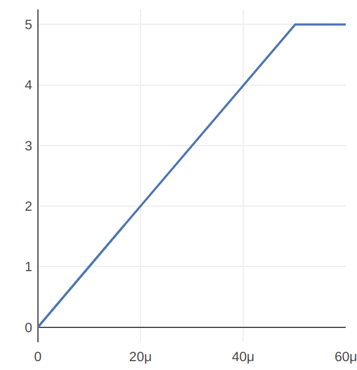
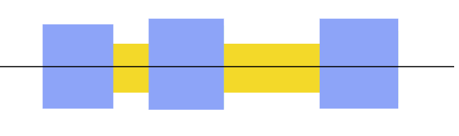
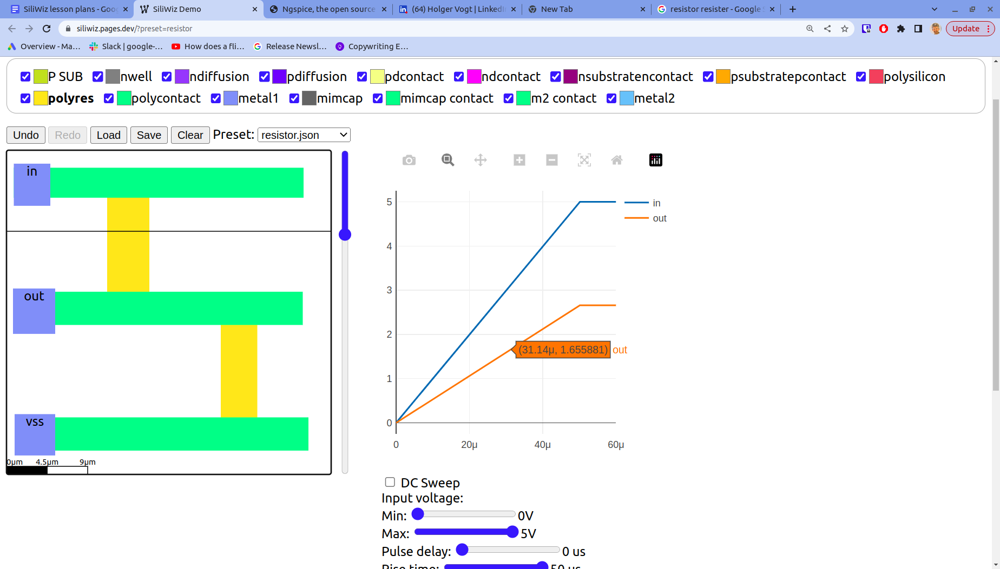

### Aim

*   Make something useful
*   Demonstrate some limitations of circuit extraction
*   Make some measurements on the plot

In the previous lesson you learnt the basics of SiliWiz. Now we’re going to put that knowledge to use and build a tiny calculating machine on a silicon chip. We’re going to build a potential divider. This takes a voltage in, divides it, and gives us the answer.

How many connections does this device have? We need one for in and out as before, and we’re going to add a new one called **vss**. vss is also called ground or 0v. It’s used as a reference for the rest of the circuit.

Let’s try to make a potential divider that divides by 2. So if 4v goes in, then 2v should come out. That’s actually easy, all we need is to make the 2 resistors the same resistance.

If the input voltage looks like this:

What do you think the output voltage should look like? **Make a prediction and see if you’re right after you’ve drawn the divider.**

There are lots of ways to draw it, but you’ll at least need:

*   3 **metal1** squares, labelled in, out and vss
*   3 **metal1 vias** to connect between **metal1** and **polyres**
*   2 resistors made out of **polyres** that are joined between the 3 contacts.

### How does it work? Magic!

Another important tool behind the SiliWiz scenes is called [Magic](https://www.zerotoasiccourse.com/terminology/magic/).

As mentioned earlier, we have two layers that actually specify the same material, polysilicon and polyres. There is no difference between the two layers when the chip is manufactured. The reason we keep them separate is to make Magic’s job easier when it extracts the circuit from the picture we draw.

A limitation you might run into when drawing the divider is that Magic can't tell this is two separate resistors. It extracts just a single resistor between the first 2 contacts.

You have to draw 2 separate rectangles, one for each resistor:

Once your divider is finished, you should see a simulation like this:

Play with the simulation controls to change the input signal’s min, max and rise time.

*   How close is your divider to dividing the input voltage by 2?  Can you measure how accurate it is?
*   How could you make the divider more precise?
*   What's best, big or small shapes?
*   Can you make a divide-by-3 potential divider?

### Solution

If you get stuck, take a [look at my solution](https://siliwiz.pages.dev/?preset%3Dresistor).
