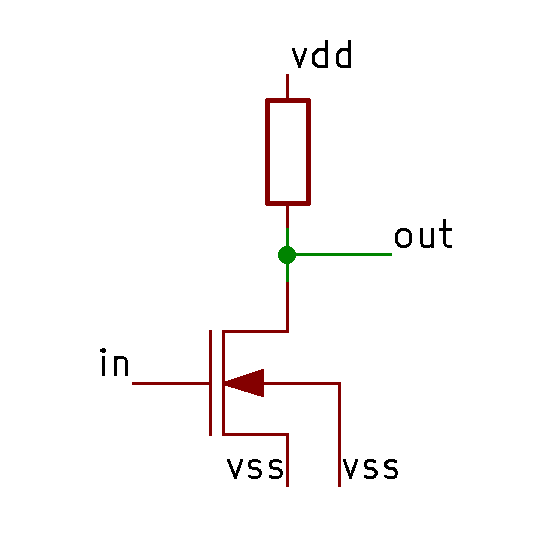
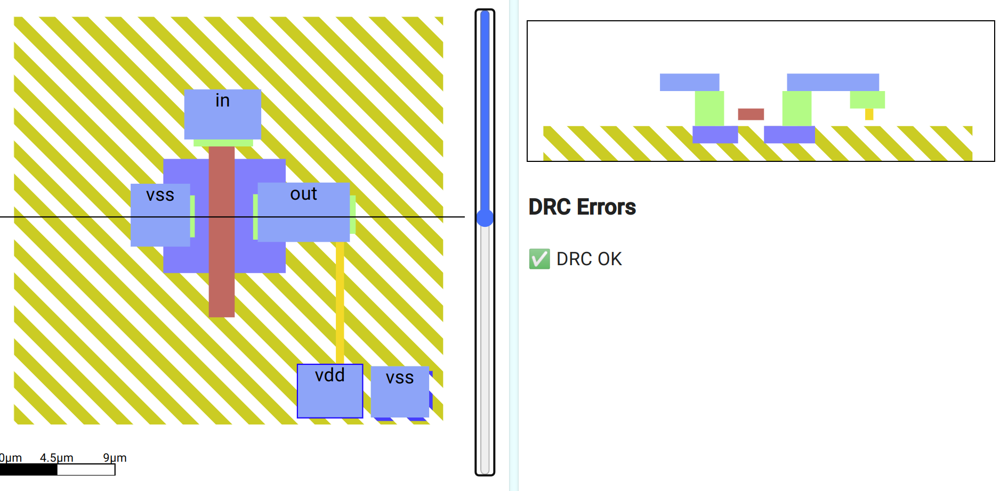
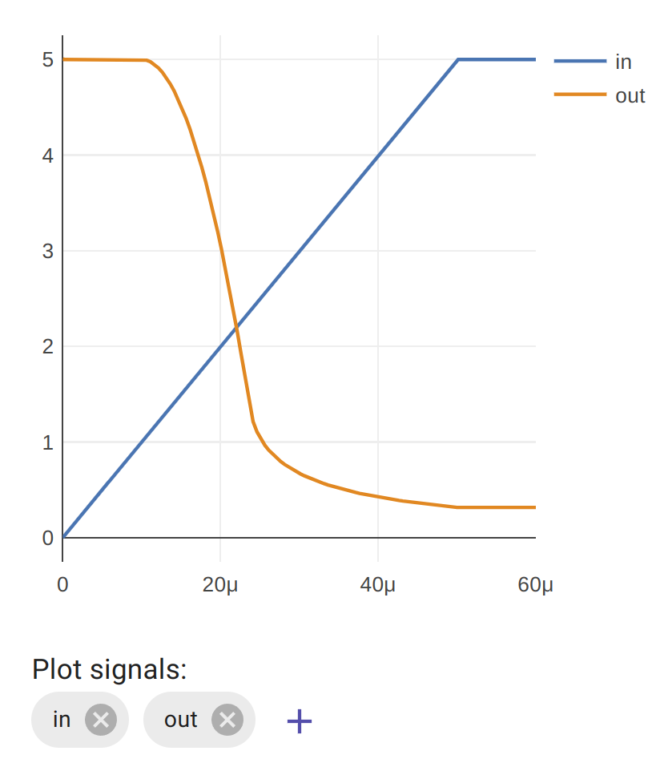
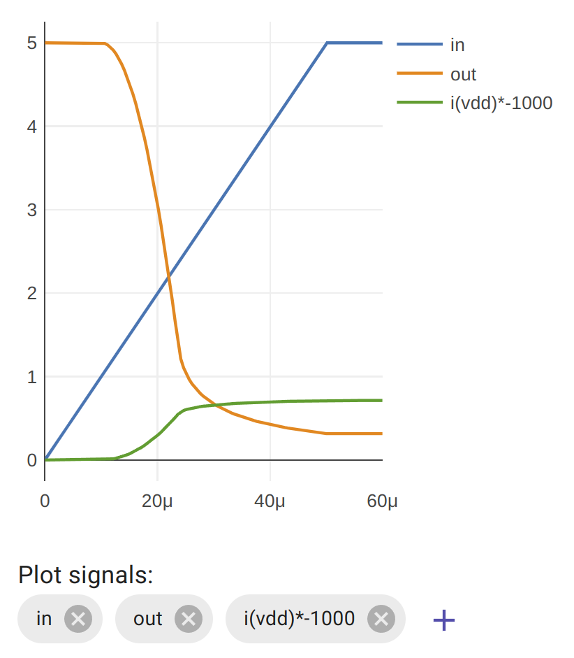

### Aim

*   Learn how a combination of a resistor and MOSFET can create an inverter
*   Discover the shortcomings of this type of inverter
*   Measure the current consumption of an NMOS inverter

A logic inverter has an input and an output. If the input is low, the output should be high, and if the input is high, the output should be low.

 

| in      | out     |
|---------|---------|
| 0       | 1       | 
| 1       | 0       | 

### NMOS

We can build a logic inverter with an N type MOSFET and a pull up resistor. This type of inverter is called an NMOS inverter.

If the input is low, the gate is not charged and current doesn’t flow through the MOSFET. The resistor pulls up the output to make it high.

If the input is high, the gate is charged and the MOSFET conducts. This pulls the output low.

### Draw an NMOS inverter

See if you can draw this inverter using the skills you’ve already learnt. Here’s [my solution](https://app.siliwiz.com/?preset%3Dnmos):

Once it’s wired up correctly, select the **simulation** tab and you should see a simulation result like this. You’ll need the **in** and **out** plot traces.

You can see that when the input is low, the output is high. Once the gate voltage gets to around 1.5v the output is already falling. And once the voltage is around 2.5v the output is less than 1v.

The disadvantage with NMOS logic is that the pullup resistors waste a tiny bit of current when the transistor is on.

### Measuring the current consumption of an NMOS inverter

As before, add **i(vdd)\*-1000** to the list of signals to be plotted.

Now we can see that when the input is low, the current use is low, but once we turn on the MOSFET, we are connecting the resistor down to vss, and this draws current.

Try changing the width of the gate and the width of the resistor. Can you make the inverter switch faster? How about making it more efficient?

If you have millions of these logic inverters then you are wasting electricity as heat and your chips get hot and slow down. [CMOS](https://www.zerotoasiccourse.com/terminology/cmos) was invented to solve this shortcoming.

In the next lesson you’ll learn how to draw a P type MOSFET, and then you’ll have everything you need to make your own CMOS inverter.
