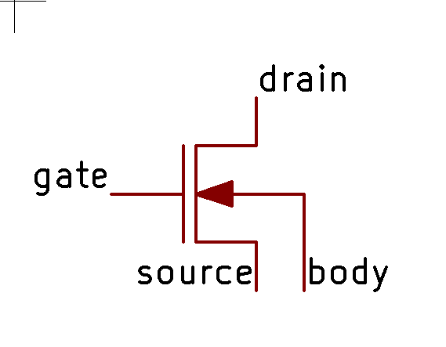
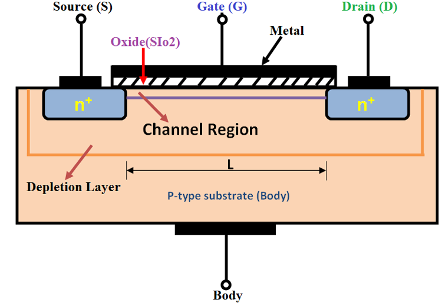
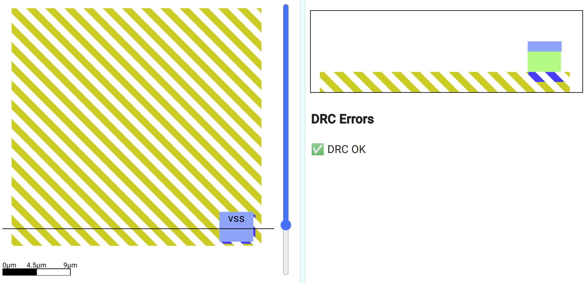
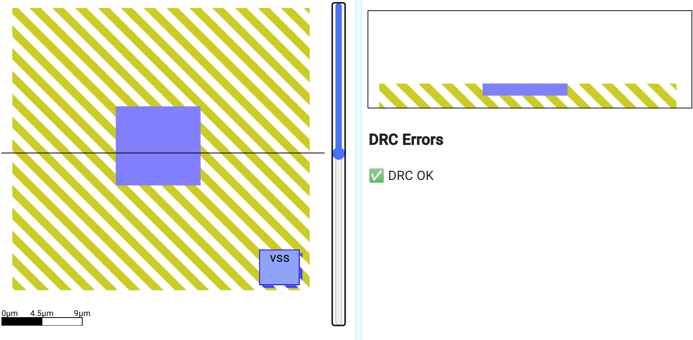
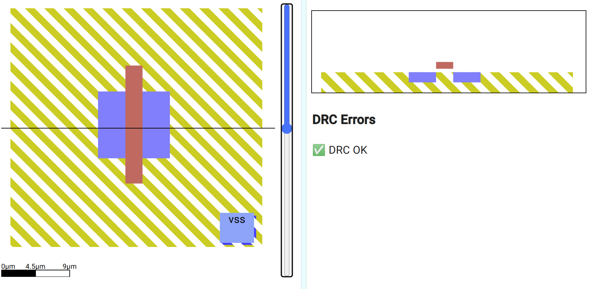
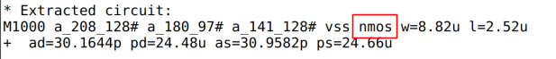
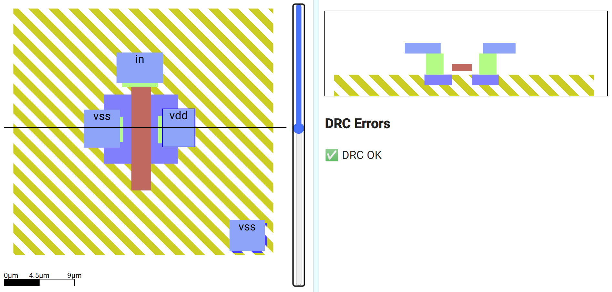
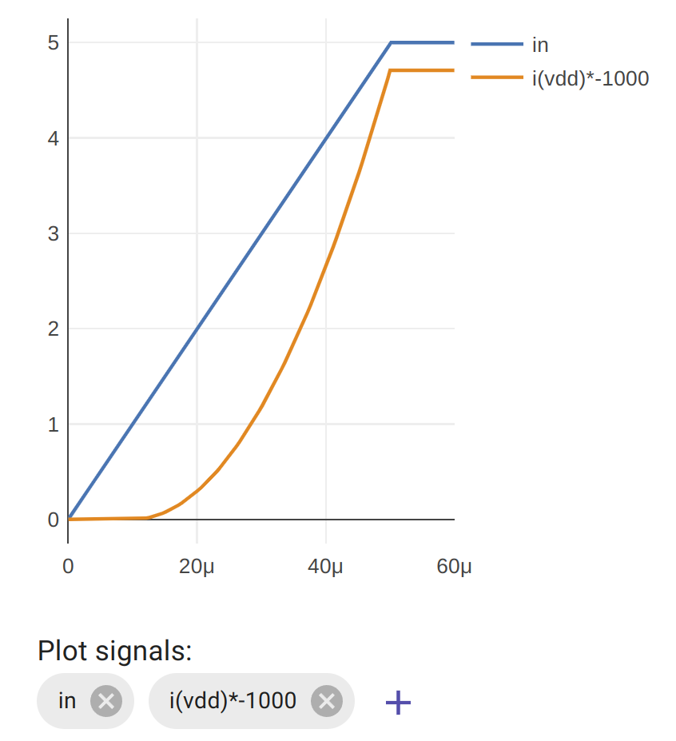

#5 Draw an N MOSFET
-------------------

### Aim

*   Introduce MOSFETs as an example of an active component
*   Draw a MOSFET
*   Plot the VGS curve
*   Measure the gate threshold voltage

So far we’ve been familiarising ourselves with SiliWiz by drawing passive components. Passive components store or use energy. Active components can control the flow of electricity, and these are the key to building more complex circuits like amplifiers or logic gates.

In this lesson we will learn how to draw a [MOSFET](https://www.google.com/url?q=https://www.zerotoasiccourse.com/terminology/mosfet/&sa=D&source=editors&ust=1677096507849680&usg=AOvVaw03QXFeoGspIZA_AjVJ7GJL). MOSFET stands for Metal Oxide Semiconductor Field Effect Transistor.

A MOSFET is an active component with 4 ports: gate, drain, source and body.

The gate used to be formed by putting metal on top of an insulating oxide layer, that’s the MO in MOSFET.

When a voltage is applied across the gate and the body, an electric field is formed in the channel. This field attracts the charge carriers to the channel region where they can then work to conduct electricity. That’s the FE in MOSFET.

In an N type MOSFET built on a P type substrate, the majority charge carriers are holes, and it’s the minority carriers (the electrons) that get attracted to the gate and form the conductive channel between the drain and source.

That describes what’s happening physically inside a transistor. If that doesn’t make total sense though, don’t worry. How a MOSFET works will become clearer once we start making one.

### Let’s get drawing!

So far, we’ve been ignoring the base layer of a silicon chip. In most cases this is a P [doped](https://www.google.com/url?q=https://www.zerotoasiccourse.com/terminology/doping/&sa=D&source=editors&ust=1677096507852598&usg=AOvVaw3guiHor4WOzK1OUBJqLPnv) silicon wafer. Instead of being pure silicon, it has a minute quantity of impurities added to increase the wafer’s conductivity, changing from an insulator to a semi-conductor.

Select the p subtrate layer, and draw a square that fills the whole canvas.

The p substrate needs to be connected to vss. To do that we use a lightly doped p area, called p tap.

p tap is different to the layers we’ve already seen. Instead of being built up on top of the substrate, it’s formed inside the substrate. The mask is used as before, but instead of building up a new layer of metal or polysilicon, we’re implanting atoms of a P type semiconductor, for example Boron.

In the corner draw a small square of p tap. Then we connect that up through a metal1 via to a metal1 contact labelled vss.

Next, select the n diffusion layer and draw a square in the middle. This will form both the drain and the source of the MOSFET. Like the p tap layer, n diffusion is formed inside the p substrate, but using atoms of an N type semiconductor like Arsenic.

The next step is to draw the gate. MOSFETs used to have their gate drawn with metal, but now the gate is much more commonly made from polysilicon. Use the polysilicon layer to draw the gate.

Look at the cross section - the n diffusion got split! Now we have 2 n type sections with a p type in between. What happened?

### Split diffusion

We could have drawn the gate first, and then the diffusion, but drawing the diffusion first lets us more easily align the gate in the middle. When the chip is made, the gate is put down first, and then the diffusion mask is used. The gate protects the P substrate from the N type diffusion, so we end up with 2 regions of N type and a region of P in the middle.

This is essentially all we need for a MOSFET, and if you take a look at the SPICE file you’ll see an “nmos” has been detected and extracted by Magic.

However, to see how well our MOSFET works we need to connect up the gate, drain and source. The body is the p substrate, and we’ve already connected that to vss.

### Drain, Source and Gate

We need to draw the layers to connect the MOSFET’s gate, drain and source to contacts on metal1. For this, we’ll use 3 metal1 vias.

The red polysilicon forms the gate, but which way round is the source and the drain - the cross section shows the MOSFET is symmetrical!

For an N MOSFET to work, the body needs to be kept at the same or lower voltage as one of the remaining terminals. We normally do this by connecting one of the terminals to the same voltage as the body, and historically, this terminal is called the source. The other becomes the drain.

Label the gate in, the source vss and the drain vdd. We’ve already connected the body to vss. If you get stuck, check [my s](https://www.google.com/url?q=http://app.siliwiz.com/?preset%3Dnmosfet&sa=D&source=editors&ust=1677096507861190&usg=AOvVaw08aih5qEXFT1-Dl3SAuope)[olution he](https://www.google.com/url?q=http://app.siliwiz.com/?preset%3Dnmosfet&sa=D&source=editors&ust=1677096507861595&usg=AOvVaw1FNSXRSQuoAKtBa-RpcVZs)[re](https://www.google.com/url?q=http://app.siliwiz.com/?preset%3Dnmosfet&sa=D&source=editors&ust=1677096507861857&usg=AOvVaw3-LLkFtuKGHosd13ZJX8Lj).

### VGS curves

In this experiment, we’re going to see what happens when we increase the gate voltage from 0v to 5v and measure the current that flows from vdd to vss. Current is a measure of how many charge carriers are flowing per second, it tells us how ‘switched on’ the MOSFET is. Current is measured in [Amps](https://www.google.com/url?q=https://en.wikipedia.org/wiki/Ampere&sa=D&source=editors&ust=1677096507862781&usg=AOvVaw180Y96noDkpSwYrQqgnJ7_).

This is one of the most important experiments we can do with a MOSFET, and it’s going to help us understand how they work in the next exercises.

In the simulation tab, look for the plot signals:

Click the out’s x to remove it, then click the + button to add a new trace. Type i(vdd)\*-1000

The i(vdd) means to plot the current instead of the voltage. The \*-1000 means to magnify the signal by -1000 times. This makes the signal look much bigger and flips it upside down. This is just to make it look how it does in all the textbooks.

What does the graph show us? To start with, when the gate is less than around one volt, there is no current flowing. The MOSFET is off. Once we get past a threshold, the MOSFET starts to conduct and lets more and more current flow. This value is called the gate-source threshold.

Try changing the width of the gate of the MOSFET and see how this affects the curve. If we want the most current to flow in the saturation region, should we use a thin or a thick gate?

If you zoom into the graph, can you measure what gate voltage is required to get the MOSFET to start conducting?
