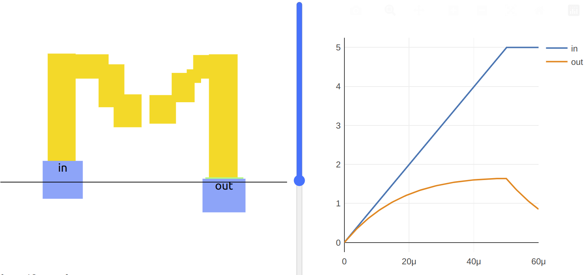

### Aim

*   Understand what parasitic means in microelectronics
*   See how we get unwanted capacitance and resistance in our circuits

What do you think will happen to the orange output line when you delete a part of your initial? Make a prediction. To delete a part, select it then either choose ‘delete’ or press the D key.

What happens? Did you expect it? You probably got something like me:

The blue input line keeps doing what it was doing, but the orange output has a nice curve now. What’s happening is that even though there is no direct circuit for the electricity to flow through your letter, we have made a small capacitor by having 2 conductive elements separated with a small non conductive gap. A capacitor is a circuit element with 2 ports. The electric field between the 2 elements works to keep the voltage across the plate the same. The capacitor charges up as the input rises, but then it slowly decays back to 0 once the input stops changing.

What happens to the output curve when you make the input rise faster by decreasing the rise time?

### Parasitic Capacitance

This type of effect is called parasitic capacitance. We didn’t really want or expect it, but it’s there because that’s how the world works. Parasitics are often unnoticeable at a larger scale, but the capacitor you just made is only 1μm wide and has a noticeable effect on the output of your circuit. Analyzing parasitics is an important part of microelectronics and can’t be ignored if we want our chips to work properly.

### Parasitic Resistance

Why did the capacitor discharge to zero? Because it also has a **parasitic resistance** that allows the electricity to leak out!

