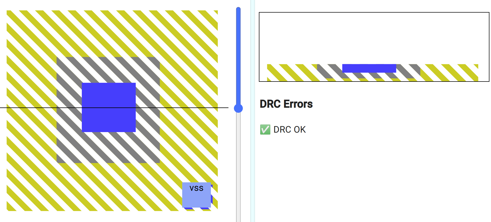
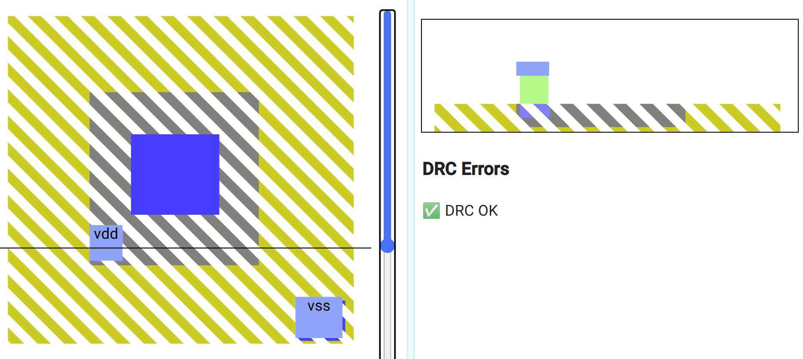
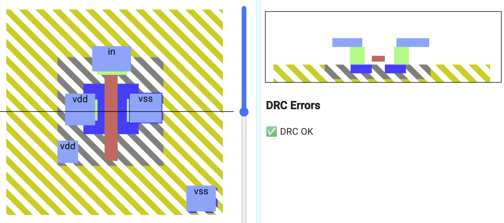
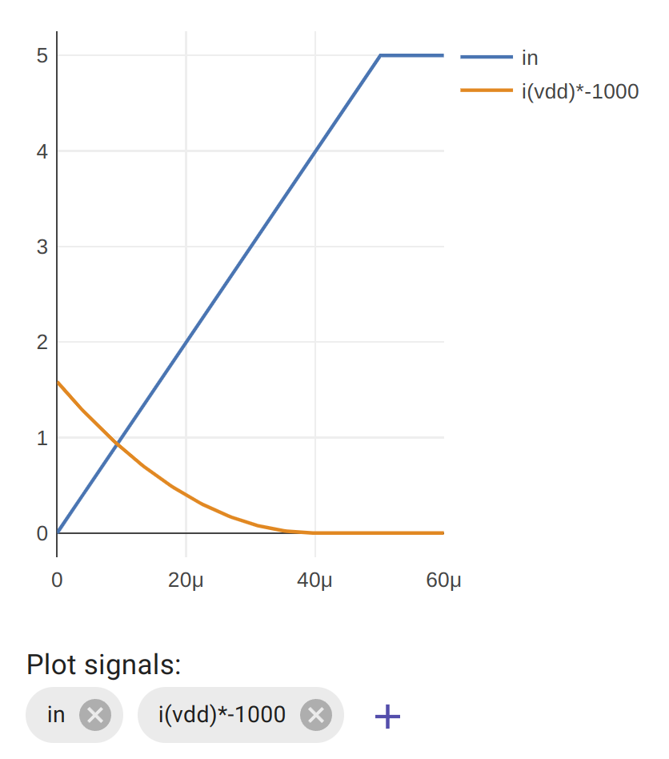
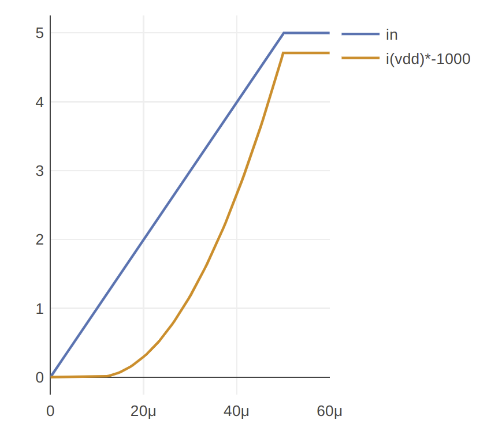
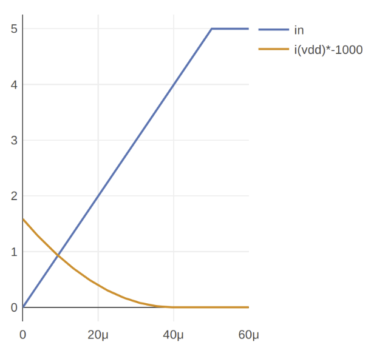

### Aim

*   Discover how a P type MOSFET is the complement of an N type MOSFET
*   Learn that a P type MOSFET needs an N well to isolate it from the P substrate
*   Compare characteristics of N type and P type MOSFETs

If we change the diffusion type of the gate and source from N type to P type, and the body from P type to N type, we make a type of MOSFET that’s the opposite of the N type we’ve already seen. This version of MOSFET is called a P type MOSFET.

### P substrate

Like the N MOSFET, we need the **p substrate** with the connection to vss.

### N well

The N type MOSFET was built on top of the P type substrate. So during the N diffusion process, when the gate protects the channel region, we end up with a P type channel. For a P type MOSFET, this needs to be switched: we need an N type channel that will be protected by P type diffusion.

For a P type MOSFET we need to create a deep area of N type diffusion on the substrate. This is called a well. The layer we need to use to draw this is called **n well**. Draw a smaller square in the center using the **n well** layer.

Next, draw the P type diffusion on top of that using the **p diffusion** layer.

The N well insulates the P diffusion from the P type substrate. It’s called a well because it’s deep, deeper than the diffusion layers used to build the gate and source of the MOSFET.

One question you might have is why not just use an N diffusion layer rather than P diffusion? Remember that the P diffusion is our wafer where all of our devices will be fabricated using photolithography. Using the N well allows us to fabricate P type MOSFETs while keeping the bulk material–the P type wafer–the same.

### Well tap

Just as the p substrate needs to be connected to vss, we need to connect the **n well** to vdd. Use n tap, **metal1 via** and **metal1** to do it.

### Connect it up

Connect up the gate, source and drain as you did for the N type MOSFET. This time the source is connected to vdd and the drain to vss.

As before, remove the **out** trace, and add **i(vdd)\*-1000**.

You can see [my solution here](https://app.siliwiz.com/?preset=pmosfet).

### N vs P type MOSFET

What do you notice between the N and P type MOSFETs? The first is plot is for N and on the second is for P.

*   Which MOSFET conducts the best?
*   If you change the P MOSFET’s **p diffusion** layer size, can you improve its performance?
*   Do they have the same gate-source threshold?

{}
The N MOSFET conducts about 2.6 times better than P MOSFET.

Drawing a P MOSFET 2.6 times wider than the N MOSFET will give it the same performance as the N MOSFET.

Explanation: This is due to the N type doping having excess electrons, which carry the current, compared to the P type doping which has gaps between electrons, and the movement of these electron "holes" is what carries the current. This is analogous to water quickly falling though air, vs a bubble of air rising much slower though water. (Alternate explanation: cars driving on a road vs a traffic jam where the gap between cars is moving backwards as the cars move slowly forwards).
{}
