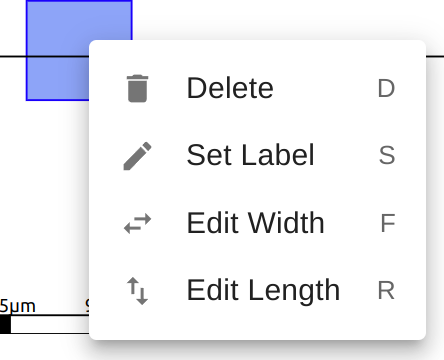

### Aim

*   Learn the basics of SiliWiz
*   How to draw and simulate a MOSFET
*   Understand the cross section view
*   Understand how to read the simulation plot
*   What to do next

Here’s an overview of the SiliWiz user interface:

You can try it out with [this link](https://app.siliwiz.com/?preset=blank).

#### Layers

*   Control which layers are visible with the 👁 icon
*   Choose which layer is active by clicking on the colour or the text
*   Hover the mouse over the text to get a brief description of the layer’s purpose

#### Canvas

*   Load a preset
*   Undo ↶ and Redo ↷ buttons
*   Clear the drawing
*   Click and drag to draw shapes on the canvas
*   Click an existing shape to change its dimensions, delete it or label it

#### Cross section and graph view

*   Switch between cross section and graph view
*   In cross section you can drag the slider to choose where to cross section
*   In graph view you can adjust the sliders to change the simulation parameters

### SiliWiz stackup

When a factory develops a way to make a chip, they need to share that information with the chip designers - that’s you! 

{}
Normally, you’d need to sign a document to say you wouldn't share the information. With the open source [PDK](https://www.zerotoasiccourse.com/terminology/pdk/), you don’t need to sign any paperwork before you start using it.
{}

The Sky130 stackup we use for real chips is quite complicated, so we’re using a simpler, custom made one for SiliWiz. This helps to keep things approachable and fast. Bear in mind that a real, manufacturable PDK has a [lot more layers](https://skywater-pdk.readthedocs.io/en/main/rules/masks.html). The SiliWiz layer stackup looks like this:

After we’ve finished our design we can turn each layer into a mask. A mask allows us to control the shapes made by the light on the photoresist. 

[Photolithography](https://www.zerotoasiccourse.com/terminology/photolithography/) is the key technology that allows us to take the patterns we create in a tool like SiliWiz and miniaturise them down to the nanometer scale. It also lets us easily tile the same design over the silicon wafer to make the individual chips. It allows us to use a prepared image of the chip to make millions of copies reliably and rapidly.

### Draw a MOSFET

In this lesson we will learn how to draw a [MOSFET](https://www.zerotoasiccourse.com/terminology/mosfet/). MOSFET stands for Metal Oxide Semiconductor Field Effect Transistor.

A MOSFET is an active component with 4 ports: gate, drain, source and body.

The gate used to be formed by putting metal on top of an insulating oxide layer, that’s the MO in MOSFET.

When a voltage is applied across the gate and the body, an electric field is formed in the channel. This field attracts the charge carriers to the channel region where they can then work to conduct electricity. That’s the FE in MOSFET.

In an N type MOSFET built on a P type substrate, the majority charge carriers are holes, and it’s the minority carriers (the electrons) that get attracted to the gate and form the conductive channel between the drain and source.

That describes what’s happening physically inside a transistor. If that doesn’t make total sense though, don’t worry. How a MOSFET works will become clearer once we start making one.

### Let’s get drawing!

The base layer of a silicon chip is called the substrate. In most cases this is a P [doped](https://www.zerotoasiccourse.com/terminology/doping/) silicon wafer. Instead of being pure silicon, it has a minute quantity of impurities added to increase the wafer’s conductivity, changing from an insulator to a semi-conductor.

Go to the [SiliWiz page](https://app.siliwiz.com/?preset=blank), select the **p substrate** layer, then left-click-drag to draw a square that fills the whole canvas.

The **p substrate** needs to be at 0 volts, so we are going to connect it to the **vss** supply. To do that we use a lightly doped p area, called **p tap**.

The **p tap** is formed inside the substrate and makes it easier to connect to 0 volts. It's made by bombarding the substrate with atoms of a P type semiconductor, for example Boron. The atoms only hit the substrate where there is a hole in the mask.

In the corner draw a small square of **p tap**. Then we connect that up through a **metal1 via** to a **metal1** contact labelled **vss**.

Click the **metal1** contact, and choose the option ‘Set Label’. or S on the keyboard. Then type **vss** to set the label.

Next, select the **n diffusion** layer and draw a square in the middle. This will form both the drain and the source of the MOSFET. Like the **p tap** layer, **n diffusion** is formed inside the **p substrate**, but using atoms of an N type semiconductor like Arsenic.

The next step is to draw the gate. MOSFETs used to have their gate drawn with metal, but now the gate is much more commonly made from polysilicon. Use the **polysilicon** layer to draw the gate.

Drag the cross section slider up and down so you can see the layers clearly. If you hover over a shape in the cross section, you’ll get a popup to tell you the name of the layer.

Look at the cross section of the MOSFET - the **n diffusion** got split! Now we have 2 **n type** sections with a **p type** in between. What happened?

### Split diffusion

We could have drawn the gate first, and then the diffusion, but drawing the diffusion first lets us more easily align the gate in the middle. When the chip is made, the gate is put down first, and then the diffusion mask is used. The gate protects the P substrate from the N type diffusion, so we end up with 2 regions of N type and a region of P in the middle.

### Drain, Source and Gate

To see how well our MOSFET works we need to connect up the gate, drain and source. The body is the **p substrate**, and we’ve already connected that to vss.

We need to draw the layers to connect the MOSFET’s gate, drain and source to contacts on **metal1**. For this, we’ll use 3 **metal1 via**s followed by 3 squares of **metal1**.

The red **polysilicon** forms the gate, but which way round is the source and the drain - the cross section shows the MOSFET is symmetrical!

For an N MOSFET to work, the body needs to be kept at the same or lower voltage as one of the remaining terminals. We normally do this by connecting one of the terminals to the same voltage as the body, and because this is where the charge carriers come from, its called the source. The other becomes the drain.

Label the gate **in**, the source **vss** and the drain **vdd**. We’ve already connected the body to vss. If you get stuck, check [my solution here](http://app.siliwiz.com/?preset=nmosfet).

### VGS curves

In this experiment, we’re going to see what happens when we increase the gate voltage from 0v to 5v and measure the current that flows from vdd to vss. Current is a measure of how many charge carriers are flowing per second, it tells us how ‘switched on’ the MOSFET is. Current is measured in [Amps](https://en.wikipedia.org/wiki/Ampere).

This is one of the most important experiments we can do with a MOSFET, and it’s going to help us understand how they are used to build the logic gates we use in future exercises.

In the simulation tab, look for the plot signals:

Click the out’s x to remove it, then click the + button to add a new trace. Type **i(vdd)\*-1000**

The i(vdd) means to plot the current instead of the voltage. The \*-1000 means to magnify the signal by -1000 times. This makes the signal look much bigger and flips it upside down. This is just to make it look how it does in all the textbooks.

What does the graph show us? To start with, when the gate is less than around one volt, there is no current flowing. The MOSFET is off. Once we get past a threshold, the MOSFET starts to conduct and lets more and more current flow. This value is called the gate-source threshold.

Try changing the width of the gate of the MOSFET and see how this affects the curve. If we want the most current to flow in the saturation region, should we use a short or a long gate?

If you zoom into the graph, can you measure what gate voltage is required to get the MOSFET to start conducting?

### Next steps

If you're interested to learn more about microelectronics with SiliWiz, you can try going through all the lessons [here](/siliwiz). Have fun!

You can also watch this video I made inside the IHP semiconductor factory.


