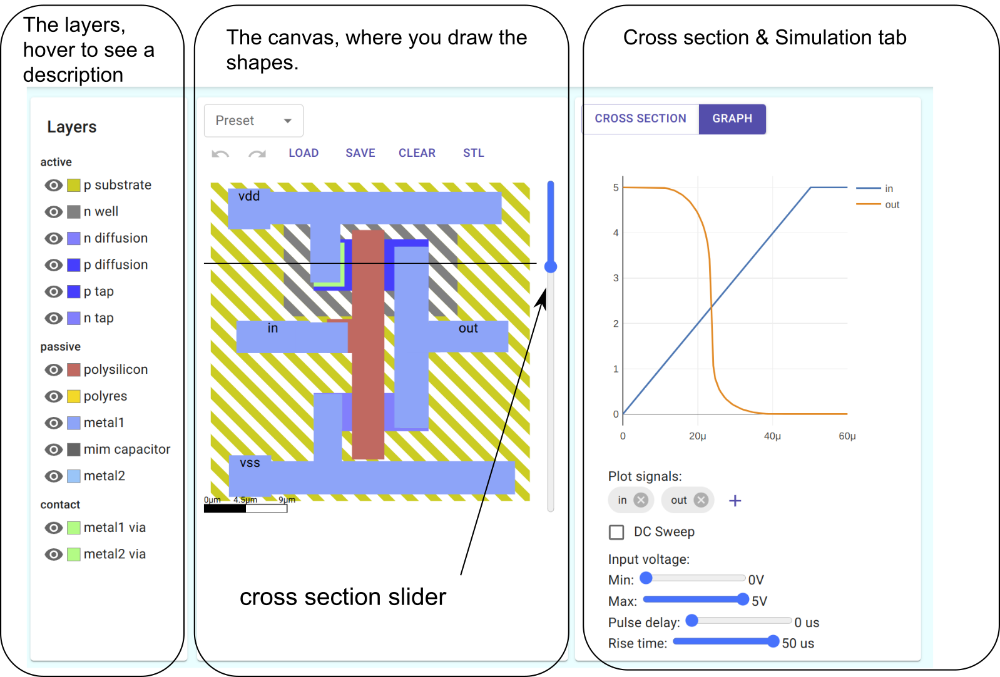
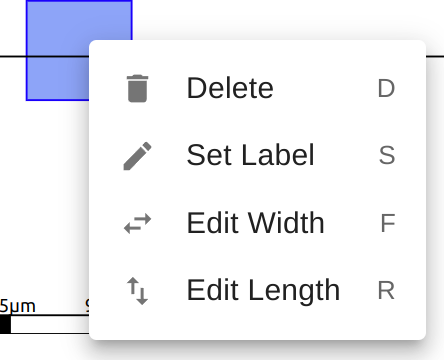

#1 Draw a resistor
------------------

### Aim

*   Learn the basics of SiliWiz

*   How to draw basic shapes and label terminals
*   Understand the cross section view

*   Understand how to read the simulation plot
*   Understand how resistance changes with shape
*   Where to get help

Here’s an overview of the SiliWiz user interface:

### Draw some shapes!

Choose which layer to draw on by using the palette. By the end of these lessons you will know what each layer is for and what role it plays in building a logic gate.

Go to the [SiliWiz page](https://www.google.com/url?q=https://app.siliwiz.com/?preset%3Dblank&sa=D&source=editors&ust=1677096507788006&usg=AOvVaw0jWIDgyoLDxGEmKahMl65o), select the polyres layer, then draw the first letter of your name on the canvas.

*   Control which layers are visible with the 👁 
*   Choose which layer is active by clicking on the colour or the text
*   Hover the mouse over the text to get a brief description of the layer’s purpose

*   Try the Undo ↶ and Redo ↷ buttons
*   The Clear button clears everything
*   You can download your design with the Save button
*   You can load a saved design with the Load button

### Layers

When a factory develops a way to make a chip, they need to share that information with the chip designers - that’s you! 

Normally, you’d need to sign a document to say you wouldn't share the information. With the open source [PDK](https://www.google.com/url?q=https://www.zerotoasiccourse.com/terminology/pdk/&sa=D&source=editors&ust=1677096507792073&usg=AOvVaw0Qy6lt4J6TfzOpL1V0A1tb) from Skywater (a chip factory in the US), you don’t need to sign any paperwork before you start using it.

Here are the layers that are used to make a chip on Skywater’s 130 nm (nanometer) process. A nanometer is 1 million times smaller than a millimetre. So the period at the end of this sentence could easily be a million nanometers across. Note that figures shown in the picture are in micrometres (μm).

### SiliWiz stackup

This is quite a complicated stackup, so we’re using a simpler, custom made one for SiliWiz. This helps to keep things approachable and fast. Bear in mind that a real, manufacturable PDK has a [lot more layers](https://www.google.com/url?q=https://skywater-pdk.readthedocs.io/en/main/rules/masks.html&sa=D&source=editors&ust=1677096507794500&usg=AOvVaw0tKZ9PApUOZxSfs2VuC16l). The SiliWiz layer stackup looks like this:

If you’re feeling adventurous, you can take a look at the [tech](https://www.google.com/url?q=https://app.siliwiz.com/assets/siliwiz.tech&sa=D&source=editors&ust=1677096507796683&usg=AOvVaw21GqJ4qgGcdZ3dWQ2ccMM6)[nolog](https://www.google.com/url?q=https://app.siliwiz.com/assets/siliwiz.tech&sa=D&source=editors&ust=1677096507797097&usg=AOvVaw3seJVRZKvAs94iu-YZZT3F)[y file](https://www.google.com/url?q=https://app.siliwiz.com/assets/siliwiz.tech&sa=D&source=editors&ust=1677096507797477&usg=AOvVaw3NkROfCk6L9qD85EuFmX3L) (techfile) of our custom stackup. Thanks to [Tim Edwards at Efabless](https://www.google.com/url?q=https://efabless.com/&sa=D&source=editors&ust=1677096507797805&usg=AOvVaw2gvL1AUqUibVeGmYTs3191) for the techfile and a lot of other things!

After we’ve finished our design we can turn each layer into a mask. A mask allows light to pass through the areas we coloured in on the layers. The masks are used in a process called photolithography.

[Photolithography](https://www.google.com/url?q=https://www.zerotoasiccourse.com/terminology/photolithography/&sa=D&source=editors&ust=1677096507799162&usg=AOvVaw1or-fyOWlJ7r2IREH0O_dx) is the key step that allows us to take the patterns we create in a tool like SiliWiz and miniaturise them down to the nanometer scale. It also lets us easily tile the same design over the silicon [wafer](https://www.google.com/url?q=https://www.zerotoasiccourse.com/terminology/wafer/&sa=D&source=editors&ust=1677096507799540&usg=AOvVaw18elXOyYDZv3__RCaA5JuV) to make the individual chips. It allows us to use a prepared image of the chip to make millions of copies reliably and rapidly.

Some layers are ‘virtual’. For example polyres and polysilicon are the same physical layer, but we need to have them split onto 2 separate layers so that the simulation knows whether we mean drawing the gate of a [MOSFET](https://www.google.com/url?q=https://www.zerotoasiccourse.com/terminology/mosfet/&sa=D&source=editors&ust=1677096507800631&usg=AOvVaw2viUanGuRa2_k7auGD-t15), or drawing a resistor.

### How resistive is your initial?

Now we’ve drawn a shape, we can run a simulation and find out how resistive the letter is. Resistance is measured in [Ohms](https://www.google.com/url?q=https://en.wikipedia.org/wiki/Ohm&sa=D&source=editors&ust=1677096507801632&usg=AOvVaw2dItZd8jr50n2VadCxTOOj). A resistor is a circuit element with 2 ports. The higher the resistance, the harder it is to move electricity through it.

The resistance of polysilicon is proportional to the cross sectional area and the length.

In a PDK, we can’t control the height of the layers - the factory has already decided that. Instead we can control the width and the length. So if you draw a long thin shape it will have a higher resistance, and a short fat shape will have lower resistance. Our polyres layer has a resistance of 400 ohms per square micrometre (μm). There are 1000 micrometres in a millimetre.

*   A 1μm x 1μm square should have 400 Ohms resistance.
*   A long skinny 10μm long x 1μm rectangle should have 4000 Ohms resistance.
*   How many Ohms should a 10μm x 10μm square have? Because it’s 10 times wider than the long skinny one, it will have 10 times less resistance, so it should be 400 Ohms.

Take a look at your drawing - can you predict the resistance?

### Connect it up

To measure the resistance, we need to connect 2 parts of your initial to some input and output ports.

We can only make ports on the metal1 and metal2 layers. If you look at the stackup, metal1 and metal2 do not touch the polyres layer. We first use a metal1 via to bridge between metal1 and polyres layers.

Select the metal1 via layer and add two vias to your initial made in polyres.

Here’s how the metal1 via looks from the top on my letter:

And here is how it looks in the Cross Section View. Ensure you have selected the cross section tab.

Drag the cross section slider up and down so you can see the layers clearly. If you hover over a shape in the cross section, you’ll get a popup to tell you the name of the layer.

* * *

Now add 2 metal1 contacts on top of the metal1 via. To simulate our design, we need to tell SiliWiz that we want these contacts to be the ports of our circuit. To do so, click each metal1 contact, and choose the option ‘Set Label’. or S on the keyboard.

Set the labels to be in and out. As soon as you’ve done that you should see the simulation plot update. You’ll need to switch from the cross section to the simulation tab.

The x axis of the plot is time, in microseconds. There are 1,000,000 microseconds in a second. The y axis is voltage. Voltage is measured in Volts and is the unit we use when talking about electric field strength.

Charge carriers, such as electrons, are moved by electric fields. The stronger the field, the more effect it has on an electron. Electrons are the ‘moving parts’ of the machines we build.

In this graph there are actually 2 lines, blue for in and orange for out. They are right on top of each other, so it looks like just one line. Try the sliders to see how it affects the plot.

What the graph shows is that the output voltage is the same as the input voltage. The input voltage is varying over time, which you can control with the sliders.

### Spice it up

Now we’ll look at another part of SiliWiz to determine the resistance of our polyres design.

Tick the Show SPICE check box at the bottom of the page and have a look in the text box. Look for a line that says R0 in out and then some numbers. My letter M has a resistance of 5575 ohms! Cool! I drew my own resistor.

There’s a lot of stuff going on in the SPICE file, but we’ll be mostly ignoring it in these lessons. [SPICE](https://www.google.com/url?q=https://www.zerotoasiccourse.com/terminology/spice/&sa=D&source=editors&ust=1677096507812412&usg=AOvVaw0uV_lC5-W02rS515t7W13j) is an important part of a chip designer’s toolkit. [ngspice](https://www.google.com/url?q=https://ngspice.sourceforge.io/&sa=D&source=editors&ust=1677096507812830&usg=AOvVaw13HFU5phGPgcVDRmisYbGB) is the open source tool that runs the SPICE simulations for SiliWiz. Thanks to [H](https://www.google.com/url?q=https://www.linkedin.com/in/holger-vogt-737ba5a8/&sa=D&source=editors&ust=1677096507813171&usg=AOvVaw1IOlzrtRvI2Gh3-tZApCRy)[olger Vo](https://www.google.com/url?q=https://www.linkedin.com/in/holger-vogt-737ba5a8/&sa=D&source=editors&ust=1677096507813460&usg=AOvVaw2IDeGQlXgZ5pQkiLqEkkEb)[gt](https://www.google.com/url?q=https://www.linkedin.com/in/holger-vogt-737ba5a8/&sa=D&source=editors&ust=1677096507813759&usg=AOvVaw25FYyQBCrpo5r6Bu7rXLUq) for making us a special small version.

Try to make your letter a higher or lower resistance. Here’s me making a really high resistance:

I got 37,800 Ohms! Can you make an even higher resistance?
