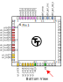

The information in this document applies to Tiny Tapeout 4 and beyond.

Tiny Tapeout includes a clock input signal (`clk`), provided externally through the `mprj_io[6]` pin of the caravel chip (pin number 37 in the QFN-64 chip package).

## Limitations

Internally, both the `clk` and `rst_n` pins are handled like any other input pins. We expect a latency (insertion delay) of up to 10 nanoseconds between the chip's I/O pad and your project's clock.

The caravel chip uses the [sky130_ef_io_gpiov2_pad](https://skywater-pdk.readthedocs.io/en/main/contents/libraries/sky130_fd_io/docs/user_guide.html#sky130-fd-io-gpiov2-additional-features) macro for the I/O pads. The documentation specifies a maximum input frequency of 66 MHz. Therefore, we believe that the maximum clock frequency for your designs will be around 66 MHz.

## Clock Generation

The Tiny Tapeout Demo board can generate the clock signal for your designs. The clock is generated by the on-board RP2040 microcontroller ([firmware source code](https://github.com/TinyTapeout/tt-rp2040-firmware/blob/main/src/clkgen.c)).

The RP2040 can generate a wide range of frequencies, including 50 MHz, 48 MHz (useful for USB), 40 MHz, 25.179 MHz (useful for VGA), 10 MHz, 1 MHz. If you need a very slow clock like 1Hz, this can be generated with a simple circuitpython program.

You can find the complete lists of verified frequencies in the [firmware's README file](https://github.com/TinyTapeout/tt-rp2040-firmware#clock-configurations). If you need a frequency that does not appear on the list, feel free to [open an issue](https://github.com/TinyTapeout/tt-rp2040-firmware/issues/new) and we'll look into adding it to the list.


