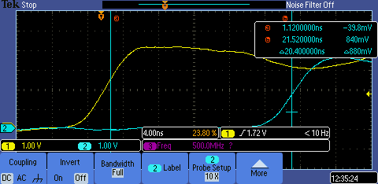
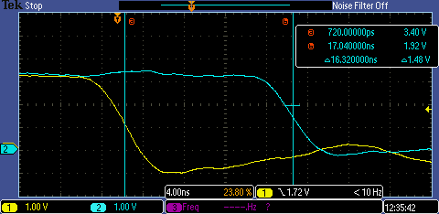

### GPIO pins

There are total of 26 I/O pins available for your design:

| Name          | Count | Direction | Description            |
|---------------|-------|-----------|------------------------|
| `clk`         | 1     | Input     | Clock input            |
| `rst_n`       | 1     | Input     | Active low reset       |
| `ui_in[7:0]`  | 8     | Input     | General purpose input  |
| `uo_out[7:0]` | 8     | Output    | General purpose output |
| `uio[7:0]`    | 8     | Bidir     | General purpose I/O    |

Internally, both the `clk` and `rst_n` pins are handled like any other input pins. However, they have special meaning to the [Tiny Tapeout demo board](../pcb). For more information on the `clk` pin and input synchronization, see the [Clock](../clock) section.

### Limitations

The caravel chip uses the [sky130_ef_io_gpiov2_pad](https://skywater-pdk.readthedocs.io/en/main/contents/libraries/sky130_fd_io/docs/user_guide.html#sky130-fd-io-gpiov2-additional-features) macro for the I/O pads. The documentation lists the following limitations:

| Parameter                    | Limitation   |
|------------------------------|--------------|
| Maximum output frequency     | 33 MHz       |
| Maximum input frequency      | 66 MHz       |
| Drive strength (source/sink) | 4 mA         |
| IO supply voltage \*        | 1.71V - 5.5V |

\* The demo board provides 3.3V IO supply voltage. The input pins are not 5V tolerant.

### Electrical Characteristics

Note: the following measurements were taken on a single die at ~22 °C and may not be representative of future batches. They are only provided for reference.

### Multiplexer measurements

Note: the following measurements were taken on a single die at ~22 °C and may not be representative of future batches. They are only provided for reference.

After Tiny Tapeout 3.5 silicon was received and tested the worst round trip latency was measured to be 20 ns as shown in the following scope screen captures.

Delay variance between different IO pins has been measured at less than 2ns.
